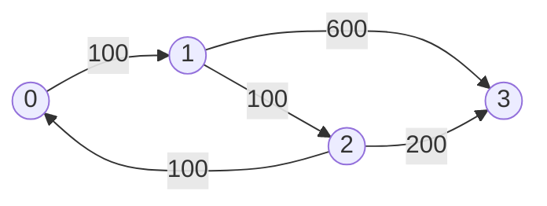
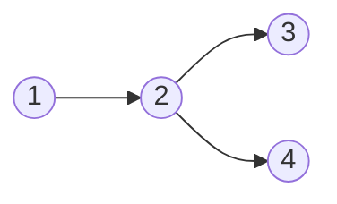

# Shortest Path

It’s about recognizing:
> [!IMPORTANT]
> “What exactly is the STATE?”
>
> “What exactly am I minimizing?”

## Signal A — “Minimum”

Words like:
1. minimum
2. shortest
3. cheapest
4. least
5. optimal
6. earliest
7. fastest

> usually indicate shortest path.

##Signal B — Incremental Transitions

If you move:
1. cell → cell
2. city → city
3. state → state

## Signal C — State Changes Matter

If answer depends on:
1. fuel
2. stops remaining
3. keys collected
4. mask
5. direction
6. time parity

> then node is NOT just u.

Node becomes:
> (node, state)

---

> [!IMPORTANT]
> Mental model
>
> 1. Q1 — What is the NODE?
>           
>           u ?
>           (u, mask) ?
>           (u, fuel) ?
>           (u, direction) ?
>
> 2. Q2 — What is the EDGE COST?
>
>           distance ?
>           maximum edge ?
>           time ?
>           effort ?
>           steps ?
>
> 3. Q4 — Is state part of optimality?
>
>           If yes: dist[node][state]
>           If not: dis[node]

---

# Step 2 — Identify Edge Type

# CASE 1 — Unweighted Graph

- Every edge cost same.
- move costs 1
- every transition equal

> Use BFS

## 1. Word Ladder
[Leetcode link](https://leetcode.com/problems/word-ladder/description/)

A transformation sequence from word beginWord to word endWord using a dictionary wordList is a 
sequence of words beginWord -> s1 -> s2 -> ... -> sk such that:

- Every adjacent pair of words differs by a single letter.

Input: beginWord = "hit", endWord = "cog", wordList = ["hot","dot","dog","lot","log","cog"]

Output: 5

Explanation: One shortest transformation sequence is 
- "hit" -> "hot" -> "dot" -> "dog" -> cog", which is 5 words long.

### Intuition
> [!IMPORTANT]
>               Node is string u
>               Each edge tpu -> lpu costs 1
>               shortest transformation == minimum number of edges
>               Use BFS
>
> - Have a set words which tracks unvisited strings
> - for curr string u
>
>       - try changing one char and get string v
>
>           - if v is unvisited then visit it

```cpp
int ladderLength(string beginWord, string endWord, vector<string>& wordList) {
    unordered_set<string> words(wordList.begin(), wordList.end());

    queue<string> q;
    q.push(beginWord);
    if(words.count(beginWord)) words.erase(beginWord); // remove beginWord so we dont visit again

    int level = 1;
    while(!q.empty()) {
        int len = q.size();
        
        while(len--) { // visit each level compeletely
            string u = q.front();
            q.pop();

            if(u == endWord) return level;

            for(int i=0; i<u.size(); i++) {
                char prev = u[i];

                for(char c='a'; c<='z'; c++) {
                    if(c == prev) continue;
                    u[i] = c;    // make new string

                    if(words.count(u)) {
                        q.push(u);
                        words.erase(u);
                    }
                }

                u[i] = prev;
            }
        }

        level++;
    }

    return 0;
}

/*
    Time complexity:
        we visit each node by putting into queue
        each node is transformed into L*25 new strings where L is length of string
    time - O(N*L*25) = O(N*L)

    Generally time complexity of BSF is O(V + E) = O(N + N*L*25) = O(N*L)

    each step we see 25*L new tranformations so b = 25*L branching factor

    branch explosion --> 1, b^2, b^3, b^4.... = 1, 25L, (25L)^2, (25L)^3....
*/
```

> [!IMPORTANT]
> We can use Bidirectional BFS
>
>               The worst case time complexity does not improve
>               But overall it:
>                   improves practial runtime
>                   Less number of states
>                   Avoids branching explosion
>
> start -------- end ==> path length is 10
>               
>                If we use normal BFS, at the end there will be (25L)^m 
>
>                But if we use bidirectional BFS there will be total 2*(25L)^(m/2) states at the end
>
>               maintain two sets: start and end
>                   - start set starts expansion from beginWord
>                   - end set starts expansion from endWord
>               
>               Always expand shortest set 

```cpp
int ladderLength(string beginWord, string endWord, vector<string>& wordList) {

    unordered_set<string> words(wordList.begin(), wordList.end());
    if(!words.count(endWord)) return 0;
    if(words.count(beginWord)) words.erase(beginWord);

    unordered_set<string> start, end;
    start.insert(beginWord);
    end.insert(endWord);

    int level = 1;
    while(!start.empty() && !end.empty()) {
        if(start.size() > end.size()) swap(start, end);

        unordered_set<string> next;
        for(string u: start) {
            
            for(int i=0; i<u.size(); i++) {
                char prev = u[i];
                for(char c='a'; c<='z'; c++) {
                    if(c == prev) continue;

                    u[i] = c;
                    if(end.count(u)) return level+1;

                    if(words.count(u)) {
                        next.insert(u);
                        words.erase(u);
                    }
                }

                u[i] = prev;
            }
        }

        start = next;
        level++;
    }

    return 0;
}
```

---

## 2. Open the Lock
[Leetcode link](https://leetcode.com/problems/open-the-lock/description/)

start from "0000" you can turn a wheel one step at a time and reach new sequence.
If you arrive at deadEnd, then you can not move further

- Input: deadends = ["0201","0101","0102","1212","2002"], target = "0202"
- Output: 6

Explanation: 
- A sequence of valid moves would be "0000" -> "1000" -> "1100" -> "1200" -> "1201" -> "1202" -> "0202".

### Intuition
> [!IMPORTANT]
> - node is string u
> - each tranformation costs = 1
> - minimise total tranformatons = shortest path = minimum number of edges
>
>               BFS
>
>               For string "0134" 
>               each wheel can be rotated one step up or down
>               if we rotate 1st wheel ==> "9134" or "1134"

```cpp
int openLock(vector<string>& deadends, string target) {
      
    string start = "0000";
    unordered_set<string> dEnds(deadends.begin(), deadends.end());
    if(dEnds.count(start) || dEnds.count(target)) return -1;

    unordered_set<string> visited;

    queue<string> q;
    q.push(start);
    visited.insert(start);

    int level = 0;
    while(!q.empty()) {
        int len = q.size();

        while(len--) {
            string u = q.front();
            q.pop();
            if(u == target) return level;

            for(int i=0; i<u.size(); i++) {
                char prev = u[i];

                for(int d: {1, -1}){        // rotating wheel i, up or down
                    char next = prev + d;

                    if(next > '9') next = '0';
                    if(next < '0') next = '9';

                    u[i] = next;
                    if(dEnds.count(u) || visited.count(u)) continue;
                    
                    visited.insert(u);
                    q.push(u);
                }
                u[i] = prev;
            }
        }

        level++;
    }

    return -1;
}

/*
 total possible combinations = 10^4 = 10000
 each level we see 4*2 = 8 new combinations

 Time complexity = O(N + E) = O(10000 + 10000*8)
*/
```

--- 

## 3. Sliding Puzzle
[Leetcode link](https://leetcode.com/problems/sliding-puzzle/description/)

### Intuition
> [!IMPORTANT]
> puzzle if a 2*3 board, for example [[1,2,3],[4,5,0]]
>
> we can represent it as one string "123450"
>
> we can move 0 with neighours
>
> dir = {{1, 3}, {0, 2, 4}, {1, 5}, {0, 4}, {3, 5, 1}, {2, 4}}
>
>           0th peice can be swapped with {1, 3}
>           1st peice can be swapped with {0, 2, 4}
>
>           Node = string = u
>           each transformation = 1 cost = edge
>           minimum moves = minimum slides = minimum edges 
>
>           BFS

```cpp
int slidingPuzzle(vector<vector<int>>& board) {
    
    vector<vector<int>> dir = {{1, 3}, {0, 2, 4}, {1, 5}, {0, 4}, {3, 5, 1}, {2, 4}};

    string end = "123450";
    string start = "";
    for(int j=0; j<3; j++) start += '0' + board[0][j];
    for(int j=0; j<3; j++) start += '0' + board[1][j];

    unordered_set<string> visited;
    visited.insert(start);

    queue<string> q;
    q.push(start);

    int level = 0;
    while(!q.empty()) {
        int len = q.size();

        while(len--) {
            string u = q.front();
            q.pop();

            if(u == end) return level;

            int idx = u.find('0');   // find index where 0 is
            for(int swapIdx : dir[idx]) {
                if(swapIdx < 0 || swapIdx >= u.size()) continue;
                swap(u[idx], u[swapIdx]);

                if(!visited.count(u)) {
                    q.push(u);
                    visited.insert(u);
                }

                swap(u[idx], u[swapIdx]);
            }
        }

        level++;
    }

    return -1;
}
/*
    total transformations = 6*5*4*3*2*1 = 6! = 720
    for each string we create atmost 3 new transformation
    so total number of edges = 720*3

    time = O(V + E) = O(720 + 720*3) = O(720*4)
*/
```

---

## 4. Shortest Path Visiting All Nodes
[Leetcode link](https://leetcode.com/problems/shortest-path-visiting-all-nodes/description/)

You have an undirected, connected graph of n nodes labeled from 0 to n - 1. You are given an array 
graph where graph[i] is a list of all the nodes connected with node i by an edge.

Return the length of the shortest path that visits every node. You may start and 
stop at any node, you may revisit nodes multiple times, and you may reuse edges.

- Input: graph = [[1,2,3],[0],[0],[0]]
- Output: 4
- Explanation: One possible path is [1,0,2,0,3]

### Intuition
> [!IMPORTANT]
>  Future possibilities depend on TWO things
> 1. Where you currently are
> 2. Which nodes have already been visited
>
> Why mask alone is NOT enough
>
>               Suppose:
>                    visited = {0,1}
>
>               There are multiple possibilities:
>                   currently at 0
>                   currently at 1
>
>               state = mask + curr node
>               dp[mask][i] = minimum cost to visit nodes in mask and while currently being at i
>
>               Now we do to transitions between states
>
>               dp[mask][i] ==> dp[newmask][j]
>                   mask can be same as newmask during state transition: we we visit and already visit node
>
>               We are not runnig BFS on nodes, we are running BFS on new state(mask + node)
>
>               To check if a state is visited or not we check (mask+node) is visited or not

```cpp
int shortestPathLength(vector<vector<int>>& graph) {

    int n = graph.size();
    int totalMasks = 1<<n;
    int finalMask = (1<<n) - 1;

    vector<vector<int>> dp(totalMasks, vector<int>(n, INT_MAX));
    queue<pair<int, int>> q;

    for(int i=0; i<n; i++) {
        int mask = 1 << i;
        dp[mask][i] = 0;
        q.push({mask, i});
    }

    while(!q.empty()) {
        auto [mask, u] = q.front();
        q.pop();

        if(mask == finalMask) return dp[mask][u];

        for(int v : graph[u]) {
            // if(mask & 1<<v) continue; // not needed: we can visit a visited node again

            int newMask = mask | 1<<v;
            if(dp[newMask][v] == INT_MAX) { // we dont visit a visited state(mask+node) again
                dp[newMask][v] = dp[mask][u] +1;
                q.push({newMask, v});
            }
        }
    }

    return -1;
}

/*
    total nodes = n
    total masks = 2^n

    total states = n*2^n

    For each state we derive n new states
    total time = O(n*2^n * n)
    time = O(2^n * n^2)
*/
```

# CASE 2 - 0-1 BFS

> [!IMPORTANT]
> Apply when edge weight is either O or 1
>
> Normal BSF will give correct answer but it will take more time
>
> BSF is optimal only for unweighted graph
> - we have weight now 0, 1
>
> So we can use Dijkstra or more lightweaight and optimal 0-1 BSF
>
> In 0-1 BSF first process edges with 0 cost then process edges with 1 cost
>
> Use deque<pair<int,int>> instead of queue
>
> if dist[u] = d, then next dist could be d or d+1
>
> - if edge weight is 0
>               
>               then deque.push_front(v)
>               cause same cost, so it needs to processed immediately
>
> - if edge weight is 1
>
>               then deque.push_back(v)
>               cause cost increased, so process it later
>
> This way deque maintains nodes in sorted cost order automatically
>
> which is what Dijkstra does

---

## 1. Minimum Obstacle Removal to Reach Corner
[Leetcode link](https://leetcode.com/problems/minimum-obstacle-removal-to-reach-corner/description/)

You are given a 0-indexed 2D integer array grid of size m x n. Each cell has one of two values:

- 0 represents an empty cell,
- 1 represents an obstacle that may be removed.

You can move up, down, left, or right from and to an empty cell.

Return the minimum number of obstacles to remove so you can move from the upper left corner (0, 0) to the lower right corner (m - 1, n - 1).

### Intuition
> [!IMPORTANT]
> You can move from one cell to neighbour cells with cost 0 or 1
>
> Use 0-1 BSF instead of dijkstra or normal BSF
>
> if there is wall, cost increases by 1, deque.push_back
>
> else, cost remain same, deque.push_front

```cpp
int minimumObstacles(vector<vector<int>>& grid) {
    int n = grid.size(), m = grid[0].size();
    vector<vector<int>> dir = {{1, 0}, {0, 1}, {-1, 0}, {0, -1}};

    vector<vector<int>> cost(n, vector<int>(m, INT_MAX));
    deque<pair<int, int>> q;
    q.push_front({0, 0});
    cost[0][0] = 0;

    int totalCost = INT_MAX;
    while(!q.empty()) {
        auto [i, j] = q.front();
        q.pop_front();

        for(auto d: dir) {
            int x = i + d[0], y = j + d[1];

            if(x<0 || y<0 || x>=n || y>=m) continue;

            if(grid[x][y] == 1 && cost[x][y] > cost[i][j]+1){
                q.push_back({x, y});
                cost[x][y] = cost[i][j] + 1;
            } 
            else if(grid[x][y] == 0 && cost[x][y] > cost[i][j]) {
                q.push_front({x, y});
                cost[x][y] = cost[i][j];
            }
        }
    }

    return cost[n-1][m-1];
}
/*
 total nodes = n*m
 total edges = 4*n*m

 time = O(V + E) = O(n*m + 4*n*m) = O(n*m)
*/
```

---

## 2.  Minimum Cost to Make at Least One Valid Path in a Grid
[Leetcode link](https://leetcode.com/problems/minimum-cost-to-make-at-least-one-valid-path-in-a-grid/description/)

### Intuition
> [!IMPORTANT]
> If we move in same direction: cost = 0, deque.push_front()
>
> If we change the directoin then cost = 1, deque.push_back()

```cpp
int minCost(vector<vector<int>>& grid) {
    int n = grid.size(), m = grid[0].size();
    vector<vector<int>> dir = {{}, {0, 1}, {0, -1}, {1, 0}, {-1, 0}};

    vector<vector<int>> cost(n, vector<int>(m, INT_MAX));

    deque<pair<int, int>> q;
    q.push_front({0, 0});
    cost[0][0] = 0;

    while(!q.empty()) {
        auto [i, j] = q.front();
        q.pop_front();

        // dont change direction
        int d = grid[i][j];
        int x = i + dir[d][0], y = j + dir[d][1];
        
        if(!(x<0 || y<0 || x>=n || y>=m)) {
            if(cost[x][y] > cost[i][j]) {
                q.push_front({x, y});
                cost[x][y] = cost[i][j];
            }
        }

        // change direction
        for(int newD : {1, 2, 3, 4}) {
            if(newD == d) continue;
            int x = i + dir[newD][0], y = j + dir[newD][1];

            if(!(x<0 || y<0 || x>=n || y>=m)) {
                if(cost[x][y] > cost[i][j]+1) {
                    q.push_back({x, y});
                    cost[x][y] = cost[i][j]+1;
                }
            }
        }
    }

    return cost[n-1][m-1];
}
/*
 total nodes = n*m
 total edges = 4*n*m

 time = O(V + E) = O(n*m)
*/
```

---

# CASE 3 - DIJKSTRA

> [!IMPORTANT]
> Positive weighted graph
>
> You see:
>           cost, weight ,effort, price, delay, time
>           AND weights are non-negative.
>
>           Dijkstar: expand closest in terms of COST
>
>           BFS     : expand closest in terms of EDGES
>
>           Key Greedy Property:
>               When node is popped from min-heap: pq.pop()
>                   that distance is finalized.
>
>           time : O(ElogV)
>           space: O(V)

> [!NOTE]
>
>               time = O((V+E)logV)
>
>               since E >= V-1 so time = O(ElogV)


---

## 1. Network Delay Time
[Leetcode link](https://leetcode.com/problems/network-delay-time/description/)

You are given a network of n nodes, labeled from 1 to n. You are also given times, a list of 
travel times as directed edges times[i] = (ui, vi, wi), where ui is the source node, vi is 
the target node, and wi is the time it takes for a signal to travel from source to target.

> We will send a signal from a given node k. Return the minimum time it takes for all the n nodes 
> to receive the signal. If it is impossible for all the n nodes to receive the signal, return -1.

Input: 
- times = [[2,1,1],[2,3,1],[3,4,1]], n = 4, k = 2
Output: 
- 2

### Intuition
> [!IMPORTANT]
> Time to reach from one node to another node == positive
> 
> minimise time to reach from node k to all nodes
>
> state is node u only
>
>               DIJKSTRA

```cpp
#define pii pair<int,int>

int networkDelayTime(vector<vector<int>>& times, int n, int k) {
    vector<vector<pii>> adj(n, vector<pii>());

    for(auto t: times) adj[t[0]-1].push_back({t[2], t[1]-1}); //0 based nodes

    vector<int> cost(n, INT_MAX);
    priority_queue<pii, vector<pii>, greater<pii>> pq;

    pq.push({0, k-1});
    cost[k-1] = 0;

    while(!pq.empty()) {
        auto [currCost, u] = pq.top();
        pq.pop();

        if(currCost > cost[u]) continue; // stale entry

        for(auto [weight, v] : adj[u]) {
            if(cost[v] > currCost + weight) {
                cost[v] = currCost + weight;
                pq.push({cost[v], v});
            }
        }
    }

    int ans = INT_MIN;
    for(int c : cost) {
        if(c == INT_MAX) return -1;
        ans = max(ans, c);
    }

    return ans;
}
```

---

## 2. Swim in Rising Water
[Leetcode link](https://leetcode.com/problems/swim-in-rising-water/description/)

You are given an n x n integer matrix grid where each value grid[i][j] 
represents the elevation at that point (i, j).

It starts raining, and water gradually rises over time. At time t, the water level is t,
 meaning any cell with elevation less than equal to t is submerged or reachable.

You can swim from a square to another 4-directionally adjacent square if and only if the
elevation of both squares individually are at most t. You can swim infinite distances 
in zero time. Of course, you must stay within the boundaries of the grid during your swim.

Return the minimum time until you can reach the bottom right square (n - 1, n - 1) 
if you start at the top left square (0, 0).

Input: 

grid = [[0,2],
        [1,3]]

Output: 3

Explanation:
- At time 0, you are in grid location (0, 0).
- You cannot go anywhere else because 4-directionally adjacent neighbors have a higher elevation than t = 0.
- You cannot reach point (1, 1) until time 3.
- When the depth of water is 3, we can swim anywhere inside the grid.

### Intuition
> [!IMPORTANT]
> State is node (i, j)
>
> From one state to another state, we need to wait height(state2)-height(state1) time
>
> If we are already on greater height then no wait
>
> We need to find the maximum height in the path from (0, 0) to (n-1, n-1)
>
>                   Weight = height diff = positive
>                   state is (i, j)
>                   minimise the maximum height seen in path
>
>                   Dijkstra


```cpp
#define pii pair<int, pair<int,int>>

int swimInWater(vector<vector<int>>& grid) {
    
    int n = grid.size();
    vector<vector<int>> dir = {{1, 0}, {0, 1}, {-1, 0}, {0, -1}};
    vector<vector<int>> cost(n, vector<int>(n, INT_MAX));
    priority_queue<pii, vector<pii>, greater<pii>> pq;

    pq.push({grid[0][0], {0, 0}});
    cost[0][0] = grid[0][0];

    while(!pq.empty()) {
        auto [currCost, node] = pq.top();
        pq.pop();
        int i = node.first, j = node.second;

        if(i == n-1 && j == n-1) return currCost;

        if(currCost > cost[i][j]) continue; // stale entry

        for(auto d : dir) {
            int x = i + d[0], y = j + d[1];
            if(x<0 || y<0 || x>=n || y>=n) continue;
            
            int weight = max(currCost, grid[x][y]);
            if(cost[x][y] > weight) {
                cost[x][y] = weight;
                pq.push({cost[x][y], {x, y}});
            }
        }
    }

    return cost[n-1][n-1];
}
```

---

## 3. Path With Minimum Effort
[Leetcode link](https://leetcode.com/problems/path-with-minimum-effort/description/)

You are a hiker preparing for an upcoming hike. You are given heights, a 2D array of 
size rows x columns, where heights[row][col] represents the height of cell (row, col). 
You are situated in the top-left cell, (0, 0), and you hope to travel to the bottom-right cell, 
(rows-1, columns-1) (i.e., 0-indexed). You can move up, down, left, or right, and you wish 
to find a route that requires the minimum effort.

A route's effort is the maximum absolute difference in heights between two consecutive cells of the route.

Return the minimum effort required to travel from the top-left cell to the bottom-right cell.

Input: heights = 
[[1,2,3],
[3,8,4],
[5,3,5]]

Output: 1

Explanation: 
The route of [1,2,3,4,5] has a maximum absolute difference of 1 in consecutive cells, which is better than route [1,3,5,3,5].

### Intuition
> [!IMPORTANT]
> state is node (i, j)
>
> Weight =  absolute height difference = positive weight
>
> cost = max(maximumCost, weight)
> 
> We need to find maximum cost seen in the path from (0, 0) to (n-1, m-1)
>
>           Dijkasta

```cpp
#define pii pair<int, pair<int,int>>

int minimumEffortPath(vector<vector<int>>& heights) {
      
    int n = heights.size(), m = heights[0].size();
    vector<vector<int>> dir={{1, 0}, {0, 1}, {-1, 0}, {0, -1}};

    vector<vector<int>> cost(n, vector<int>(m, INT_MAX));
    priority_queue<pii, vector<pii>, greater<pii>> pq;

    pq.push({0, {0, 0}});
    cost[0][0] = 0;

    while(!pq.empty()) {
        auto [currCost, node] = pq.top();
        pq.pop();
        int i = node.first, j = node.second;

        if(currCost > cost[i][j]) continue; // stale entry

        for(auto d: dir) {
            int x = i + d[0], y = j + d[1];
            if(x<0 || y<0 || x>=n || y>=m) continue;

            int weight = abs(heights[i][j] - heights[x][y]);
            weight = max(weight, currCost);

            if(cost[x][y] > weight) {
                cost[x][y] = weight;
                pq.push({cost[x][y], {x, y}});
            }
        }
    }

    return cost[n-1][m-1];
}   
```

---

## 4. Path with Maximum Probability
[Leetcode link](https://leetcode.com/problems/path-with-maximum-probability/description/)

You are given an undirected weighted graph of n nodes (0-indexed), represented by an edge 
list where edges[i] = [a, b] is an undirected edge connecting the nodes a and b with a 
probability of success of traversing that edge succProb[i].

Given two nodes start and end, find the path with the maximum probability of success 
to go from start to end and return its success probability.

If there is no path from start to end, return 0. Your answer will be accepted if it 
differs from the correct answer by at most 1e-5.

Input: n = 3, edges = [[0,1],[1,2],[0,2]], succProb = [0.5,0.5,0.2], start = 0, end = 2

Output: 0.25000

Explanation: There are two paths from start to end, one having a probability of success = 0.2 and the other has 0.5 * 0.5 = 0.25.

### Intuition
> [!IMPORTANT]
> State is node u
>
> From one state to another state, edge weight = succ probability of that edge = positive
>
>               cost[v] = probability of reaching v = cost[u] * weight(u, v)
>
> Path with maximum probability
>
>           DIJKSTRA with max HEAP

```cpp
#define pdi pair<double, int>

ouble maxProbability(int n, vector<vector<int>>& edges, vector<double>& succProb, int start_node, int end_node) {
    
    vector<vector<pdi>> adj(n, vector<pdi>());
    for(int i=0; i<edges.size(); i++) {
        adj[edges[i][0]].push_back({succProb[i], edges[i][1]});
        adj[edges[i][1]].push_back({succProb[i], edges[i][0]});
    }

    vector<double> cost(n, INT_MIN);
    priority_queue<pdi> pq;

    pq.push({1.0, start_node});
    cost[start_node] = 1.0; 

    while(!pq.empty()) {
        auto [currCost, u] = pq.top();
        pq.pop();

        if(currCost < cost[u]) continue; // stale entry

        for(auto [weight, v] : adj[u]) {
            if(cost[v] < currCost*weight) {
                cost[v] = currCost*weight;
                pq.push({cost[v], v});
            }
        }
    }

    return cost[end_node]==INT_MIN ? 0 : cost[end_node];
}
```

---

## 5. Cheapest Flights Within K Stops
[Leetcode link](https://leetcode.com/problems/cheapest-flights-within-k-stops/description/)

There are n cities connected by some number of flights. You are given an array flights where 
flights[i] = [fromi, toi, pricei] indicates that there is a flight from city fromi to city toi with cost pricei.

You are also given three integers src, dst, and k, return the cheapest price from src to 
dst with at most k stops. If there is no such route, return -1.

Input: n = 4, flights = [[0,1,100],[1,2,100],[2,0,100],[1,3,600],[2,3,200]], src = 0, dst = 3, k = 1

Output: 700

Explanation:
- The graph is shown above.
- The optimal path with at most 1 stop from city 0 to 3 is marked in red and has cost 100 + 600 = 700.
- Note that the path through cities [0,1,2,3] is cheaper but is invalid because it uses 2 stops.

### Intuition
> [!IMPORTANT]
> 
>               State is:
>                   city + number of stops
>                   cost[u][k] = minimum cost of arrive at city u with k stops
>
>                   From one state to another state: weight = price(city1, city2) = positive
>                                                   cost[v][k+1] = cost[u][k] + weight
>
>                   Find minimum cost to reach from city src --> dst, within k stops
>                                               return max(cost[dst][t]) where 1<=t<=k
>
>                   DIJKSTRA

```cpp
#define pii pair<int, int>
#define piii pair<int, pair<int,int>>

int findCheapestPrice(int n, vector<vector<int>>& flights, int src, int dst, int k) {
        
    vector<vector<pii>> adj(n, vector<pii>());
    for(auto &f: flights)
        adj[f[0]].push_back({f[1], f[2]});
    
    k += 2;
    vector<vector<int>> cost(n, vector<int>(k, INT_MAX));

    priority_queue<piii, vector<piii>, greater<piii>> pq;
    pq.push({0, {src, 0}});
    cost[src][0] = 0;

    while(!pq.empty()) {
        auto [currCost, info] = pq.top();
        pq.pop();
        int u = info.first;
        int stops = info.second;

        if(currCost > cost[u][stops]) continue; // stale entry
        if(stops == k-1) continue;

        for(auto [v, weight] : adj[u]) {
            if(cost[v][stops+1] > currCost + weight) {
                cost[v][stops+1] = currCost + weight;
                pq.push({cost[v][stops+1], {v, stops+1}});
            }
        }
    }

    int ans = INT_MAX;
    for(int j=0; j<k; j++)
        ans = min(ans, cost[dst][j]);
    
    return ans==INT_MAX ? -1 : ans;
}
```

---

## 6. Minimum Cost to Reach Destination in Time
[Leetcode link](https://leetcode.com/problems/minimum-cost-to-reach-destination-in-time/description/)

Input: maxTime = 30, edges = [[0,1,10],[1,2,10],[2,5,10],[0,3,1],[3,4,10],[4,5,15]], passingFees = [5,1,2,20,20,3]

Output: 11

Explanation: The path to take is 0 -> 1 -> 2 -> 5, which takes 30 minutes and has $11 worth of passing fees.

### Intuition
> [!IMPORTANT]
> 
>                   State is node u and time t
>                   cost[u][t] = minimum cost(passing fees) to reach node u in time t
>
>                   from node u --> v
>                   cost[v][t+edge(u, v)] = cost[u][t] + passingFees[v]
>
>                   Weight of edge = passingFees[v] = positive
>
>                   Dijkstra

```cpp
int minCost(int maxTime, vector<vector<int>>& edges, vector<int>& passingFees) {

    int n = passingFees.size();
    vector<vector<pair<int,int>>> adj(n, vector<pair<int,int>>());

    for(auto e: edges) {
        adj[e[0]].push_back({e[2], e[1]});
        adj[e[1]].push_back({e[2], e[0]});
    } 

    vector<vector<int>> cost(n, vector<int>(maxTime+1, INT_MAX));
    priority_queue<pii, vector<pii>, greater<pii>> pq;

    pq.push({passingFees[0], {0, 0}}); // node, cost, time
    cost[0][0] = passingFees[0]; // node, time

    while(!pq.empty()) {
        auto [currCost, state] = pq.top();
        pq.pop();
        int u = state.first, currTime = state.second;

        if(currCost > cost[u][currTime]) continue; // stale entry
        if(u == n-1) return currCost;

        for(auto [t, v] : adj[u]) {
            int nextTime = currTime + t;
            if(nextTime > maxTime) continue;

            int weight = passingFees[v];

            if(cost[v][nextTime] > currCost + weight) {
                cost[v][nextTime] = currCost + weight;
                pq.push({cost[v][nextTime], {v, nextTime}});
            }
        }
    }

    return -1;
}   
```

---

## 7.  Trapping Rain Water II
[Leetcode link](https://leetcode.com/problems/trapping-rain-water-ii/description/)

Given an m x n integer matrix heightMap representing the height of each unit cell in a 2D elevation map, 
return the volume of water it can trap after raining.

### Intuition
> [!IMPORTANT]
> state is node
>
> state from all boundary nodes
>
> pick node with minimum height --> check its neighbours --> if they have less height --> store water
>
> node1 -> node2
>
>           if(height[node2] < height[node1]) {
>               node2. can store some water
>               calculate water
>
>               and push max(height[node1], height[node2]), node2 into pq
>           }


```cpp
int trapRainWater(vector<vector<int>>& heightMap) {
   
    vector<vector<int>> dir = {{1, 0}, {0, 1}, {-1, 0}, {0, -1}};

    int n = heightMap.size(), m = heightMap[0].size();
    vector<vector<bool>> visited(n, vector<bool>(m, false));
    priority_queue<pii, vector<pii>, greater<pii>> pq;
    
    for(int i=0; i<n; i++) {
        for(int j=0; j<m; j++) {
            if(i == 0 || j == 0 || i == n-1 || j == m-1) { // all boundary nodes
                pq.push({heightMap[i][j], {i, j}});
                visited[i][j] = true;
            }
        }
    }

    int water = 0;
    while(!pq.empty()) {
        auto [currHeight, node] = pq.top();
        pq.pop();
        int i = node.first, j = node.second;

        for(auto d: dir) {
            int x = i + d[0], y = j + d[1];
            if(x<0 || y<0 || x>=n || y>=m || visited[x][y]) continue;

            if(heightMap[x][y] < currHeight) water += currHeight - heightMap[x][y];

            pq.push({max(heightMap[x][y], currHeight), {x, y}}); // effective height becomes after filling water
            visited[x][y] = true;
        }
    }

    return water;
}
```

---

## 8. Number of Ways to Arrive at Destination
[Leetcode link](https://leetcode.com/problems/number-of-ways-to-arrive-at-destination/description/)

You are in a city that consists of n intersections numbered from 0 to n - 1 with bi-directional roads 
between some intersections. The inputs are generated such that you can reach any intersection from any 
other intersection and that there is at most one road between any two intersections.

You are given an integer n and a 2D integer array roads where roads[i] = [ui, vi, timei]. You want to 
know in how many ways you can travel from intersection 0 to intersection n - 1 in the shortest amount of time.

Return the number of ways you can arrive at your destination in the shortest amount of time. Since the answer may be large, 
return it modulo 1e9 + 7.

### Intuition
> state is node u
>           weight = time = positive
>
>            cost[u] = minimum time to reach node u
>
>            u --> v
>            cost[v] = cost[u] + time(u, v)
>
>            Dijkstra
>
>                   have way[u] = number of ways to reach u
>                   if(cost[v] == cost[u] + weight) ways[v] += ways[u];
               

```cpp
#define pli pair<long, int>

int countPaths(int n, vector<vector<int>>& roads) {
    
    int mod = 1e9+7;
    vector<vector<pli>> adj(n, vector<pli>());
    for(auto r : roads) {
        adj[r[0]].push_back({r[2], r[1]});
        adj[r[1]].push_back({r[2], r[0]});
    }

    vector<long> cost(n, LONG_MAX);
    vector<long> ways(n, 0);

    priority_queue<pli, vector<pli>, greater<pli>> pq;
    pq.push({0, 0});
    cost[0] = 0;
    ways[0] = 1;

    while(!pq.empty()) {
        auto [currCost, u] = pq.top();
        pq.pop();

        if(currCost > cost[u]) continue; // stale entry

        for(auto [weight, v] : adj[u]) {
            if(cost[v] > currCost + weight) {
                cost[v] = currCost + weight;
                ways[v] = ways[u];
                pq.push({cost[v], v});
            } else if(cost[v] == currCost + weight) {
                ways[v] += ways[u];
                ways[v] %= mod;
            }
        }
    }

    return ways[n-1];
}
```

---

# CASE 4 - Bellman–Ford Algorithm

> Bellman–Ford is the single-source shortest path algorithm used when:

- Graph has negative edge weights
- You may need to detect negative cycles
- Dijkstra fails because of negative weights

> Time complexity: O(V×E)
> Space: O(V)

## Core Intuition

> Suppose shortest path from source to some node uses at most:
>
> - 1 edge
> - 2 edges
> - 3 edges
> - …
> - V−1 edges
>
> Why V−1?
>
>           Because a shortest simple path in a graph with V nodes can contain at most V−1 edges.
>           So Bellman-Ford repeatedly says:
>
>               “If I already know shortest paths using ≤ k edges,
>               can I improve paths using one more edge?”
>
>           This is called edge relaxation.

Relaxation
For edge:
> u -----> v with weight w

If:
> dist[v] > dist[u]+w then:  dist[v]=dist[u]+w

Main Observation
After:

1. 1st iteration → shortest paths using ≤1 edge become correct
2. 2nd iteration → ≤2 edges
3. …
4. V−1 iterations → all shortest paths become correct

> This is the entire algorithm.

```cpp
class Solution {
public:
    vector<int> bellmanFord(int V, vector<vector<int>>& edges, int src) {

        vector<int> dist(V, 1e8);
        dist[src] = 0;

        // V-1 relaxations
        for(int i = 0; i < V - 1; i++) {

            bool updated = false;

            for(auto &e : edges) {

                int u = e[0];
                int v = e[1];
                int w = e[2];

                if(dist[u] != 1e8 &&  dist[v] > dist[u] + w) {

                    dist[v] = dist[u] + w;
                    updated = true;
                }
            }

            // optimization
            if(!updated) break;
        }

        // negative cycle detection
        for(auto &e : edges) {

            int u = e[0];
            int v = e[1];
            int w = e[2];

            if(dist[u] != INF &&
               dist[u] + w < dist[v]) {

                // negative cycle exists
            }
        }

        return dist;
    }
};
```

---

## Negative Cycle Detection
> [!IMPORTANT]
>
> This is VERY important for Google.
>
> After doing V−1 relaxations:
>
>           If you can STILL relax an edge:
>               dist[u]+w<dist[v]
>
>               then a negative cycle exists.
>
>          Because shortest paths should already be finalized after V−1 edges.
>               If improvement still occurs:
>                   path length keeps decreasing forever
>                   only possible via negative cycle
>
>           Time O(V)

Use when:
1. Negative weights
2. Need negative cycle detection
3. “Shortest path with at most K edges”

> [!NOTE]
> Hidden DP Interpretation
> - State: dp[k][v] = shortest distance to v using at most k edges.
>
> - Transition: dp[k][v] = min(dp[k][v],dp[k−1][u]+w)

---

1. Cheapest Flights Within K Stops
2. Detect Arbitrage
3. SPFA (Optimization) Queue-based Bellman Ford optimization.
4. Find the City With the Smallest Number of Neighbors at a Threshold Distance
5. Modify Graph Edge Weights
6. Evaluate Division
7. Reconstruct Itinerary
8. Minimum Cost to Reach Destination in Time

## 1. Cheapest Flights Within K Stops
[Leetcode link](https://leetcode.com/problems/cheapest-flights-within-k-stops/description/)



### Intuition

> [!IMPORTANT]
> State: dp[i][v] = minimum cost to reach node v, using at most i edges
>
>Transition:
>
>               dp[i][v] = min(dp[i][v], dp[i−1][u]+w)
>
> Space optimization:
>
>               cost = previous row
>               temp = current row
>
> This is why temp array is REQUIRED.

```cpp
int findCheapestPrice(int n, vector<vector<int>>& flights, int src, int dst, int k) {
    /*
        k stops
        in final path there will be k+1 edges

        so we need to relax (K+1) edges and get the minimum cost

        Bellman ford
    */   

    vector<int> cost(n, INT_MAX);
    cost[src] = 0;

    // Relax (k+1) edges
    for(int i=1; i<=k+1; i++) {
        bool updated = false;
        vector<int> temp = cost;
        // iteration i should ONLY use answers from iteration i-1, so using temp

        for(auto e : flights) {
            int u = e[0], v = e[1], w = e[2];

            if(cost[u] != INT_MAX && temp[v] > cost[u] + w) {
                temp[v] = cost[u] + w;
                updated = true;
            }
        }

        cost = temp;
        if(!updated) break; // no edge got relaxed
    }

    return cost[dst]==INT_MAX ? -1 : cost[dst];
}

/*
 Time : O(k*E)
 Space: O(V)
*/
```

---

## 2. Negative weight cycle
[Leetcode link](https://www.geeksforgeeks.org/problems/negative-weight-cycle3504/1)

Given a weighted directed graph with n nodes and m edges. Nodes are labeled from 0 to n-1, 
the task is to check if it contains a negative weight cycle or not.
Note: edges[i] is defined as u, v and weight.

### Intuition
> [!IMPORTANT]
> Negative weights -- Belmann ford
>
> Important
>
>                   vector<int> cost(n, 0)
>                   We are setting all cost to 0 cause negative cycle can begin at any node not just source node

```cpp
int isNegativeWeightCycle(int n, vector<vector<int>> edges) {

    vector<int> cost(n, 0); // we are setting every cost to 0 cause
    
    // n-1 edge relaxation
    for(int i=1; i<n; i++) {
        bool updated = false;
        
        for(auto e : edges) {
            int u = e[0], v = e[1], w = e[2];
            
            if(cost[u] != INT_MAX && cost[v] > cost[u] + w) {
                cost[v] = cost[u] + w;
                updated = true;
            }
        }
        
        if(!updated) break;
    }
        
    // nth edge relaxation
    for(auto e : edges) {
        int u = e[0], v = e[1], w = e[2];
            
        if(cost[u] != INT_MAX && cost[v] > cost[u] + w) {
            return 1;
        }
    }
    
    return 0;
}
```

---

# CASE 4 - Floyd Warshall

Floyd Warshall computes the shortest distance between every pair of nodes.

> Instead of: “Shortest path from source → all nodes” (Dijkstra)
> it solves: “Shortest path between all pairs”

Mental Model

Think of it as:
- “Can using node k as an intermediate improve path from i → j?”

Transition:
> dist[i][j] = min(dist[i][j], dist[i][k]+dist[k][j])

- This is the entire algorithm.


When to Use Floyd Warshall

Use it when you see:

1. All-Pairs Shortest Path

Keywords:
- every pair
- all cities
- all nodes
- shortest distance between any two nodes
- connectivity between all pairs

2. Small n (VERY IMPORTANT)
Floyd Warshall is:
- O(n^3)

So usually:
- n <= 100 → very comfortable
- n <= 200 → possible
- n >= 500 → usually too slow

> [!IMPORTANT]
> DP Interpretation (IMPORTANT for Google)
>
>           Define: dp[k][i][j] = shortest path from i to j
>           using only nodes 0...k as intermediates.
>
>           Transition:
>
>               don't use k OR use k
>
>           This becomes:
>               dp[k][i][j]=min(dp[k−1][i][j], dp[k−1][i][k]+dp[k−1][k][j])
>
>           Then optimize space → 2D matrix.
>
>           Time O(n^3)
>           Space O(n^2)

> [!NOTE]
> Negative Cycle Detection
>
> After Floyd: 
>
>           If: dist[i][i]<0 , for any i,
>           then a negative cycle exists.
>
>           Reason:
>           shortest path from node to itself became negative.

Comparision Between Dijkstra and Floyd warshall
> [!IMPORTANT]
> Distance from every node to every node 
>
>               Dijkstra - O(V*E*logV)
>               Floyd    - O(n^3)
>
> For a dence graph: 
>
>               E ~ V^2
>               so dijkstra = O(V*V^2*logV) = O(V^3* logV)
>               floyd       = O(V^3)
>
>               Floyd is better then Dijkstra for dence graph
>
> For a sparse graph:
>               E ~ V
>               so dijkstra = O(V*V*logV) = O(V^2* logV)
>               floyd       = O(V^3)
>
>               Dijkstra is better then Floyd warshall for sparse graph             

```cpp
vector<vector<long long>> dist(n, vector<long long>(n, INF));

for(int i=0; i<n; i++)
    dist[i][i] = 0;

for(auto &e : edges) {
    int u = e[0], v = e[1], w = e[2];
    dist[u][v] = min(dist[u][v], 1LL * w);
}

for(int k=0; k<n; k++) {
    for(int i=0; i<n; i++) {
        for(int j=0; j<n; j++) {

            if(dist[i][k] == INF || dist[k][j] == INF)
                continue;

            dist[i][j] = min(
                dist[i][j],
                dist[i][k] + dist[k][j]
            );
        }
    }
}
```

## 1. Find the City With the Smallest Number of Neighbors at a Threshold Distance
[Leetcode link](https://leetcode.com/problems/find-the-city-with-the-smallest-number-of-neighbors-at-a-threshold-distance/description/)

There are n cities numbered from 0 to n-1. Given the array edges where edges[i] = [fromi, toi, weighti] represents a 
bidirectional and weighted edge between cities fromi and toi, and given the integer distanceThreshold.

Return the city with the smallest number of cities that are reachable through some path and whose distance is at most
 distanceThreshold, If there are multiple such cities, return the city with the greatest number.

> Input: n = 4, edges = [[0,1,3],[1,2,1],[1,3,4],[2,3,1]], distanceThreshold = 4
> Output: 3

Explanation: The figure above describes the graph. 

The neighboring cities at a distanceThreshold = 4 for each city are:
- City 0 -> [City 1, City 2] 
- City 1 -> [City 0, City 2, City 3] 
- City 2 -> [City 0, City 1, City 3] 
- City 3 -> [City 1, City 2] 
Cities 0 and 3 have 2 neighboring cities at a distanceThreshold = 4, but we have to return city 3 since it has the greatest number.

### Intuition
> [!IMPORTANT]
> We need distance from every node to every node
>
>            If we use Dijkstra i will be O(N*E*logV)
>
> Since the constraints are small 2 <= n <= 100 we can use Floyd warshall 
>
>             O(n^3)
> For each city: Count number of cities which are reachable within threshold distace = x
>
> pick the city with smaller x

```cpp
int findTheCity(int n, vector<vector<int>>& edges, int distanceThreshold) {
    vector<vector<int>> cost(n, vector<int>(n, INT_MAX));

    for(auto e: edges) {
        cost[e[0]][e[1]] = e[2];
        cost[e[1]][e[0]] = e[2];
    }

    for(int k=0; k<n; k++) {
        for(int i=0; i<n; i++) {
            for(int j=0; j<n; j++) {
                if(cost[i][k] == INT_MAX || cost[k][j] == INT_MAX) continue;

                cost[i][j] = min(cost[i][j], cost[i][k] + cost[k][j]);
            }
        }
    }

    int ansCity = 0, ansCount = INT_MAX;
    for(int i=0; i<n; i++) { // for each city
        int count = 0;
        for(int j=0; j<n; j++) {
            if(i == j) continue;
            if(cost[i][j] <= distanceThreshold) // count cities which are reachable with distance <= distanceThreshold
                count++;
        }

        if(count <= ansCount) {
            ansCity = i;
            ansCount = count;
        }
    }

    return ansCity;

}
```

---

## 2. Minimum Cost to Convert String I

Input: source = "abcd", target = "acbe", 
- original = ["a","b","c","c","e","d"], 
- changed = ["b","c","b","e","b","e"], 
- cost = [2,5,5,1,2,20]

Output: 28

Explanation: To convert the string "abcd" to string "acbe":
- Change value at index 1 from 'b' to 'c' at a cost of 5.
- Change value at index 2 from 'c' to 'e' at a cost of 1.
- Change value at index 2 from 'e' to 'b' at a cost of 2.
- Change value at index 3 from 'd' to 'e' at a cost of 20.
The total cost incurred is 5 + 1 + 2 + 20 = 28.

> [!IMPORTANT]
> a can be converted into b, b can be converted into c
>
>   this becomes a graph
> To convert a -> f we need to pick the path with minimum cost
>
>           We need distance from every(a...z) node to every(a...z) node
>           Use Floyd warshall == O(26^3)

```cpp
ong long minimumCost(string source, string target, vector<char>& original, vector<char>& changed, vector<int>& c) {
      
    vector<vector<long long>>  cost(26, vector<long long>(26, LONG_MAX));
    for(int i=0; i<original.size(); i++) {
        int u = original[i] - 'a';
        int v = changed[i] - 'a';

        cost[u][v] = min(cost[u][v], (long long)c[i]);
    }

    for(int i=0; i<26; i++) cost[i][i] = 0;

    for(int k=0; k<26; k++) {
        for(int i=0; i<26; i++) {
            for(int j=0; j<26; j++) {
                if(cost[i][k] == LONG_MAX || cost[k][j] == LONG_MAX) continue;

                cost[i][j] = min(cost[i][j], cost[i][k] + cost[k][j]);
            }
        }
    }

    long long ans = 0;
    for(int i=0; i<source.size(); i++) {
        if(source[i] == target[i]) continue;
        int u = source[i] - 'a';
        int v = target[i] - 'a';

        if(cost[u][v] != LONG_MAX)
            ans += cost[u][v];
        else return -1;
    }

    return ans;
}
```

---

## 3. Number of Possible Sets of Closing Branches
[Leetcode link](https://leetcode.com/problems/number-of-possible-sets-of-closing-branches/description/)

> [!IMPORTANT]
> For all subsets
>
>           Check if it is a valid subset
>               If distance between all pairs <= maxDistance
>           Use bitmask to track all subsets
>
>           for all nodes in mask compute distance between every node to every node 
>               use floyd warshall
>
>           if distance for all pairs is <= maxDistance
>                   ans++;

```cpp
int numberOfSets(int n, int maxDistance, vector<vector<int>>& roads) {
       
        int ans = 0;
        int totalMasks = 1 << n;

        for(int mask=0; mask<totalMasks; mask++) { // for every subset
            unordered_set<int> inMask; // nodes in current subset
            for(int i=0; i<n; i++) {
                if(mask & 1<<i)
                    inMask.insert(i);
            }

            // compute cost for all pairs using floyd warshall
            vector<vector<int>> cost(n, vector<int>(n, INT_MAX));
            for(auto r: roads) {
                int u = r[0], v = r[1], w = r[2];
                if(!inMask.count(u) || !inMask.count(v)) continue;
                cost[u][v] = min(cost[u][v], w);
                cost[v][u] = min(cost[v][u], w);
            }
            for(int i=0; i<n; i++) cost[i][i] = 0;

            for(int k: inMask) {
                for(int i : inMask) {
                    for(int j : inMask) {
                        if(cost[i][k]==INT_MAX || cost[k][j]==INT_MAX) continue;

                        cost[i][j] = min(cost[i][j], cost[i][k]+cost[k][j]);
                    }
                }
            }

            // check if distance for all pairs <= maxDistance
            bool isValid = true;
            for(int i : inMask) {
                for(int j : inMask) {
                    if(cost[i][j] > maxDistance) {
                        isValid = false;
                        break;
                    }
                }
                if(!isValid) break;
            }

            if(isValid) ans++;
        }

        return ans;
    }
```

---

## 4. Count Subtrees With Max Distance Between Cities
[Leetcode link](https://leetcode.com/problems/count-subtrees-with-max-distance-between-cities/description/)



- Input: n = 4, edges = [[1,2],[2,3],[2,4]]
- Output: [3,4,0]
- Explanation:
        The subtrees with subsets {1,2}, {2,3} and {2,4} have a max distance of 1.
        The subtrees with subsets {1,2,3}, {1,2,4}, {2,3,4} and {1,2,3,4} have a max distance of 2.
        No subtree has two nodes where the max distance between them is 3.

### Intuition
> [!IMPORTANT]
> For all subset:
>
>               step1:
>                   Check if it is a valid tree
>                   number of edges == number of nodes - 1
>
>               step2:
>                   Compute the diameter of tree and update: ans[dia]++
>
> To compute dia:
>
>               Precompute all distances for all pairs
>               Using floyd warshall

```cpp
vector<int> countSubgraphsForEachDiameter(int n, vector<vector<int>>& edges) {

    // precompute using floyd warshal
    vector<vector<int>> cost(n, vector<int>(n, INT_MAX));
    vector<vector<bool>> graph(n, vector<bool>(n, false));
    for(auto e: edges) {
        int u = e[0]-1, v = e[1]-1;

        cost[u][v] = 1;
        cost[v][u] = 1;

        graph[u][v] = true;
        graph[v][u] = true;
    }

    for(int i=0; i<n; i++) cost[i][i] = 0;

    for(int k=0; k<n; k++) {
        for(int i=0; i<n; i++) {
            for(int j=0; j<n; j++) {
                if(cost[i][k]==INT_MAX || cost[k][j]==INT_MAX) continue;

                cost[i][j] = min(cost[i][j], cost[i][k] + cost[k][j]);
            }
        }
    }

    int totalMasks = 1 << n;
    vector<int>ans(n-1, 0);

    for(int mask=0; mask<totalMasks; mask++) {
        unordered_set<int> inMask;
        for(int i=0; i<n; i++) {
            if(mask & 1<<i)
                inMask.insert(i);
        }

        // step 1: check if it is a valid tree
        int edgeCount = 0;
        for(int u : inMask) {
            for(int v : inMask) {
                if(u == v) continue;
                if(graph[u][v]) edgeCount++;
            }
        }
        edgeCount /= 2;
        if(edgeCount != inMask.size()-1) continue; // invalid subset

        // step 2: get diameter of tree and compute ans
        int dia = 0;
        for(int u : inMask) {
            for(int v : inMask) {
                if(u == v) continue;
                dia = max(dia, cost[u][v]);
            }
        }

        if(dia != 0) ans[dia-1]++;
    }

    return ans;
}
```

---

## 5. Design Graph With Shortest Path Calculator
[Leetcode link](https://leetcode.com/problems/design-graph-with-shortest-path-calculator/description/)

Implement the Graph class:

> Graph(int n, int[][] edges) initializes the object with n nodes and the given edges.

> addEdge(int[] edge) adds an edge to the list of edges where edge = [from, to, edgeCost]. 
> It is guaranteed that there is no edge between the two nodes before adding this one.

> int shortestPath(int node1, int node2) returns the minimum cost of a path from node1 to node2. 
> If no path exists, return -1. The cost of a path is the sum of the costs of the edges in the path.

### Intuition
> [!IMPORTANT]
> 

```cpp
class Graph {
    vector<vector<int>> e;
    int n;
    vector<vector<int>> cost;
public:
    Graph(int n, vector<vector<int>>& edges) {
        e = edges;
        this->n = n;

        cost.resize(n, vector<int>(n, INT_MAX));

        for(auto ed: edges) {
            int u = ed[0], v = ed[1], w = ed[2];
            cost[u][v] = w;
        }

        for(int k=0; k<n; k++) {
            for(int i=0; i<n; i++) {
                for(int j=0; j<n; j++) {
                    if(cost[i][k]==INT_MAX || cost[k][j]==INT_MAX) continue;
                    cost[i][j] = min(cost[i][j], cost[i][k] + cost[k][j]);
                }
            }
        }

        for(int i=0; i<n; i++)
            cost[i][i] = 0;
    }
    
    void addEdge(vector<int> edge) {
        this->e.push_back(edge);
        int u = edge[0], v = edge[1], w = edge[2];

        if(w >= cost[u][v]) return;
        cost[u][v] = w;

        // there is new edge u --> v
        // some paths will be affected i --> u --> v --> j

        for(int i=0; i<n; i++) {
            for(int j=0; j<n; j++) {
                if(cost[i][u] == INT_MAX || cost[v][j] == INT_MAX) continue;

                cost[i][j] = min(cost[i][j], cost[i][u]+cost[u][v]+cost[v][j]);
            }
        }
    }
    
    int shortestPath(int node1, int node2) {
        return cost[node1][node2]==INT_MAX ? -1 : cost[node1][node2];
    }
};
```

---

## 6. Course Schedule IV
[Leetcode link](https://leetcode.com/problems/course-schedule-iv/description/)

For example, the pair [0, 1] indicates that you have to take course 0 before you can take course 1.
Prerequisites can also be indirect. If course a is a prerequisite of course b, and course b is a prerequisite 
of course c, then course a is a prerequisite of course c.

You are also given an array queries where queries[j] = [uj, vj]. For the jth query, you should 
answer whether course uj is a prerequisite of course vj or not.

Return a boolean array answer, where answer[j] is the answer to the jth query.

- Input: numCourses = 3, prerequisites = [[1,2],[1,0],[2,0]], queries = [[1,0],[1,2]]

- Output: [true,true]

### Intuition
> [!IMPORTANT]
> To check u is a prereq of v, there must be a path from u to v
>
> Since n is small <= 100
>
> We can compute all paths for all pairs using floyd warshall
>
>               If cost[u][v] != INT_MAX
>               There is a path between u and v
>               Which mean u is a prereq of v