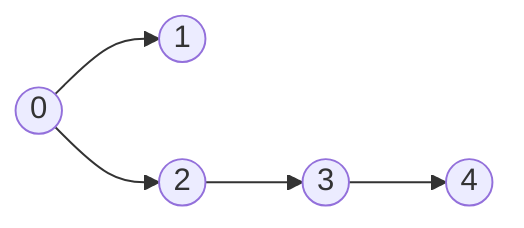
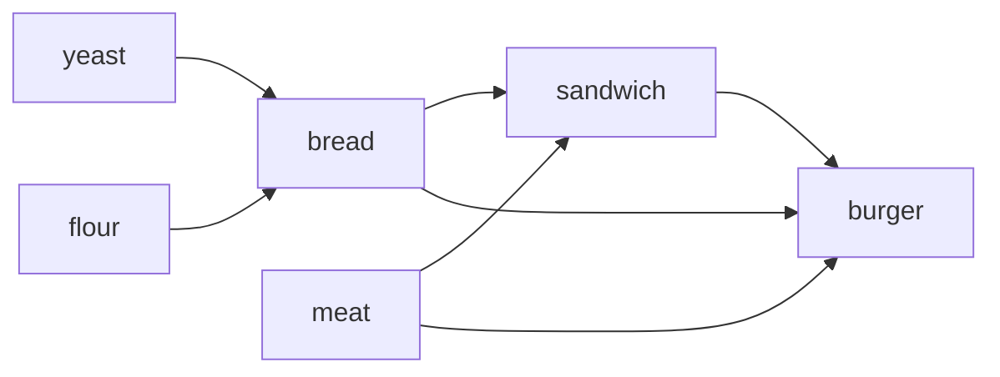

# Topological Sort Pattern

> “Some things must happen before others.”

- It is mainly used on Directed Acyclic Graphs (DAGs).

## 1. How to Identify Topological Sort Problems

Look for these clues:

1. dependency
2. prerequisite
3. order of execution
4. scheduling
5. build system
6. course prerequisites
7. alien dictionary
8. can finish all tasks?
9. before/after constraints
10. derive ordering
11. minimum semesters
12. parallel tasks

## 2. Core Recognition Trick

If the problem says:
>  “A must happen before B”

Think:  A → B ==> This becomes a directed edge.

Then ask:
1. Can cycles exist?
2. If cycle exists → impossible
3. Else → topological ordering exists

## 3. Two Main Algorithms

### A) Kahn’s Algorithm (BFS Topological Sort)

Most important for interviews.

Idea
1. Compute indegree of every node
2. Push all indegree 0 nodes into queue
3. Remove them one by one
4. Reduce indegree of neighbors

> [!IMPORTANT]
> We start from node with indegree 0
>
> Means a node does not have imcomming edge, 
>
>               only have outgoing edges
>               It becomes the starting node
>   

```cpp
vector<int> topoSort(int n, vector<vector<int>>& edges) {
    vector<vector<int>> g(n);
    vector<int> indegree(n, 0);

    for(auto &e: edges) {
        int u = e[0], v = e[1];
        g[u].push_back(v);
        indegree[v]++;
    }

    queue<int> q;

    for(int i=0; i<n; i++) {
        if(indegree[i] == 0)
            q.push(i);
    }

    vector<int> topo;

    while(!q.empty()) {
        int u = q.front();
        q.pop();

        topo.push_back(u);

        for(int v: g[u]) {
            indegree[v]--;

            if(indegree[v] == 0)
                q.push(v);
        }
    }

    // cycle check
    if(topo.size() != n)
        return {};

    return topo;
}
/*
BFS traversal

Each:
node enters queue once
edge processed once

So: O(V + E)
*/
```

> [!NOTE]
> Lexicographically Smallest Topo -- sometime asked in interviews:
>
> Use:
>
>               priority_queue<int, vector<int>, greater<int>>

### B) DFS Topological Sort

Idea
Postorder DFS.

1. Explore children first
2. Push node after recursion
3. Reverse answer

Useful in:
- Alien Dictionary
- DP on DAG
- Memoization + topo

---

## 1. Course Schedule
[Leetcode link](https://leetcode.com/problems/course-schedule/description/)

There are a total of numCourses courses you have to take, labeled from 0 to numCourses - 1. 
You are given an array prerequisites where prerequisites[i] = [ai, bi] indicates that you must 
take course bi first if you want to take course ai.

For example, the pair [0, 1], indicates that to take course 0 you have to first take course 1.
Return true if you can finish all courses. Otherwise, return false.

> Input: numCourses = 2, prerequisites = [[1,0]]
> Output: true

> Input: numCourses = 2, prerequisites = [[1,0],[0,1]]
> Output: false

### Intuition
> [!IMPORTANT]
> 
>               If there is a cycle we cannot complete all courses
>               
>               To detect a cycle find the topo-sort of course
>               if topo.size() != n then return false

```cpp
bool canFinish(int numCourses, vector<vector<int>>& prerequisites) {
    // there must not be a cycle
    // topo sort must exist

    int n = numCourses;
    vector<vector<int>> adj(n, vector<int>());
    vector<int> indegree(n);

    for(auto p : prerequisites) {
        int u = p[0], v = p[1];

        adj[u].push_back(v);
        indegree[v]++;
    }

    queue<int> q;
    for(int i=0; i<n; i++)
        if(indegree[i] == 0) // push all indegree 0 node to queue
            q.push(i);

    vector<int> topo;       // find the topo order
    while(!q.empty()) {
        int u = q.front();
        q.pop();

        topo.push_back(u);

        for(int v : adj[u]) {
            indegree[v]--;

            if(indegree[v] == 0) q.push(v);
        }
    }

    return topo.size() == n;
}
```

---

## 2. Course Schedule II
[Leetcode link](https://leetcode.com/problems/course-schedule-ii/description/)

Now return the order in which you can complete the courses.

> Input: numCourses = 4, prerequisites = [[1,0],[2,0],[3,1],[3,2]]
> Output: [0,2,1,3]

```cpp
vector<int> findOrder(int numCourses, vector<vector<int>>& prerequisites) {
        
    int n = numCourses;
    vector<vector<int>> adj(n);
    vector<int> indegree(n, 0);

    for(auto p : prerequisites) {
        int u = p[1], v = p[0];

        adj[u].push_back(v);
        indegree[v]++;
    }

    queue<int> q;
    for(int i=0; i<n; i++)
        if(indegree[i] == 0)
            q.push(i);
    
    vector<int> topo;
    while(!q.empty()) {
        int u = q.front();
        q.pop();

        topo.push_back(u);

        for(int v : adj[u]) {
            indegree[v]--;

            if(indegree[v] == 0)
                q.push(v);
        }
    }

    if(topo.size() != n) return {}; // there is a cycle
    return topo;
}
```

## 3. Alien Dictionary
[GFG link](https://www.geeksforgeeks.org/problems/alien-dictionary/1)

However, if the given arrangement of words is inconsistent with any possible letter ordering, return an empty string ("").

A string a is lexicographically smaller than a string b if, at the first position where they differ, 
the character in a appears earlier in the alien language than the corresponding character in b. If all 
characters in the shorter word match the beginning of the longer word, the shorter word is considered smaller.

Input: 
- words[] = ["baa", "abcd", "abca", "cab", "cad"]
Output: 
- true
Explanation: 
- A possible correct order of letters in the alien dictionary is "bdac".
- The pair "baa" and "abcd" suggests 'b' appears before 'a' in the alien dictionary.
- The pair "abcd" and "abca" suggests 'd' appears before 'a' in the alien dictionary.
- The pair "abca" and "cab" suggests 'a' appears before 'c' in the alien dictionary.
- The pair "cab" and "cad" suggests 'b' appears before 'd' in the alien dictionary.
- So, 'b' → 'd' → 'a' → 'c' is a valid ordering.

```cpp
string findOrder(vector<string> &words) {
    // code here
    vector<bool> exists(26, false);
    for(string &w : words) {
        for(char ch : w) {
            exists[ch - 'a'] = true;
        }
    }
    
    vector<set<int>> adj(26);
    vector<int> indegree(26, 0);
    for(int i=1; i<words.size(); i++) {
        string a = words[i-1], b = words[i];
        
        if(a.size() > b.size() && a.substr(0, b.size()) == b) // Invalid case
            return "";
            
        int len = min(a.size(), b.size());
        for(int j = 0; j < len; j++) {
            if(a[j] != b[j]) {
                int u = a[j] - 'a';
                int v = b[j] - 'a';
                
                // check if we already pushed this edge
                if(adj[u].count(v)) break;
                adj[u].insert(v);
                indegree[v]++;
                
                break;
            }
        }
    }
    
    
    queue<int> q;
    int totalChars = 0;
    for(int i=0; i<26; i++) {
        if(exists[i]) {
            totalChars++;
            
            if(indegree[i] == 0) q.push(i);
        }
    }
            
    string topo = "";
    while(!q.empty()) {
        int u = q.front();
        q.pop();
        
        topo += ('a' + u);
        
        for(int v : adj[u]) {
            indegree[v]--;
            
            if(indegree[v] == 0) q.push(v);
        }
    }
    
    if(topo.size() != totalChars) return "";
    return topo;
}
```

---

## 4. Parallel Courses III
[Leetcode link](https://leetcode.com/problems/parallel-courses-iii/description/)

relations[j] = [prevCoursej, nextCoursej] denotes that course prevCoursej has to be completed before course nextCoursej
time[i] denotes how many months it takes to complete the (i+1)th course.

You must find the minimum number of months needed to complete all the courses following these rules:

- You may start taking a course at any time if the prerequisites are met.
- Any number of courses can be taken at the same time.
> Return the minimum number of months needed to complete all the courses.

Input: 
> n = 3, relations = [[1,3],[2,3]], time = [3,2,5]

Output: 
> 8

Explanation: 

The figure above represents the given graph and the time required to complete each course. 
We start course 1 and course 2 simultaneously at month 0.
Course 1 takes 3 months and course 2 takes 2 months to complete respectively.
Thus, the earliest time we can start course 3 is at month 3, and the total time required is 3 + 5 = 8 months.

### Intuition
> [!IMPORTANT]
> 
>               The order matters: So we need topo sort
>
>               lets say dp[u] = maximum time to finish course u
>               if there is an edge u---> v
>                   finish[v] = max(finish[v], finish[u] + time[v])
>
>               In other words:
>               finish[v] = time[v] + max time to compelete all prerequisits
>               all courses with indegree 0 ==> dp[u] = time[u]
>
>               topo-sort + dp

```cpp
int minimumTime(int n, vector<vector<int>>& relations, vector<int>& time) {
        vector<int> indegree(n, 0);
        vector<vector<int>> adj(n);

        for(auto &r : relations) {
            int u = r[0]-1, v = r[1]-1;

            adj[u].push_back(v);
            indegree[v]++;
        }

        queue<int> q;
        vector<int> dp(n, INT_MIN);
        for(int i=0; i<n; i++) {
            if(indegree[i] == 0) {
                q.push(i);
                dp[i] = time[i]; // starting course, no prereq
            }
        }

        vector<int> topo;
        while(!q.empty()) {
            int u =q.front();
            q.pop();

            topo.push_back(u);

            for(int v : adj[u]) {
                dp[v] = max(dp[v], dp[u] + time[v]);
                indegree[v]--;
                if(indegree[v] == 0) {
                    q.push(v);
                }
            }
        }

        if(topo.size() != n) return -1; // there is a cycle, no possible to finish
        int ans = INT_MIN;
        for(int a : dp) ans = max(ans, a);

        return ans;
    }
```

---

## 5. Find Eventual Safe States
[Leetcode link](https://leetcode.com/problems/find-eventual-safe-states/description/)

There is a directed graph of n nodes with each node labeled from 0 to n - 1. The graph is 
represented by a 0-indexed 2D integer array graph where graph[i] is an integer array of 
nodes adjacent to node i, meaning there is an edge from node i to each node in graph[i].

A node is a terminal node if there are no outgoing edges. A node is a safe node if every 
possible path starting from that node leads to a terminal node (or another safe node).

> Return an array containing all the safe nodes of the graph. The answer should be sorted in ascending order.

### Intuition
> [!IMPORTANT]
>
> We can start from terminal nodes
> - Ignore all nodes that forms a cycle --> there will be no terminal nodes
> - every node reachable from terminal nodes is safe node
>
>                 reverse the graph
>                 start from all indegree 0 nodes in reversed_graph
>                 keep expanding using topo-sort
>
>                 We implicitly removed cyclic nodes by only starting from indegree 0 nodes

```cpp
vector<int> eventualSafeNodes(vector<vector<int>>& graph) {
    int n = graph.size();
    vector<vector<int>> reverseGraph(n);
    vector<int> outdegree(n, 0);

    for(int i=0; i<n; i++) {
        for(int j=0; j<graph[i].size(); j++) {
            int u = i, v = graph[i][j];

            reverseGraph[v].push_back(u);
            outdegree[u]++;
        }
    }

    queue<int> q;
    for(int i=0; i<n; i++)
        if(outdegree[i] == 0)
            q.push(i);
    
    vector<int> topo;
    while(!q.empty()) {
        int u = q.front();
        q.pop();

        topo.push_back(u);

        for(int v : reverseGraph[u]) {
            outdegree[v]--;
            if(outdegree[v]==0) q.push(v);
        }
    }

    sort(topo.begin(), topo.end());
    return topo;
}
```

---

## 6. Sort Items by Groups Respecting Dependencies
[Leetcode link](https://leetcode.com/problems/sort-items-by-groups-respecting-dependencies/description/)


There are n items each belonging to zero or one of m groups where group[i] is the group that
 the i-th item belongs to and it's equal to -1 if the i-th item belongs to no group. 
 The items and the groups are zero indexed. A group can have no item belonging to it.

> Return a sorted list of the items such that:

- The items that belong to the same group are next to each other in the sorted list.
- There are some relations between these items where beforeItems[i] is a list containing 
    all the items that should come before the i-th item in the sorted array (to the left of the i-th item).

> Return any solution if there is more than one solution and return an empty list if there is no solution.

Input: 
- n = 8, m = 2, group = [-1,-1,1,0,0,1,0,-1], beforeItems = [[],[6],[5],[6],[3,6],[],[],[]]

Output: 
- [6,3,4,1,5,2,0,7]

graph: 6 --> 1, 5 --> 2, 3 --> 4
       6 --> 3
       6 --> 4

groups = 0(3, 4, 6) A
         1(2, 5)    B
         3(0)       C
         4(1)       D
         5(7)       E

### Intuition
> [!IMPORTANT]
> If we have an edge u(group A) --> v(group B)
>
>               means u comes before v
>               Which also means group A comes before group B
>
> So we need to find the topo sort of Groups
>
>           Suppose we find A --> D --> B --> C --> E
>       
> Now for each group we construct graph and find its topo sort
>
>                   A(6, 3, 4) --> D(1) --> B(5, 2) --> C(0) --> E(7)
>
>           Time  = O(n * (n + E))
>
>           But instead of computing topo sort for each group
>               Just compute one topo sort golablly
>               and then map then on topo sort of groups
>
> Algo:
>               
>           1. find total groups
>           2. Assign group number to all -1
>           3. Make two graphs adj and adjGroup
>           4. find topo of groups
>           5. find topo of all items
>           6. Create group to items mapping from topo of all items
>           7. Extend topo of groups with correct items from mapping   
>
>           Time = O(n + E)

```cpp
vector<int> toposort(int n, vector<vector<int>>&adj, vector<int>&indegree) {
    queue<int> q;
    for(int i=0; i<n; i++) {
        if(indegree[i] == 0)
            q.push(i);
    }

    vector<int> topo;
    while(!q.empty()) {
        int u = q.front();
        q.pop();
        topo.push_back(u);

        for(int v : adj[u]) {
            indegree[v]--;
            if(indegree[v] == 0) q.push(v);
        }
    }

    return topo;
}
vector<int> sortItems(int n, int m, vector<int>& group, vector<vector<int>>& beforeItems) {
    // find total groups
    int totalGroups = m;
    int groupId = m;
    for(int i=0; i<group.size(); i++) {
        int g = group[i];
        if(g == -1) {
            group[i] = groupId++;
            totalGroups++;
        }
    }

    // Make items and groups graph
    vector<vector<int>> adj(n);
    vector<vector<int>> adjGroup(totalGroups);

    vector<int> indegree(n, 0);
    vector<int> indegreeGroup(totalGroups, 0);

    for(int v=0; v<beforeItems.size(); v++) {
        int groupV = group[v]; 
        for(int u : beforeItems[v]) {
            adj[u].push_back(v);
            indegree[v]++;

            int groupU = group[u];
            if(groupV != groupU) {
                adjGroup[groupU].push_back(groupV);
                indegreeGroup[groupV]++;
            }
        }
    }

    // topo sort items
    vector<int> topo = toposort(n, adj, indegree);
    if(topo.size() != n) return {};

    // topo sort group
    vector<int> topoGroup = toposort(totalGroups, adjGroup, indegreeGroup);
    if(topoGroup.size() != totalGroups) return {};

    // mapping from group to sorted items
    vector<vector<int>> topoGroupMap(totalGroups);
    for(int item : topo) {
        int g = group[item];
        topoGroupMap[g].push_back(item);
    }

    vector<int> ans;
    for(int g : topoGroup) {
        for(int item : topoGroupMap[g]) {
            ans.push_back(item);
        }
    }

    return ans;

}   
```

---

## 7. Loud and Rich
[Leetcode link](https://leetcode.com/problems/loud-and-rich/description/)

You are given an array richer where richer[i] = [ai, bi] indicates that ai has more money than bi

an integer array quiet where quiet[i] is the quietness of the ith person

Return an integer array answer where answer[x] = y
y is the quitest person among all person richer or equal than x

### intuition
> [!IMPORTANT]
> for every person i = (0...n-1) we need to find
>                who are richer than i
>                and among those we need to pick the quitest person
>            
>            for i=0, 0th person
>                richer are = (5, 3, 1, 0)
>                quite level = (1, 4, 2, 3)
>
>                so 5th is the quitest => ans[0] = 5
>
> Given richer [[1, 0], [2, 1]..]
> - 1 is richer than 0
>
>           we can make graph like : 0 --> 1, 1 --> 2
>
>           u --> v            v is richer than u
>            so adj[u] == all persons richer than u
>
>
>           Now for every i = (0,...n-1)
>                find all adj[i] ==> richer
>                pick the quitest 
>
>           So for each person --> do dfs and find quitest
>           Time = O(n * (N+E))
>
>           IF we have path like
>            1 --> 0 --> 3 --> 2
>            2 is most richest
>
>            so ans[2] = quite[2]
>            ans[3] = quiter among(3, 2)
>            ans[0] = quiter among(0, 3)
>            ans[1] = quiter among(1, 0)
>
>            so toposort and dp
>            we find topo sort then from the end of toposort we start computing answers
>            when processing u, all richer neighbors v
>               already have ans[v]
>
>           toposort + dp

```cpp
vector<int> loudAndRich(vector<vector<int>>& richer, vector<int>& quiet) {
       
    int n = quiet.size();
    vector<vector<int>> adj(n);
    vector<int> indegree(n, 0);

    for(auto r : richer) {
        int u = r[1], v = r[0];
        adj[u].push_back(v);
        indegree[v]++;
    }

    vector<int> topo = topoOrder(n, adj, indegree);

    vector<int> ans(n, 0);
    for(int i=n-1; i>=0; i--) { // starting from end of topo sort
        int u = topo[i];
        ans[u] = u;

        // find all richer
        for(int v : adj[u]) {
            if(quiet[ans[v]] < quiet[ans[u]])
                ans[u] = ans[v];
        }
    }

    return ans;
}
```

---

## 8. LeetCode 444 — Sequence Reconstruction
[GFG links](https://www.geeksforgeeks.org/dsa/shortest-supersequence-by-sequence-reconstruction/)

Given an array nums of size n which is permitation of elements 0 to n-1
Given an array of subsequences, 

return true:    
> if there is a shortes supersequence which contains all subsequences 

> and this supersequence is unique and is equal to given array nums

Input: 
- arr = {1,2,3}, sequences = {{1,2},{1,3}}
Output: 
- false

Explanation: There are two possible supersequences: {1,2,3} and {1,3,2}.
- The sequence {1,2} is a subsequence of both: {1,2,3} and {1,3,2}.
- The sequence {1,3} is a subsequence of both: {1,2,3} and {1,3,2}.
- As arr is not the only shortest supersequence, the output is false.

Input: 
- arr = {1,2,3}, sequences = {{1,2},{1,3}, {1,2,3}}
Output: 
- true

### Intuition
> [!IMPORTANT]
> The solution can be found the way topological sort is created
>
> If at any point of time the queue has more then 1 elements 
>
>           Which means more then one elements with indegree = 0
>           Means there can be more than one permutations
>           Which will result in more than one supersequence

```cpp
bool sequenceReconstruction(vector<int>& nums, vector<vector<int> >& sequences) {
    int n = nums.size();

    vector<vector<int> > adj(n+1);
    vector<int> indegree(n+1, 0);

    // Build the dependency graph
    for (auto& seq : sequences) {
        for (int j = 0; j < seq.size() - 1; j++) {
            int u = seq[j], v = seq[j+1];

            adj[u].push_back(v]);
            indegree[v]]++;
        }
    }

    queue<int> q;
    for (int i = 1; i <= n; i++) {
        if (indegree[i] == 0) {
            q.push(i);
        }
    }

    // If there are multiple elements with indegree 0, it's
    // not the only supersequence
    if (q.size() > 1) {
        return false;
    }

    vector<int> topo;
    while (q.size()) {
        auto u = q.front();
        q.pop();
        topo.push_back(u);

        for (auto v : adj[u]) {
            indegree[v]--;
            if (indegree[v] == 0) 
                q.push(v);
        }

        // If there are multiple elements ready at the same
        // time, it's not the only supersequence
        if (q.size() > 1) {
            return false;
        }
    }

    return (topo == nums);
}
```

---

## 9. Largest Color Value in a Directed Graph
[Leetcode link](https://leetcode.com/problems/largest-color-value-in-a-directed-graph/description/)

string colors where colors[i] is a lowercase English letter representing the color of the ith node in this graph 

2D array edges where edges[j] = [aj, bj] indicates that there is a directed edge from node aj to node bj.

Return the largest color value of any valid path in the given graph, or -1 if the graph contains a cycle.



Input: 
- colors = "abaca", edges = [[0,1],[0,2],[2,3],[3,4]]
Output: 
- 3

> Explanation: The path 0 -> 2 -> 3 -> 4 contains 3 nodes that are colored "a" (red in the above image).

### Intuition
> [!IMPORTANT]
> For each element:
>       
>           Run DFS, keep track of encountered frequencies
>               pick the max one
>
>           Time = O(n * (N + E))
>
> If we find the toposort
>
>           0, 1, 2, 3, 4
>
>           For node 4 there is only one color, 
>           dp[4][a] = 1
>
> Now we process node 3:
> 
>           Now for node 3, we already know freqencies for node 4
>           So it becomes easy to calculate freqencies for node 3
>                   Since we can use prev frequencies                   
>
>           Time = O(N+E)
>
>           toposort + DP

```cpp
int largestPathValue(string colors, vector<vector<int>>& edges) {
        
    int n = colors.size();
    vector<vector<int>> adj(n);
    vector<int> indegree(n, 0);

    for(auto e: edges) {
        int u = e[0], v = e[1];
        adj[u].push_back(v);
        indegree[v]++;
    } 

    vector<int> topo = toposort(n, adj, indegree);
    if(topo.size() != n) return -1;

    vector<vector<int>> freq(n, vector<int>(26, 0)); // freq[u] = frequencies of all node's color that start from u
    int ans = 0;

    for(int i=n-1; i>=0; i--) {
        int u = topo[i];
        int color = colors[u] - 'a';

        for(int v : adj[u]) {
            for(int j=0; j<26; j++) {
                freq[u][j] = max(freq[u][j], freq[v][j]);
            } 
        }

        freq[u][color]++;

        int maxFreq = 0;
        for(int i=0; i<26; i++)
            maxFreq = max(maxFreq, freq[u][i]);
        
        ans = max(ans, maxFreq);
    }

    return ans;
}
```

---

## 10. Find All Possible Recipes from Given Supplies
[Leetcode link](https://leetcode.com/problems/find-all-possible-recipes-from-given-supplies/description/)

You are given a string array recipes and a 2D string array ingredients

The ith recipe has the name recipes[i], and you can create it if you have 
all the needed ingredients from ingredients[i]

A recipe can also be an ingredient for other recipes.

You are also given a string array supplies containing all the ingredients that you initially have, 
and you have an infinite supply of all of them.

> Return a list of all the recipes that you can create. You may return the answer in any order.

Input: 
- recipes = ["bread","sandwich","burger"], 
- ingredients = [["yeast","flour"],["bread","meat"],["sandwich","meat","bread"]], 
- supplies = ["yeast","flour","meat"]

Output: 
- ["bread","sandwich","burger"]



### Intuition
> [!IMPORTANT]
> Graph:
>
>           yeast -> bread, flour -> bread, 
>           bread -> sandwich, mead -> sandwich
>           sandwich -> burger, meat -> burger, bread -> burger
>
>           We can start toposort from what we have in supplies
>           If we see indegree[recipe] == 0
>                   That means that recipe can be made

```cpp
vector<string> findAllRecipes(vector<string>& recipes, vector<vector<string>>& ingredients, vector<string>& supplies) {
    unordered_map<string, vector<string>> adj;
    unordered_map<string, int> indegree;

    for(string &recipe : recipes)
        indegree[recipe] = 0;
    
    for(int i=0; i<recipes.size(); i++) {
        string recipe = recipes[i];

        for(string &ing : ingredients[i]) {
            adj[ing].push_back(recipe);
            indegree[recipe]++;
        }
    }

    queue<string> q;
    for(string &supply: supplies)
        q.push(supply);
    
    vector<string> ans;
    while(!q.empty()) {
        string u = q.front();
        q.pop();

        for(string v : adj[u]) {
            indegree[v]--;

            if(indegree[v] == 0) {
                ans.push_back(v);
                q.push(v);
            }
        }
    }

    return ans;
}
```

---

## 11. Build a Matrix With Conditions
[Leetcode link](https://leetcode.com/problems/build-a-matrix-with-conditions/description/)

a 2D integer array rowConditions of size n where rowConditions[i] = [a, b], 
a 2D integer array colConditions of size m where colConditions[i] = [l, r].

meaning a should come above b
l should come left of r

We need to build k*k matrics with item from 1 to k such that each row and col will have only one item.

Input: 
- k = 3, 
- rowConditions = [[1,2],[3,2]], 
- colConditions = [[2,1],[3,2]]

Output: 
[[3,0,0],
[0,0,1],
[0,2,0]]

### Intuition
> [!IMPORTANT]
>
> 1 should be above 2, 3 should be above 2
>
> 2 should be left of 1, e should be left of 2
>
> Ordering problem: we can use toposort
>
>               topoSort row = 3, 1, 2
>               topoSort col = 3, 2, 1
>
>               3(0, 0), 1(1, 2), 2(2, 1) ==> final answer

```cpp
vector<vector<int>> buildMatrix(int k, vector<vector<int>>& rowConditions, vector<vector<int>>& colConditions) {
    vector<vector<int>> adjRow(k+1);
    vector<int> indegreeRow(k+1, 0);
    for(auto &rd : rowConditions) {
        int u = rd[0], v = rd[1];
        adjRow[u].push_back(v);
        indegreeRow[v]++;
    }

    vector<int> topoRow = toposort(k+1, adjRow, indegreeRow);
    if(topoRow.size() != k) return {};

    vector<vector<int>> adjCol(k+1);
    vector<int> indegreeCol(k+1, 0);
    for(auto &cd : colConditions) {
        int u = cd[0], v = cd[1];
        adjCol[u].push_back(v);
        indegreeCol[v]++;
    }

    vector<int> topoCol = toposort(k+1, adjCol, indegreeCol);
    if(topoCol.size() != k) return {};

    vector<int> rowAns(k+1, 0);
    vector<int> colAns(k+1, 0);
    for(int i=0; i<k; i++) {
        rowAns[topoRow[i]] = i;
        colAns[topoCol[i]] = i;
    }

    vector<vector<int>> ans(k, vector<int>(k, 0));
    for(int i=1; i<=k; i++) {
        ans[rowAns[i]][colAns[i]] = i;
    }

    return ans;
}
```