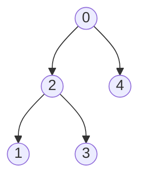
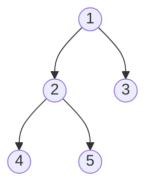
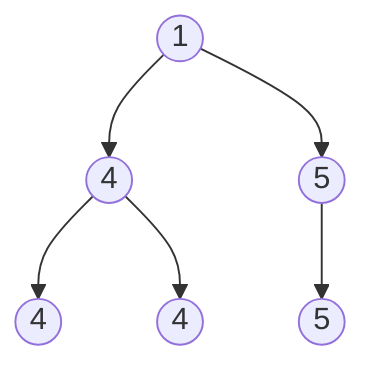

# DP on Trees

How to identify Tree DP

Ask:

> "Do I need information from children to compute the answer for a parent?"

> If yes → Tree DP is likely.

State is : dp[node]
and dp[node] depends on children dp[chil1], dp[child2]...

```
      1
    / | \
   2  3  4

To calculate node 1

We need:
dp[2]
dp[3]
dp[4]
```

## Generic template

```cpp
vector<int> adj[N];
vector<int> dp(N);

void dfs(int node, int parent) {

    for(auto child: adj[node]) {

        if(child == parent)
            continue;

        dfs(child,node);

        // merge child contribution
        dp[node] += dp[child];
    }
}
```

> [!IMPORTANT]
> Pattern:
>
>           Compute children
>           Merge children
>           Return result upward
>
>   State per node? Think:
>
>           "What information should every node send to its parent?"

---

# CASE 1: Subtree DP

> State depends only on subtree.

## 1. Count Nodes With the Highest Score
[Leetcode link](https://leetcode.com/problems/count-nodes-with-the-highest-score/description/)

The nodes are labeled from 0 to n - 1.
where parents[i] is the parent of node i. Since node 0 is the root, parents[0] == -1.

Each node has a score. To find the score of a node, consider if the node and the edges 
connected to it were removed. The tree would become one or more non-empty subtrees. The 
size of a subtree is the number of the nodes in it. The score of the node is the product
of the sizes of all those subtrees.

> Return the number of nodes that have the highest score.



Input: parents = [-1,2,0,2,0]

Output: 3

Explanation:
- The score of node 0 is: 3 * 1 = 3
- The score of node 1 is: 4 = 4
- The score of node 2 is: 1 * 1 * 2 = 2
- The score of node 3 is: 4 = 4
- The score of node 4 is: 4 = 4
The highest score is 4, and three nodes (node 1, node 3, and node 4) have the highest score.

### Intuition
> [!IMPORTANT]
>  score[i] = size of left tree * size of right tree * (n - size of tree whose node is i)
>
> So we just need to find the size of each node
>
> size[node] = size[left node] + size[right node] + 1
>
>               State dp[node] = size of node
>
> Transition:
>
>               get size of childs
>               dp[node] = dp[child1] + dp[child2] + 1;

```cpp
class Solution {
    vector<int> dp;
    int n;
    vector<vector<int>> child;
public:
    int dfs(int node) {
        int size = 1;

        for(int ch : child[node]) {
            size += dfs(ch);
        }
        return dp[node] = size;
    }

    int countHighestScoreNodes(vector<int>& parents) {
       
        this->n = parents.size();
        child.resize(n);
        dp.resize(n);

        for(int i=1; i<n; i++) {
            //parent[i] is parent of i
            child[parents[i]].push_back(i);
        }

        dfs(0); // compute dp

        vector<long long> score(n, 0);
        long long maxScore = 0;

        for(int i=0; i<n; i++) {
            long long sco = 1;

            for(int ch: child[i]) {
                sco *= dp[ch];
            }

            long long rem = n - dp[i];
            if(rem > 0) sco *= rem;

            score[i] = sco;
            maxScore = max(maxScore, score[i]);
        }

        int ans = 0;
        for(long long sco : score) {
            if(sco == maxScore)
                ans++;
        }

        return ans;
    }
};
```

---

## 2. Distribute Coins in Binary Tree
[Leetcode link](https://leetcode.com/problems/distribute-coins-in-binary-tree/description/)

You are given the root of a binary tree with n nodes where each node in the tree has node.val coins. 
There are n coins in total throughout the whole tree.

In one move, we may choose two adjacent nodes and move one coin from one node to another. 
A move may be from parent to child, or from child to parent.

Return the minimum number of moves required to make every node have exactly one coin.

> Input: root = [3,0,0]
>
> Output: 2
>
> Explanation: From the root of the tree, we move one coin to its left child, and one coin to its right child.

> Input: root = [0,3,0]
>
> Output: 3
>
> Explanation: From the left child of the root, we move two coins to the root [taking two moves]. Then, we move one coin from the root of the tree to the right child.


### Intuition
> [!IMPORTANT]
> There are n nodes and n coins
>
>               So every node must have one coin
>
> For a node:
>
>           1. it can send coins to child
>           2. it can receive from child
>
> Always get the children first:
>
>           A child can either receive coins from parent
>                   or send coins to parent
>
>           A child sends child->val - 1 coins to parent
>                   ans += abs(child->val - 1)
>
>           Now the parent has   root->val + leftRes + rightRes coins
>
> dp[node] = coins required to make node having only 1 coin
>
>           dp[node] = node->val + dp[left] + dp[right] - 1
>
>           everyTime ans += abs(dp[node])  

```cpp
lass Solution {
    int ans = 0;
public:
    int dfs(TreeNode* root) {
        if(!root) return 0; 

        int l = dfs(root->left);
        int r = dfs(root->right);

        ans += abs(l+r+root->val - 1);

        return (l+r+root->val) - 1;
    }

    int distributeCoins(TreeNode* root) {
        
        this->ans = 0;
        dfs(root);
        return ans;
    }
};
```

# CASE 2: Take or Skip DP

## 1. House Robber III
[Leetcode link](https://leetcode.com/problems/house-robber-iii/description/)

After a tour, the smart thief realized that all houses in this place form a binary tree. 
It will automatically contact the police if two directly-linked houses were broken into on the same night.

Given the root of the binary tree, return the maximum amount of money the thief can rob without alerting the police.

> Input: root = [3,2,3,null,3,null,1]
> Output: 7
> Explanation: Maximum amount of money the thief can rob = 3 + 3 + 1 = 7.

### Intuition
> [!IMPORTANT]
> at each node we have two choices take or skip
>
> these choices affects our further choices
> 
>           If we take current node, then we have to skip the child nodes
>           If we skip the current node, then we can take or skip the child nodes
>
>           dp[node][0] = take
>           dp[node][1] = skip
>
>           take = val + skip(left) + skip(right)
>           skip = max(skip(left), take(left)) + max(skip(right), take(right))

```cpp
class Solution {
public:
    pair<int, int> dfs(TreeNode* root) {
        if(!root) return {0, 0};

        auto [takeLeft, skipLeft] = dfs(root->left);
        auto [takeRight, skipRight] = dfs(root->right);

        int take = root->val + skipLeft + skipRight;
        int skip = max(takeLeft, skipLeft) + max(takeRight, skipRight);

        return {take, skip};
    }

    int rob(TreeNode* root) {
       
        auto [take, skip] = dfs(root);
        return max(take, skip);
    }
};
```

---

## 2. Binary Tree Cameras
[Leetcode link](https://leetcode.com/problems/binary-tree-cameras/description/)

- Input: root = [0,0,null,0,0]
- Output: 1
Explanation: One camera is enough to monitor all nodes if placed as shown.

- Input: root = [0,0,null,0,null,0,null,null,0]
- Output: 2
Explanation: At least two cameras are needed to monitor all nodes of the tree. The above image shows one of the valid configurations of camera placement.

### Intuition
> [!IMPORTANT]
> A node can have three states:
>
>               0: Need camera
>               1: has camera
>               2: covered
>
> Node for a node:
>
>                   if state[leftChild] == 0 || state[rightChild] == 0
>                   (left child need camera or right child need camera)
>                       Then we need to install camera at current node
>                       so camera++
>                       state[node] = 1
>
>                   if state[leftChild] == 1 || state[rightChild] == 1
>                   (left child has camera or right child has camera)
>                       Then current node is covered
>                       so state[node] = 2
>
>                   otherwise
>                       the current node need camera
>                       so state[node] = 0

```cpp
class Solution {
    int camera;
public:
    int dfs(TreeNode* root) {
        if(!root) return 2;

        int l = dfs(root->left);
        int r = dfs(root->right);

        if(l == 0 || r == 0) { // left or right need camera
            camera++;       // add camera at current node
            return 1;       // curr node has camera
        }

        if(l == 1 || r == 1) { // if left or right have camera
            return 2;      // curr node is covered
        }

        return 0;
    }
    
    int minCameraCover(TreeNode* root) {
        /*
            a node can have 3 states:
            0 ==> need camera
            1 ==> has camera
            2 ==> covered
        */
        this->camera = 0;
        int state = dfs(root);

        if(state == 0) camera++;
        return camera;
    }
};
```

---

# CASE 3: Longest path dp

## 1. Diameter of Binary Tree
[Leetcode link](https://leetcode.com/problems/diameter-of-binary-tree/description/)

Given the root of a binary tree, return the length of the diameter of the tree.

The diameter of a binary tree is the length of the longest path between any two nodes in a tree. 
This path may or may not pass through the root.

The length of a path between two nodes is represented by the number of edges between them.



- Input: root = [1,2,3,4,5]
- Output: 3
- Explanation: 3 is the length of the path [4,2,1,3] or [5,2,1,3].

### Intution
> [!IMPORTANT]
> For a node
>
>               ans = left longest path downwards + right longest path downwards + 1
>
> So we need to find max path including current node in the downwards direction
>
>               dp[node] = max path downward including current node
>
>               dp[node] = 1 + max(dp[left], dp[right])
>
>               for a node : max path = 1 + dp[left] + dp[right]

```cpp
class Solution {
int ans;
public:
    int dfs(TreeNode* root) {
        if(!root) return 0;

        int l = dfs(root->left);
        int r = dfs(root->right);

        ans = max(ans, 1 + l + r);

        return 1 + max(l, r);
    }

    int diameterOfBinaryTree(TreeNode* root) {
        /*
            ans = left longest path downwards + right longest path downwards + 1

            dp[node] = longest path downwards starting at node
            dp[node] = 1 + max(dp[left], dp[right])
        */
        this->ans = 0;
        dfs(root);

        return ans-1;
    }
};
```

---

## 2. Binary Tree Maximum Path Sum
[Leetcode link](https://leetcode.com/problems/binary-tree-maximum-path-sum/description/)

A path in a binary tree is a sequence of nodes where each pair of adjacent nodes in the sequence 
has an edge connecting them. A node can only appear in the sequence at most once. Note that 
the path does not need to pass through the root.

The path sum of a path is the sum of the node's values in the path.

Given the root of a binary tree, return the maximum path sum of any non-empty path.

```mermaid
graph TD
    A((-10))
    B((9))
    C((20))
    D((15))
    E((7))

    A --> B
    A --> C
    C --> D
    C --> E
```

- Input: root = [-10,9,20,null,null,15,7]
- Output: 42
- Explanation: The optimal path is 15 -> 20 -> 7 with a path sum of 15 + 20 + 7 = 42.

### Intuition
> [!IMPORTANT]
> for a node:
>
>           ans = max(  node->val, 
>                       node->val + max path sum including left node, 
>                       node->val + max path sum including right node,
>                       node->val + max Path sum including left node + max path sum including right node
>           )
>
> dp[node] = max path sum downwards starting at node
>
>           dp[node] = max(  node->val,
>                            node->val + dp[left],
>                            node->val + dp[right]
>           )

```cpp
class Solution {
public:
    int ans;

    int dfs(TreeNode* root) {
        if(!root) return 0;

        int l = dfs(root->left);
        int r = dfs(root->right);

        ans = max({
            ans,
            root->val,
            root->val + l,
            root->val + r,
            root->val + l + r
        });

        return max({
            root->val,
            root->val + l,
            root->val + r
        });
    }
    
    int maxPathSum(TreeNode* root) {
        this->ans = INT_MIN;
        dfs(root);

        return ans;
    }
};
```

---

## 3. Longest Univalue Path
[Leetcode link](https://leetcode.com/problems/longest-univalue-path/description/)

Given the root of a binary tree, return the length of the longest path, where each 
node in the path has the same value. This path may or may not pass through the root.

The length of the path between two nodes is represented by the number of edges between them.



- Input: root = [1,4,5,4,4,null,5]
- Output: 2
- Explanation: The shown image shows that the longest path of the same value (i.e. 4).

### Intuition
> [!IMPORTANT]
> For a node:
>
>           ans = 1 
>              if(left->val == node->val) ans += max path starting at node left
>              if(right->val == node->val) ans += max path starting at node right
>
> dp[node] = max path starting at node downwards such all all elements in path == node->val
>
>           dp[node] = 1;
>           if(left->val == node->val) dp[node] = max(dp[node], 1 + dp[left])
>           if(right->val == node->val) dp[node] = max(dp[node], 1 + dp[right])

```cpp
class Solution {
    int ans;
public:
    int dfs(TreeNode* root) {
        if(!root) return 0;

        int l = dfs(root->left);
        int r = dfs(root->right);

        int best = 1;
        if(root->left && root->left->val == root->val) best += l;
        if(root->right && root->right->val == root->val) best += r;

        ans = max(ans, best);

        int res = 1;
        if(root->left && root->left->val == root->val) res = max(res, 1+l);
        if(root->right && root->right->val == root->val) res = max(res, 1+r);

        return res;
    }

    int longestUnivaluePath(TreeNode* root) {
        if(!root) return 0;
        
        this->ans = 0;
        dfs(root);
        return ans-1;

    }
};
```