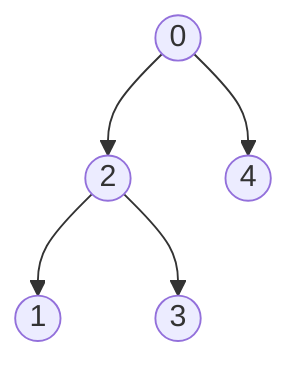
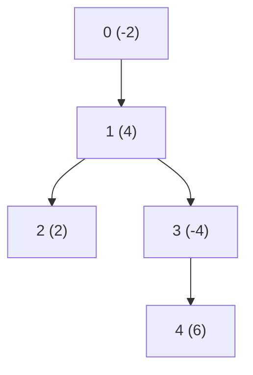
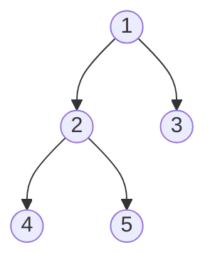
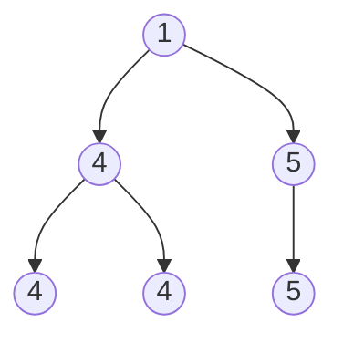
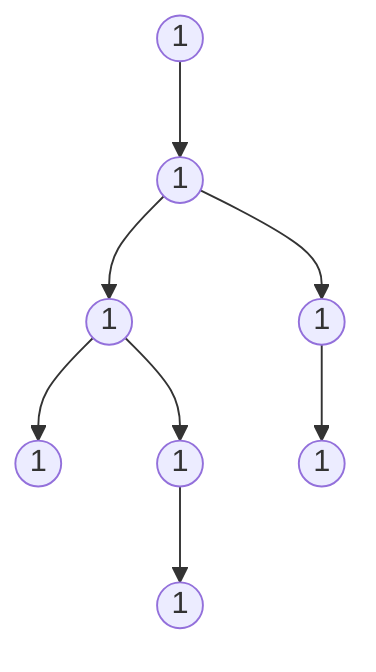
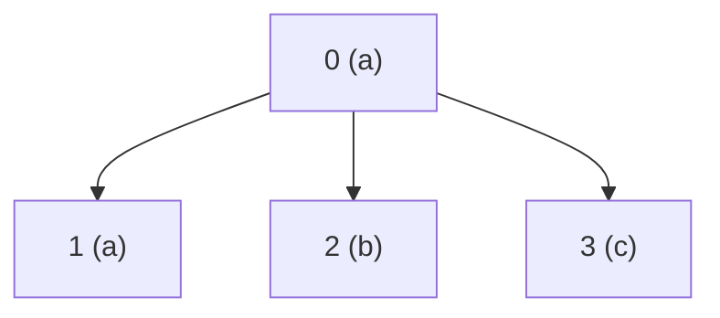
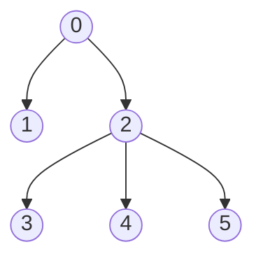
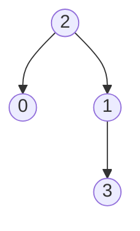
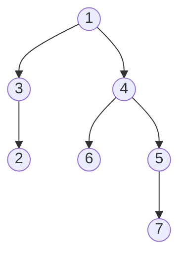

# DP on Trees

How to identify Tree DP

Ask:

> "Do I need information from children to compute the answer for a parent?"

> If yes → Tree DP is likely.

State is : dp[node]
and dp[node] depends on children dp[chil1], dp[child2]...

```
      1
    / | \
   2  3  4

To calculate node 1

We need:
dp[2]
dp[3]
dp[4]
```

## Generic template

```cpp
vector<int> adj[N];
vector<int> dp(N);

void dfs(int node, int parent) {

    for(auto child: adj[node]) {

        if(child == parent)
            continue;

        dfs(child,node);

        // merge child contribution
        dp[node] += dp[child];
    }
}
```

> [!IMPORTANT]
> Pattern:
>
>           Compute children
>           Merge children
>           Return result upward
>
>   State per node? Think:
>
>           "What information should every node send to its parent?"

---

# CASE 1: Subtree DP

> State depends only on subtree.

## 1. Count Nodes With the Highest Score
[Leetcode link](https://leetcode.com/problems/count-nodes-with-the-highest-score/description/)

The nodes are labeled from 0 to n - 1.
where parents[i] is the parent of node i. Since node 0 is the root, parents[0] == -1.

Each node has a score. To find the score of a node, consider if the node and the edges 
connected to it were removed. The tree would become one or more non-empty subtrees. The 
size of a subtree is the number of the nodes in it. The score of the node is the product
of the sizes of all those subtrees.

> Return the number of nodes that have the highest score.



Input: parents = [-1,2,0,2,0]

Output: 3

Explanation:
- The score of node 0 is: 3 * 1 = 3
- The score of node 1 is: 4 = 4
- The score of node 2 is: 1 * 1 * 2 = 2
- The score of node 3 is: 4 = 4
- The score of node 4 is: 4 = 4
The highest score is 4, and three nodes (node 1, node 3, and node 4) have the highest score.

### Intuition
> [!IMPORTANT]
>  score[i] = size of left tree * size of right tree * (n - size of tree whose node is i)
>
> So we just need to find the size of each node
>
> size[node] = size[left node] + size[right node] + 1
>
>               State dp[node] = size of node
>
> Transition:
>
>               get size of childs
>               dp[node] = dp[child1] + dp[child2] + 1;

```cpp
class Solution {
    vector<int> dp;
    int n;
    vector<vector<int>> child;
public:
    int dfs(int node) {
        int size = 1;

        for(int ch : child[node]) {
            size += dfs(ch);
        }
        return dp[node] = size;
    }

    int countHighestScoreNodes(vector<int>& parents) {
       
        this->n = parents.size();
        child.resize(n);
        dp.resize(n);

        for(int i=1; i<n; i++) {
            //parent[i] is parent of i
            child[parents[i]].push_back(i);
        }

        dfs(0); // compute dp

        vector<long long> score(n, 0);
        long long maxScore = 0;

        for(int i=0; i<n; i++) {
            long long sco = 1;

            for(int ch: child[i]) {
                sco *= dp[ch];
            }

            long long rem = n - dp[i];
            if(rem > 0) sco *= rem;

            score[i] = sco;
            maxScore = max(maxScore, score[i]);
        }

        int ans = 0;
        for(long long sco : score) {
            if(sco == maxScore)
                ans++;
        }

        return ans;
    }
};
```

---

## 2. Distribute Coins in Binary Tree
[Leetcode link](https://leetcode.com/problems/distribute-coins-in-binary-tree/description/)

You are given the root of a binary tree with n nodes where each node in the tree has node.val coins. 
There are n coins in total throughout the whole tree.

In one move, we may choose two adjacent nodes and move one coin from one node to another. 
A move may be from parent to child, or from child to parent.

Return the minimum number of moves required to make every node have exactly one coin.

> Input: root = [3,0,0]
>
> Output: 2
>
> Explanation: From the root of the tree, we move one coin to its left child, and one coin to its right child.

> Input: root = [0,3,0]
>
> Output: 3
>
> Explanation: From the left child of the root, we move two coins to the root [taking two moves]. Then, we move one coin from the root of the tree to the right child.


### Intuition
> [!IMPORTANT]
> There are n nodes and n coins
>
>               So every node must have one coin
>
> For a node:
>
>           1. it can send coins to child
>           2. it can receive from child
>
> Always get the children first:
>
>           A child can either receive coins from parent
>                   or send coins to parent
>
>           A child sends child->val - 1 coins to parent
>                   ans += abs(child->val - 1)
>
>           Now the parent has   root->val + leftRes + rightRes coins
>
> dp[node] = coins required to make node having only 1 coin
>
>           dp[node] = node->val + dp[left] + dp[right] - 1
>
>           everyTime ans += abs(dp[node])  

```cpp
lass Solution {
    int ans = 0;
public:
    int dfs(TreeNode* root) {
        if(!root) return 0; 

        int l = dfs(root->left);
        int r = dfs(root->right);

        ans += abs(l+r+root->val - 1);

        return (l+r+root->val) - 1;
    }

    int distributeCoins(TreeNode* root) {
        
        this->ans = 0;
        dfs(root);
        return ans;
    }
};
```

---

## 3. Most Profitable Path in a Tree
[Leetcode link](https://leetcode.com/problems/most-profitable-path-in-a-tree/description/)

There is an undirected tree with n nodes labeled from 0 to n - 1, rooted at node 0. You are 
given a 2D integer array edges of length n - 1 where edges[i] = [ai, bi] indicates that there 
is an edge between nodes ai and bi in the tree.

The game goes on as follows:

Initially, Alice is at node 0 and Bob is at node bob.
At every second, Alice and Bob each move to an adjacent node. Alice moves 
towards some leaf node, while Bob moves towards node 0.

IF at a node:
- alice reaches first, alice get the income of that gate
- bob reaches first, bob gets the income of that gate
- both reaches at same time, both split the income



- Input: edges = [[0,1],[1,2],[1,3],[3,4]], bob = 3, amount = [-2,4,2,-4,6]
- Output: 6

### Intuition
> [!IMPORTANT]
> Bob always move towards 0, so bob has only one path
>
> bobTime[i] = time at which bob reaches node i
>
>               Run a simple dfs for bob and compute bobTime
>
> Alice moves towards maximum income path
>
>               At time t, alice is at node u
>               if(bobTime[u] < t) bob reached first, alice get no income from node u
>               if(bobTime[u] > t) bob reaches after alice, alice gets income from node u
>               if(bobTime[u] == t) both reaches at same time, alice gets half income from node u
>
>               aliceIncome[i] = income at node i + max(aliceIncome[all child])

```cpp
class Solution {
    vector<vector<int>> adj;
    vector<int> amount;
    int ans;
    vector<int> bobTime;
public:
    bool dfsBob(int u, int parent, int t) {
        if(u == 0) {
            bobTime[u] = t;
            return true;
        };

        for(int v : adj[u]) {
            if(v == parent) continue;
            if(dfsBob(v, u, t+1)) { // if bob reached node 0
                bobTime[u] = t;     // then update time for node
                return true;
            }
        }

        return false;
    }

    int dfsAlice(int u, int parent, int t) {
        int currIncome = 0;
        if(t < bobTime[u]) currIncome += amount[u];
        if(t > bobTime[u]) currIncome += 0;
        if(t == bobTime[u]) currIncome += amount[u]/2;

        int bestFromChild = INT_MIN;

        for(int v : adj[u]) {
            if(v == parent) continue;
            
            bestFromChild = max(bestFromChild, dfsAlice(v, u, t+1));
        }

        if(bestFromChild != INT_MIN) currIncome += bestFromChild;
        return currIncome;
    }

    int mostProfitablePath(vector<vector<int>>& edges, int bob, vector<int>& amount) {
        
        int n = amount.size();
        adj.resize(n);
        bobTime.resize(n, INT_MAX);
        this->amount = amount;

        for(auto e : edges) {
            int u = e[0], v = e[1];
            adj[u].push_back(v);
            adj[v].push_back(u);
        }

        dfsBob(bob, -1, 0);

        return dfsAlice(0, -1, 0);
    }
};
```


# CASE 2: Take or Skip DP

## 1. House Robber III
[Leetcode link](https://leetcode.com/problems/house-robber-iii/description/)

After a tour, the smart thief realized that all houses in this place form a binary tree. 
It will automatically contact the police if two directly-linked houses were broken into on the same night.

Given the root of the binary tree, return the maximum amount of money the thief can rob without alerting the police.

> Input: root = [3,2,3,null,3,null,1]
> Output: 7
> Explanation: Maximum amount of money the thief can rob = 3 + 3 + 1 = 7.

### Intuition
> [!IMPORTANT]
> at each node we have two choices take or skip
>
> these choices affects our further choices
> 
>           If we take current node, then we have to skip the child nodes
>           If we skip the current node, then we can take or skip the child nodes
>
>           dp[node][0] = take
>           dp[node][1] = skip
>
>           take = val + skip(left) + skip(right)
>           skip = max(skip(left), take(left)) + max(skip(right), take(right))

```cpp
class Solution {
public:
    pair<int, int> dfs(TreeNode* root) {
        if(!root) return {0, 0};

        auto [takeLeft, skipLeft] = dfs(root->left);
        auto [takeRight, skipRight] = dfs(root->right);

        int take = root->val + skipLeft + skipRight;
        int skip = max(takeLeft, skipLeft) + max(takeRight, skipRight);

        return {take, skip};
    }

    int rob(TreeNode* root) {
       
        auto [take, skip] = dfs(root);
        return max(take, skip);
    }
};
```

---

## 2. Binary Tree Cameras
[Leetcode link](https://leetcode.com/problems/binary-tree-cameras/description/)

- Input: root = [0,0,null,0,0]
- Output: 1
Explanation: One camera is enough to monitor all nodes if placed as shown.

- Input: root = [0,0,null,0,null,0,null,null,0]
- Output: 2
Explanation: At least two cameras are needed to monitor all nodes of the tree. The above image shows one of the valid configurations of camera placement.

### Intuition
> [!IMPORTANT]
> A node can have three states:
>
>               0: Need camera
>               1: has camera
>               2: covered
>
> Node for a node:
>
>                   if state[leftChild] == 0 || state[rightChild] == 0
>                   (left child need camera or right child need camera)
>                       Then we need to install camera at current node
>                       so camera++
>                       state[node] = 1
>
>                   if state[leftChild] == 1 || state[rightChild] == 1
>                   (left child has camera or right child has camera)
>                       Then current node is covered
>                       so state[node] = 2
>
>                   otherwise
>                       the current node need camera
>                       so state[node] = 0

```cpp
class Solution {
    int camera;
public:
    int dfs(TreeNode* root) {
        if(!root) return 2;

        int l = dfs(root->left);
        int r = dfs(root->right);

        if(l == 0 || r == 0) { // left or right need camera
            camera++;       // add camera at current node
            return 1;       // curr node has camera
        }

        if(l == 1 || r == 1) { // if left or right have camera
            return 2;      // curr node is covered
        }

        return 0;
    }
    
    int minCameraCover(TreeNode* root) {
        /*
            a node can have 3 states:
            0 ==> need camera
            1 ==> has camera
            2 ==> covered
        */
        this->camera = 0;
        int state = dfs(root);

        if(state == 0) camera++;
        return camera;
    }
};
```

---

# CASE 3: Longest path dp

## 1. Diameter of Binary Tree
[Leetcode link](https://leetcode.com/problems/diameter-of-binary-tree/description/)

Given the root of a binary tree, return the length of the diameter of the tree.

The diameter of a binary tree is the length of the longest path between any two nodes in a tree. 
This path may or may not pass through the root.

The length of a path between two nodes is represented by the number of edges between them.



- Input: root = [1,2,3,4,5]
- Output: 3
- Explanation: 3 is the length of the path [4,2,1,3] or [5,2,1,3].

### Intution
> [!IMPORTANT]
> For a node
>
>               ans = left longest path downwards + right longest path downwards + 1
>
> So we need to find max path including current node in the downwards direction
>
>               dp[node] = max path downward including current node
>
>               dp[node] = 1 + max(dp[left], dp[right])
>
>               for a node : max path = 1 + dp[left] + dp[right]

```cpp
class Solution {
int ans;
public:
    int dfs(TreeNode* root) {
        if(!root) return 0;

        int l = dfs(root->left);
        int r = dfs(root->right);

        ans = max(ans, 1 + l + r);

        return 1 + max(l, r);
    }

    int diameterOfBinaryTree(TreeNode* root) {
        /*
            ans = left longest path downwards + right longest path downwards + 1

            dp[node] = longest path downwards starting at node
            dp[node] = 1 + max(dp[left], dp[right])
        */
        this->ans = 0;
        dfs(root);

        return ans-1;
    }
};
```

---

## 2. Binary Tree Maximum Path Sum
[Leetcode link](https://leetcode.com/problems/binary-tree-maximum-path-sum/description/)

A path in a binary tree is a sequence of nodes where each pair of adjacent nodes in the sequence 
has an edge connecting them. A node can only appear in the sequence at most once. Note that 
the path does not need to pass through the root.

The path sum of a path is the sum of the node's values in the path.

Given the root of a binary tree, return the maximum path sum of any non-empty path.

```mermaid
graph TD
    A((-10))
    B((9))
    C((20))
    D((15))
    E((7))

    A --> B
    A --> C
    C --> D
    C --> E
```

- Input: root = [-10,9,20,null,null,15,7]
- Output: 42
- Explanation: The optimal path is 15 -> 20 -> 7 with a path sum of 15 + 20 + 7 = 42.

### Intuition
> [!IMPORTANT]
> for a node:
>
>           ans = max(  node->val, 
>                       node->val + max path sum including left node, 
>                       node->val + max path sum including right node,
>                       node->val + max Path sum including left node + max path sum including right node
>           )
>
> dp[node] = max path sum downwards starting at node
>
>           dp[node] = max(  node->val,
>                            node->val + dp[left],
>                            node->val + dp[right]
>           )

```cpp
class Solution {
public:
    int ans;

    int dfs(TreeNode* root) {
        if(!root) return 0;

        int l = dfs(root->left);
        int r = dfs(root->right);

        ans = max({
            ans,
            root->val,
            root->val + l,
            root->val + r,
            root->val + l + r
        });

        return max({
            root->val,
            root->val + l,
            root->val + r
        });
    }
    
    int maxPathSum(TreeNode* root) {
        this->ans = INT_MIN;
        dfs(root);

        return ans;
    }
};
```

---

## 3. Longest Univalue Path
[Leetcode link](https://leetcode.com/problems/longest-univalue-path/description/)

Given the root of a binary tree, return the length of the longest path, where each 
node in the path has the same value. This path may or may not pass through the root.

The length of the path between two nodes is represented by the number of edges between them.



- Input: root = [1,4,5,4,4,null,5]
- Output: 2
- Explanation: The shown image shows that the longest path of the same value (i.e. 4).

### Intuition
> [!IMPORTANT]
> For a node:
>
>           ans = 1 
>              if(left->val == node->val) ans += max path starting at node left
>              if(right->val == node->val) ans += max path starting at node right
>
> dp[node] = max path starting at node downwards such all all elements in path == node->val
>
>           dp[node] = 1;
>           if(left->val == node->val) dp[node] = max(dp[node], 1 + dp[left])
>           if(right->val == node->val) dp[node] = max(dp[node], 1 + dp[right])

```cpp
class Solution {
    int ans;
public:
    int dfs(TreeNode* root) {
        if(!root) return 0;

        int l = dfs(root->left);
        int r = dfs(root->right);

        int best = 1;
        if(root->left && root->left->val == root->val) best += l;
        if(root->right && root->right->val == root->val) best += r;

        ans = max(ans, best);

        int res = 1;
        if(root->left && root->left->val == root->val) res = max(res, 1+l);
        if(root->right && root->right->val == root->val) res = max(res, 1+r);

        return res;
    }

    int longestUnivaluePath(TreeNode* root) {
        if(!root) return 0;
        
        this->ans = 0;
        dfs(root);
        return ans-1;

    }
};
```

---

## 4.  Longest ZigZag Path in a Binary Tree
[Leetcode link](https://leetcode.com/problems/longest-zigzag-path-in-a-binary-tree/description/)

Return the longest ZigZag path contained in that tree.
It can start from any node and only goes downwards



- Input: root = [1,null,1,1,1,null,null,1,1,null,1,null,null,null,1]
- Output: 3
- Explanation: Longest ZigZag path in blue nodes (right -> left -> right).

### Intuition
> [!IMPORTANT]
> For a node:
>
>       ans = 1 + max(
>                    max path if we go right from left node,
>                    max path if we go left from right node
>       )
>
> dp[node] = {max path if we go left, max path if we go right}
>
>       dp[node] = {1 + dp[left][we go right], 1 + dp[right][we go left]
>

```cpp
class Solution {
    int ans;
public:
    pair<int, int> dfs(TreeNode* root) {
        if(!root) return {0, 0};

        auto [lLeft, lRight] = dfs(root->left);
        auto [rLeft, rRight] = dfs(root->right);

        int goLeft = 1 + lRight;
        int goRight = 1 + rLeft;

        ans = max({ans, goLeft, goRight});

        return {goLeft, goRight};
    }

    int longestZigZag(TreeNode* root) {
        
        if(!root) return 0;

        this->ans = 0;
        dfs(root);

        return ans-1;
    }
};
```

---

## 5. Longest Path With Different Adjacent Characters
[Leetcode link](https://leetcode.com/problems/longest-path-with-different-adjacent-characters/description/)

You are given a tree (i.e. a connected, undirected graph that has no cycles) rooted at node 0 consisting
of n nodes numbered from 0 to n - 1. The tree is represented by a 0-indexed array parent of size n, 
where parent[i] is the parent of node i. Since node 0 is the root, parent[0] == -1.

You are also given a string s of length n, where s[i] is the character assigned to node i.

Return the length of the longest path in the tree such that no pair of adjacent nodes on the path have the same character assigned to them.



- Input: parent = [-1,0,0,0], s = "aabc"
- Output: 3
- Explanation: The longest path where each two adjacent nodes have different characters is the path: 2 -> 0 -> 3. The length of this path is 3, so 3 is returned.

### Intuition
> [!IMPORTANT]
> For a node
>
>               ans = 1 + max(path length from child subtrees which starts from child node)
>                       with condition s[u] != s[child]
>
>               ans = max(1,
>                            1 + max path child v,                // if s[u] != s[v]
>                            2 + max path child v1 + max path child v2      // if s[u] != s[v1] && s[u] != s[v2]
>               )
>
> Node we need to find:
>
>               dp[node] = max path length starting from node going in downward direction
>               dp[node] = max(dp[node], 1 + dp[child]), if s[node] != s[child]
>
> Since it is not a binay tree
>               
>               so there can be multiple childs for a node u
>
>               To calculate this step (2 + max path child v1 + max path child v2])
>       
>                       Brute force will be take all pairs for all childs of node u
>                       But we only need best two childs

```cpp
class Solution {
    vector<vector<int>> adj;
    int longestPathAns;
    string s;
public:
    int dfs(int u, int parent) {
        int ans = 1;

        int bestFromChild1 = -1;
        int child1 = -1;

        for(int v : adj[u]) {
            if(v == parent) continue;

            int fromChild = dfs(v, u);
            if(s[u] == s[v]) continue;
            
            longestPathAns = max(longestPathAns, 1 + fromChild);    
            if(child1 == -1) {
                child1 = v;
                bestFromChild1 = fromChild;
            } else {
                longestPathAns = max(longestPathAns, bestFromChild1 + 1 + fromChild);

                if(fromChild > bestFromChild1) {
                    child1 = v;
                    bestFromChild1 = fromChild;
                }
            }

            ans = max(ans, 1 + fromChild);
        }

        return ans;
    }

    int longestPath(vector<int>& parent, string s) {
        int n = parent.size();
        adj.resize(n);
        longestPathAns = 1;
        this->s = s;

        for(int i=0; i<n; i++) {
            if(parent[i] == -1) continue;
            adj[parent[i]].push_back(i);
        }

        dfs(0, -1);
        return longestPathAns;
    }
};
```

---

# CASE 4: Rerooting dp


## 1. 834. Sum of Distances in Tree
[Leetcode link](https://leetcode.com/problems/sum-of-distances-in-tree/description/)

There is an undirected connected tree with n nodes labeled from 0 to n - 1 and n - 1 edges.

You are given the integer n and the array edges where edges[i] = [ai, bi] indicates that there is 
an edge between nodes ai and bi in the tree.

Return an array answer of length n where answer[i] is the sum of the distances between the ith 
node in the tree and all other nodes.



- Input: n = 6, edges = [[0,1],[0,2],[2,3],[2,4],[2,5]]
- Output: [8,12,6,10,10,10]
- Explanation: The tree is shown above.
> We can see that dist(0,1) + dist(0,2) + dist(0,3) + dist(0,4) + dist(0,5)
>
> equals 1 + 1 + 2 + 2 + 2 = 8.
>
> Hence, answer[0] = 8, and so on.

### Intuition
> [!IMPORTANT]
> We need distance from every node to every node
>
>               We can use BFS for very node or floyd warshall
>               But this will take O(n^3) in worst case
>               and given: 1 <= n <= 3 * 10^4
>
> So the answer lies in reroot dp
>
> Consider 0 as root node and compute all distance sums for every node downwards
>
>               so we have calculated distSum downwards
>
> Now if we want to compute distSum for node 2 we need to consider information from above
>
> Now lets compare node 0 and node 2
>
>               All nodes under subtree 2 are 1 distance away from node 0
>               so distSum[2] = distSum[0] - 1 * size[2]
>
>               all remaining nodes n - size[2] are 1 distance closer to node 0
>               so distSum[2] += 1 * (n - size[2])
>
> finally:
>
>               distSum[child] = distSum[parent] - size[child] + (n - size[child])
>               distSum[child] = distSum[parent] + (n  - 2*size[child])
>
> Now;
>               1. calculate size of every node considering node 0 as root
>               2. calculate distSum for all nodes in downward direction considering node 0 as root
>               3. Reroot step, run one more dfs and calculate final answer for every child under node 0

```cpp
class Solution {
    int n;
    vector<int> distSum;
    vector<int> size;
    vector<vector<int>> adj;
public:
    int dfsSize(int u, int parent) {
        int ans = 1;
        for(int v : adj[u]) {
            if(v == parent) continue;

            ans += dfsSize(v, u);
        }

        return size[u] = ans;
    }

    int dfsDown(int u, int parent) {
        int ans = 0;
        for(int v : adj[u]) {
            if(v == parent) continue;

            ans += dfsDown(v, u) + size[v];
        }

        return distSum[u] = ans;
    }

    void dfsUp(int u, int parent) {
        for(int v: adj[u]) {
            if(v == parent) continue;
            distSum[v] = distSum[u] + (n - 2*size[v]);

            dfsUp(v, u);
        }
    }

    vector<int> sumOfDistancesInTree(int n, vector<vector<int>>& edges) {

        this->n = n;
        distSum.resize(n, 0);
        size.resize(n, 0);
        adj.resize(n);

        for(auto e : edges) {
            adj[e[0]].push_back(e[1]);
            adj[e[1]].push_back(e[0]);
        }

        dfsSize(0, -1);
        dfsDown(0, -1);
        dfsUp(0, -1);

        return this->distSum;
    }
};
```

---

## 2. Minimum Edge Reversals So Every Node Is Reachable
[Leetcode link](https://leetcode.com/problems/minimum-edge-reversals-so-every-node-is-reachable/description/)

There is a simple directed graph with n nodes labeled from 0 to n - 1. 
The graph would form a tree if its edges were bi-directional.

Return an integer array answer, where answer[i] is the minimum number of edge reversals required 
so it is possible to reach any other node starting from node i through a sequence of directed edges.



- Input: n = 4, edges = [[2,0],[2,1],[1,3]]
- Output: [1,1,0,2]
- Explanation: The image above shows the graph formed by the edges.
> For node 0: after reversing the edge [2,0], it is possible to reach any other node starting from node 0.
>
> So, answer[0] = 1.
>
> For node 1: after reversing the edge [2,1], it is possible to reach any other node starting from node 1.
>
> So, answer[1] = 1.
>
> For node 2: it is already possible to reach any other node starting from node 2.
>
> So, answer[2] = 0.
>
> For node 3: after reversing the edges [1,3] and [2,1], it is possible to reach any other node starting from node 3.
>
> So, answer[3] = 2.


### Intuition
> [!IMPORTANT]
> If we go to u --> v without reversing edges, we pay 0 cost
>
> If we go to u --> v reversing the edge, we pay 1 cost
>
> We need to find cost[i], cost to reach every node from node i
>
> We can solve the problem for just one node going downward
>
> Let's start from node 0
>
>               we calculate cost[i], only going downward
>
> Node we do the rerooting step (we try to go from child to parent)
>
>               for a child v of u
>
>               if(dir is u --> v)
>                   means parent reached child with paying cost 0
>                   so child v must pay 1 cost to reach u
>                   cost[child] = cost[parent] + 1
>
>               if(dir is v --> u)
>                   mean parent reached child with paying cost 1
>                   but child dont have to pay
>                   cost[child] = cost[parent] - 1

```cpp
class Solution {
    vector<vector<pair<int,int>>> adj;
    int n;
    vector<int> cost;
public:
    int dfsDown(int u, int parent) {
        int ans = 0;
        for(auto [v, w] : adj[u]) {
            if(v == parent) continue;
            ans += w + dfsDown(v, u);
        }

        return cost[u] = ans;
    }

    void dfsUp(int u, int parent) {

        for(auto [v, w]: adj[u]) {
            if(v == parent) continue;

            // u-->v
            if(w == 0) { // parent can reach child
                // child have to pay
                cost[v] = cost[u] + 1;
            } else { // child can reach parent
                // parent paid already
                cost[v] = cost[u] - 1;
            }

            dfsUp(v, u);
        }
    }
    vector<int> minEdgeReversals(int n, vector<vector<int>>& edges) {
       
        this->n = n;
        adj.resize(n);
        cost.resize(n, 0);

        for(auto &e : edges) {
            adj[e[0]].push_back({e[1], 0});
            adj[e[1]].push_back({e[0], 1});
        }

        dfsDown(0, -1);
        dfsUp(0, -1);

        return this->cost;
    }
};
```

---


## 3. Count Number of Possible Root Nodes
[Leetcode link](https://leetcode.com/problems/count-number-of-possible-root-nodes/description/)

Alice wants Bob to find the root of the tree. She allows Bob to make several guesses about her tree.
In one guess, he does the following:
- Chooses two distinct integers u and v such that there exists an edge [u, v] in the tree.
- He tells Alice that u is the parent of v in the tree.

Bob's guesses are represented by a 2D integer array guesses where guesses[j] = [uj, vj] indicates
Bob guessed uj to be the parent of vj.

Alice being lazy, does not reply to each of Bob's guesses, but just says that at least k of his guesses are true.

Given the 2D integer arrays edges, guesses and the integer k, return the number of possible nodes that 
can be the root of Alice's tree. If there is no such tree, return 0.

### Intuition
> [!IMPORTANT]
> For each root:
>
>               We iterate over childs downwards, u --> v
>               If it is guessed by Bob then score++
>
>               After visiting all subtrees if:
>               score >= k ==> which mean node that we started from can be a root
>
> So we just need to find the score along all the paths from root
> 
> It is easy to find score for a single root score[root] = 1 + max(score(all childs))
>
> But we need to find it for all the roots
>
>               We use reroot Dp
>
>               if u --> v, if guessed.count({u, v})
>                       then score[u] = max(score[u], 1 + score[v])
>                       else score[u] = max(score[u], score[v]);
>
> Reroot step:
>
>                 u
>                / \
>               v   a
>
>               If v becomes root node:            
>               score[v] = score[u] + 1 (if guessed edge is v --> u) - 1 (if gussed edge is u --> v)

```cpp
class Solution {
    int n;
    vector<vector<int>> adj;
    vector<int> parent;
    int ans;
    set<pair<int,int>> guessedParentChild;
    vector<int> score;
    int k;
public:

    int dfsDown(int u, int p) {
        int ans = 0;
        if(guessedParentChild.count({p, u})) ans = 1;

        for(int v : adj[u]) {
            if(v == p) continue;
            ans += dfsDown(v, u);
        }

        return score[u] = ans;
    }

    void dfsUp(int u, int p) {
        if(score[u] >= k) this->ans++;

        for(int v : adj[u]) {
            if(v == p) continue;

            // make v as root node
            score[v] = score[u];
            if(guessedParentChild.count({v, u})) score[v] += 1;
            if(guessedParentChild.count({u, v})) score[v] -= 1;

            dfsUp(v, u);
        }
    }

    int rootCount(vector<vector<int>>& edges, vector<vector<int>>& guesses, int k) {
        this->n = edges.size() + 1;
        adj.resize(n);
        ans = 0;
        this->k = k;
        score.resize(n, 0);

        for(auto e: edges) {
            adj[e[0]].push_back(e[1]);
            adj[e[1]].push_back(e[0]);
        }

        for(auto guess : guesses) {
            int u = guess[0], v = guess[1];
            guessedParentChild.insert({u, v});
        }

        dfsDown(0, -1);

        dfsUp(0, -1);

        return ans;
    }
};
```

---

## 4. Height of Binary Tree After Subtree Removal Queries
[Leetcode link](https://leetcode.com/problems/height-of-binary-tree-after-subtree-removal-queries/description/)

Given a binary tree.

You have to perform m independent queries on the tree where in the ith query you do the following:

- Remove the subtree rooted at the node with the value queries[i] from the tree. 
It is guaranteed that queries[i] will not be equal to the value of the root.

Return an array answer of size m where answer[i] is the height of the tree after performing the ith query.



- Input: root = [1,3,4,2,null,6,5,null,null,null,null,null,7], queries = [4]
- Output: [2]
- Explanation: The diagram above shows the tree after removing the subtree rooted at node with value 4.
- The height of the tree is 2 (The path 1 -> 3 -> 2).

### Intuition
> [!IMPORTANT]
> Let's say we calculate depth and height of each node
>
>                   a
>                  / \
>                 b   c
>               /  \   \ 
>              e    f   g
>
>                       a, b, e, f, c, g
>           height =    3, 2, 1, 1, 2, 1
>           depth  =    1, 2, 3, 3, 2, 3
>
>           If node c is removed, then max height will come from a's left subtree
>           now height = depth[a] + height[a->left]
>
>           if node b is removed, then max height will come from a's right subtree
>           now height = depth[a] + height[a->right]
>
>           First we calculate height and depth for each node
>
>           Now just like reroot step, try to go to each child, and remove it and find the max height

```cpp
lass Solution {
    int n;
    vector<int> depth;
    vector<int> height;
    vector<int> ans;
public:
    int dfs(TreeNode* root) {
        if(!root)return 0;
        return 1 + dfs(root->left) + dfs(root->right);
    }

    int dfsDown(TreeNode* root, int currDepth) {
        if(!root) return 0;
        depth[root->val] = currDepth;

        int h = 1 + max(dfsDown(root->left, currDepth+1), dfsDown(root->right, currDepth+1));
        return height[root->val] = h;
    }

    void dfsUp(TreeNode* root) {
        if(!root) return;
        int u = root->val;

        if(root->left) {
            int v = root->left->val;
            // max height will come from root ---> u --> right child
            int maxH = depth[u];
            if(root->right) maxH += height[root->right->val];

            ans[v] = max(maxH, ans[u]);

            dfsUp(root->left);
        }

        if(root->right) {
            int v = root->right->val;
            // max height will come from root ---> u --> left child
            int maxH = depth[u];
            if(root->left) maxH += height[root->left->val];

            ans[v] = max(maxH, ans[u]);

            dfsUp(root->right);
        }
    }

    vector<int> treeQueries(TreeNode* root, vector<int>& queries) {
        this->n = dfs(root) + 1;
        depth.resize(n, 0);
        height.resize(n, 0);
        ans.resize(n, 0); // ans[i] = height of tree if subtree i is removed

        dfsDown(root, 1);

        dfsUp(root);

        vector<int> res;
        for(int q : queries) {
            if(ans[q] == 0) res.push_back(0);
            else res.push_back(ans[q] - 1);
        }

        return res;
    }
};
```
