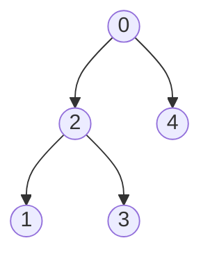

# DP on Trees

How to identify Tree DP

Ask:

> "Do I need information from children to compute the answer for a parent?"

> If yes → Tree DP is likely.

State is : dp[node]
and dp[node] depends on children dp[chil1], dp[child2]...

```
      1
    / | \
   2  3  4

To calculate node 1

We need:
dp[2]
dp[3]
dp[4]
```

## Generic template

```cpp
vector<int> adj[N];
vector<int> dp(N);

void dfs(int node, int parent) {

    for(auto child: adj[node]) {

        if(child == parent)
            continue;

        dfs(child,node);

        // merge child contribution
        dp[node] += dp[child];
    }
}
```

> [!IMPORTANT]
> Pattern:
>
>           Compute children
>           Merge children
>           Return result upward
>
>   State per node? Think:
>
>           "What information should every node send to its parent?"

---

# CASE 1: Subtree DP

> State depends only on subtree.

## 1. Count Nodes With the Highest Score
[Leetcode link](https://leetcode.com/problems/count-nodes-with-the-highest-score/description/)

The nodes are labeled from 0 to n - 1.
where parents[i] is the parent of node i. Since node 0 is the root, parents[0] == -1.

Each node has a score. To find the score of a node, consider if the node and the edges 
connected to it were removed. The tree would become one or more non-empty subtrees. The 
size of a subtree is the number of the nodes in it. The score of the node is the product
of the sizes of all those subtrees.

> Return the number of nodes that have the highest score.



Input: parents = [-1,2,0,2,0]

Output: 3

Explanation:
- The score of node 0 is: 3 * 1 = 3
- The score of node 1 is: 4 = 4
- The score of node 2 is: 1 * 1 * 2 = 2
- The score of node 3 is: 4 = 4
- The score of node 4 is: 4 = 4
The highest score is 4, and three nodes (node 1, node 3, and node 4) have the highest score.

### Intuition
> [!IMPORTANT]
>  score[i] = size of left tree * size of right tree * (n - size of tree whose node is i)
>
> So we just need to find the size of each node
>
> size[node] = size[left node] + size[right node] + 1
>
>               State dp[node] = size of node
>
> Transition:
>
>               get size of childs
>               dp[node] = dp[child1] + dp[child2] + 1;

```cpp
class Solution {
    vector<int> dp;
    int n;
    vector<vector<int>> child;
public:
    int dfs(int node) {
        int size = 1;

        for(int ch : child[node]) {
            size += dfs(ch);
        }
        return dp[node] = size;
    }

    int countHighestScoreNodes(vector<int>& parents) {
       
        this->n = parents.size();
        child.resize(n);
        dp.resize(n);

        for(int i=1; i<n; i++) {
            //parent[i] is parent of i
            child[parents[i]].push_back(i);
        }

        dfs(0); // compute dp

        vector<long long> score(n, 0);
        long long maxScore = 0;

        for(int i=0; i<n; i++) {
            long long sco = 1;

            for(int ch: child[i]) {
                sco *= dp[ch];
            }

            long long rem = n - dp[i];
            if(rem > 0) sco *= rem;

            score[i] = sco;
            maxScore = max(maxScore, score[i]);
        }

        int ans = 0;
        for(long long sco : score) {
            if(sco == maxScore)
                ans++;
        }

        return ans;
    }
};
```


