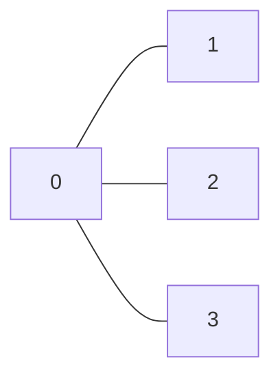

# Bitmask DP (Subset DP)
---

If you can say:

> “I need to consider all subsets, but efficiently”

👉 Use **Bitmask DP**

Bitmask DP is used when the **state depends on a subset of elements**.
- Instead of: dp[i]
- We use: dp[mask]

Where:
* `mask` = binary representation of a subset (Eg: mask = 101011, elements 0, 1, 3 and 5 are present in subset)
* `n elements → mask ∈ [0, (1<<n) - 1]`

---

## How to Identify This Pattern

### Strong signals
* `n ≤ 20` (small constraints)
* Keywords:

  * "visit all"
  * "each exactly once"
  * "minimum cost to cover all"
  * "assign tasks"
  * "subset / combination"

---

### Common problem types

| Type               | Typical State |
| ------------------ | ------------- |
| Visiting all nodes | `dp[mask][i]` |
| Assignment         | `dp[mask]`    |
| Pairing            | `dp[mask]`    |
| Partition          | `dp[mask]`    |

---

## When to Apply Bitmask DP
Use it when:
* You need to process **all subsets or permutations**
* Brute force is `O(n!)` or `O(2^n)`
* You can build answer **incrementally by adding elements**

---

##  How to Think About States

### 1. Subset only

> dp[mask]
> Used when order doesn’t matter

### 2. Subset + last element

> dp[mask][i]
> Used when order/path matters

Meaning:
> visited all in `mask`, currently at `i`

---

## Transition Pattern

Core idea:
```
for mask: // all possible subsets
    for i in mask: // currently at i
        for j not in mask: // move to j from i
            newMask = mask | (1<<j)
```

---

## ⚙️ Important Bit Operations

> [!IMPORTANT]
> - Check if i is in mask ----> mask & (1 << i)
>
> - Add i to mask ----> mask | (1 << i)
>
> - Remove i from mask ----> mask ^ (1 << i)
>
> - Check if mask is full ---- > mask == (1 << n) - 1
>
> - Iterate all masks ----> for (int mask = 0; mask < (1<<n); mask++)
>
> - Iterate elements in mask
>   - for (int i = 0; i < n; i++)
>       - if (mask & (1<<i))
> 
> - Iterate elements NOT in mask
>   - for (int i = 0; i < n; i++)
>       - if (!(mask & (1<<i)))
>
> - Remove lowest set bit ----> mask & (mask - 1)
> 
> - Get lowest set bit ----> mask & (-mask)


## 🎯 Full Mask vs Final Mask
> [!NOTE]
> - Total masks ----> totalMasks = 1 << n → number of states
> - Final mask (all visited) ----> finalMask = (1 << n) - 1
>
> - Example (`n = 4`):
>   - 1 << 4     = 10000
>   - (1<<4) - 1 = 01111 → 1111

---

## How Iteration Works
Bottom-up order:
* Always go from **small mask → large mask**

```
for mask in [0 → (1<<n)-1]:
    for i in mask:
        for j not in mask:
            expand
```

### Why this works
Because:
> smaller subsets are already computed before larger ones

---

## Common Mistakes
> [!WARNING]
> * ❌ Using size `(1<<n) - 1` instead of `(1<<n)`
> * ❌ Forgetting to check `i ∈ mask`
> * ❌ Overflow when using `INT_MAX`
> * ❌ Wrong mask transitions
> * ❌ Using when `n > 22`

---

## Mental Model

Think:

> “I have already processed this subset (mask).
> How do I extend it by adding one more element?”

---

## 🔥 Classic Problems

* Travelling Salesman Problem (TSP)
* Assignment Problem
* Minimum XOR Sum
* Shortest Path Visiting All Nodes
* Partition to K Equal Sum Subsets
* Can I Win
* Beautiful Arrangement
* Minimum Cost to Connect Two Groups

---

## ⚡ Complexity

```
Time:  O(2^n * n^2)
Space: O(2^n * n)
```
---

## 1. Travelling Salesman Problem
[GFG link](https://www.geeksforgeeks.org/problems/travelling-salesman-problem2732/1)

Given a 2d matrix cost[][] of size n where cost[i][j] denotes the cost of moving from city i to city j. 
Your task is to complete a tour from city 0 (0-based index) to all other cities such 
that you visit each city exactly once and then at the end come back to city 0 at minimum cost.

```
Input: cost[][] = [[0, 1000, 5000],
                [5000, 0, 1000],
                [1000, 5000, 0]]
Output: 3000
Explanation: We can visit 0->1->2->0 and cost = 1000 + 1000 + 1000 = 3000
```

Constraints:
- 1 ≤ cost.size() ≤ 15
- 0 ≤ cost[i][j] ≤ 104

### Intuition
> [!IMPORTANT]
> Brute-force: need to generate all permutaions --> time - 0(n!)
>
> In these permutaions many paths will be common and results for these can be stored
> 
> - States depends in which cities have been visited, and where is salesman now
>   - Example: two paths (0->1->3), (3->1->0) 
>   - mask for both path is: 1101, but both are different
>       
>           this is why we need the curr position also to determine the correct state
>
>           dp[mask][i] --> cost of visiting cities in mask while curr location is at 'i'
>           mask ---> visited cities
>           i ---> current city

> [!NOTE]
> mask is a subset not a permutation
> - mask1 = 100 --> city 2 is visited
> - mask2 = 0010010 --> cities 1 and 4 are visited

```cpp
int tsp(vector<vector<int>>& cost) {
    int n = cost.size();
    if (n == 1) return 0;
    
    int totalMasks = 1 << n;
    const int INF = 1e9;
    
    vector<vector<int>> dp(totalMasks, vector<int>(n, INF));
    dp[1 << 0][0] = 0; // visited city 0, currently at city 0 --> cost = 0
    
    for (int mask = 0; mask < totalMasks; mask++) { // all subsets -- 0(2^n)
        for (int i = 0; i < n; i++) { // curr positions
            
            // curr position i not in mask
            if (!(mask & (1 << i))) continue;
            
            // visit j from i
            for (int j = 0; j < n; j++) {
                // j is already visited
                if (mask & (1 << j)) continue;
                
                int newMask = mask | (1 << j);
                dp[newMask][j] = min(dp[newMask][j], dp[mask][i] + cost[i][j]);
            }
        }
    }
    
    int finalMask = (1 << n) - 1;
    int ans = INT_MAX;
    
    for (int i = 1; i < n; i++) {
        ans = min(ans, dp[finalMask][i] + cost[i][0]);
    }
    
    return ans;
}
```

```
Time - O(2^n * n^2)
Space - O(2^n * n)
```
---

## 2. Minimum XOR Sum of Two Arrays
[text](https://leetcode.com/problems/minimum-xor-sum-of-two-arrays/description/)

You are given two integer arrays nums1 and nums2 of length n.

The XOR sum of the two integer arrays is 
(nums1[0] XOR nums2[0]) + (nums1[1] XOR nums2[1]) + ... + (nums1[n - 1] XOR nums2[n - 1]) (0-indexed).

For example, the XOR sum of [1,2,3] and [3,2,1] is equal to 
(1 XOR 3) + (2 XOR 2) + (3 XOR 1) = 2 + 0 + 2 = 4.

> Rearrange the elements of nums2 such that the resulting XOR sum is minimized.
>
> Return the XOR sum after the rearrangement.


Input: nums1 = [1,0,3], nums2 = [5,3,4]
Output: 8

> Explanation: Rearrange nums2 so that it becomes [5,4,3]. 
>
> The XOR sum is (1 XOR 5) + (0 XOR 4) + (3 XOR 3) = 4 + 4 + 0 = 8.

```
Constraints:

n == nums1.length
n == nums2.length
1 <= n <= 14
```

### Intuition
> [!IMPORTANT]
> mask --> represents elements form nums2 which have been used already
>
> setbits in mask shows elements are used from nums2
>
> number of setbits in mask shows the index till elements are assigned form nums1
>
> dp[mask] = min XORSum achieved by elements present in mask from nums2

```cpp
int setbitsCount(int mask) {
    int count = 0;
    while (mask > 0) {
        count += (mask & 1);
        mask >>= 1;
    }
    return count;
}

int minimumXORSum(vector<int>& nums1, vector<int>& nums2) {
    // mask --> represents elements form nums2 which have been used already
    // setbits in mask shows elements are used from nums2
    // unset bits tell the indicies not used from nums2
    // number of setbits in mask shows the index till elements are assigned form nums1

    int n = nums1.size();
    int totalMasks = 1 << n;
    const int INF = 1e9;

    vector<int> dp(totalMasks, INT_MAX);
    dp[0] = 0; // 0 elements used from nums2

    for(int mask=0; mask<totalMasks; mask++) {
        if(dp[mask] == INT_MAX) continue;
        int setBits = setbitsCount(mask);
        
        int i = setBits; // next index from nums1
        if(i >= n) continue;

        for(int j=0; j<n; j++) {
            if(!(mask & (1<<j))) { // index already used from nums2
                int newMask = mask | (1<<j);

                dp[newMask] = min(dp[newMask], dp[mask] + (nums1[i]^nums2[j]));
            }
        }
    }

    int finalMask = (1<<n)-1;
    return dp[finalMask];
}
```
---

## 3. Shortest Path Visiting All Nodes
[Leetcode link](https://leetcode.com/problems/shortest-path-visiting-all-nodes/description/)

You have an undirected, connected graph of n nodes labeled from 0 to n - 1. 
You are given an array graph where graph[i] is a list of all the nodes connected with node i by an edge.

Return the length of the shortest path that visits every node. You may start and stop at any node, 
you may revisit nodes multiple times, and you may reuse edges.



Input: graph = [[1,2,3],[0],[0],[0]]
- Output: 4
- Explanation: One possible path is [1,0,2,0,3]

```
Constraints:
    n == graph.length
    1 <= n <= 12
    0 <= graph[i].length < n
```

### Intuition

> [!IMPORTANT]
> dp[mask][i] = shortest path length while visiting all nodes in mask and currently at i node
>
> Use multinode BFS -- since graph is unweighted, and we need shortest path

```cpp
int shortestPathLength(vector<vector<int>>& graph) {
    // Use multi source BFS -- since need to find shortest path and graph is unweighted
    // start with every node
    // state is (visited_mask, curr_node)
    // dp[mask][i] = shortest path while visiting all nodes in mask and currently at node i 

    int n = graph.size();
    int totalMasks = 1<<n;

    vector<vector<int>> dp(totalMasks, vector<int>(n, INT_MAX));
    queue<pair<int, int>> q; // mask, currNode

    for(int i=0; i<n; i++) {
        int mask = 1<<i;
        dp[mask][i] = 0;
        q.push({mask, i}); // start from every node
    }

    int finalMask = (1<<n) - 1;
    while(!q.empty()) {
        auto [mask, curr] = q.front();
        q.pop();
        
        int steps = dp[mask][curr];
        if(mask == finalMask) return steps;

        for(int next: graph[curr]) {
            int newMask = mask | (1 << next);

            if(dp[newMask][next] == INT_MAX) {
                dp[newMask][next] = steps+1;
                q.push({newMask, next});
            }
            
        }
    }

    return -1;
}
```

---

## 4. Partition to K Equal Sum Subsets
[Leetcode link](https://leetcode.com/problems/partition-to-k-equal-sum-subsets/description/)
Given an integer array nums and an integer k, return true if it is possible 
to divide this array into k non-empty subsets whose sums are all equal.

 

Example 1:
- Input: nums = [4,3,2,3,5,2,1], k = 4
- Output: true
- Explanation: It is possible to divide it into 4 subsets (5), (1, 4), (2,3), (2,3) with equal sums.

Example 2:
- Input: nums = [1,2,3,4], k = 3
- Output: false

```
Constraints:
    1 <= k <= nums.length <= 16
    1 <= nums[i] <= 10^4
    The frequency of each element is in the range [1, 4].
```

### Intuition

> [!IMPORTANT]
> totalSum % k == 0, otherwise partition is not possible
>
>       This problem can be solved using backtracking
>
> but we need to keep track of elements that are visited
> since n <= 16, instead of SET we can use bitmask
>
> mask --> tells us which elements are visited

```cpp
bool solve(int mask, int currSum, int target, vector<int>&nums, int k) {
    if(k == 0) return true;
    if(currSum == target) {
        return solve(mask, 0, target, nums, k-1);
    }

    int n = nums.size();
    for(int i=0; i<n; i++) {
        if(!(mask & (1<<i))) {
            int nextSum = currSum + nums[i];
            if(nextSum <= target) {
                int nextMask = mask | (1 << i);

                int ans = solve(nextMask, nextSum, target, nums, k);
                if(ans) return true;
            }
        }
    }

    return false;

}
bool canPartitionKSubsets(vector<int>& nums, int k) {
    // targetSum = totalSum(nums)/k
    // we can solve it by backtracking
    // keep picking elements if currentSum <= targetSum
    // if k == 0 return true
    // we need to keep track of elements that have been visited using mask

    int sum = accumulate(nums.begin(), nums.end(), 0);
    if(sum % k != 0) return false;

    int target = sum/k;
    sort(nums.rbegin(), nums.rend());

    return solve(0, 0, target, nums, k);
}
```

> [!NOTE]
> We can add memoization to above code

```cpp
bool solve(int mask, int currSum, int target, vector<int>&nums, int k, vector<int> &memo) {
    if(k == 0) return true;
    if(currSum == target) {
        return solve(mask, 0, target, nums, k-1, memo);
    }

    if(memo[mask] != -1) return memo[mask];

    int n = nums.size();
    for(int i=0; i<n; i++) {
        if(!(mask & (1<<i))) {
            int nextSum = currSum + nums[i];
            if(nextSum <= target) {
                int nextMask = mask | (1 << i);

                int ans = solve(nextMask, nextSum, target, nums, k, memo);
                if(ans) return memo[mask] = true;
            }
        }
    }

    return memo[mask] = false;

}
bool canPartitionKSubsets(vector<int>& nums, int k) {
    // targetSum = totalSum(nums)/k
    // we can solve it by backtracking
    // keep picking elements if currentSum <= targetSum
    // if k == 0 return true
    // we need to keep track of elements that have been visited using mask

    int sum = accumulate(nums.begin(), nums.end(), 0);
    if(sum % k != 0) return false;

    int target = sum/k;
    sort(nums.rbegin(), nums.rend());

    int totalMasks = 1 << nums.size();
    vector<int> memo(totalMasks, -1);

    return solve(0, 0, target, nums, k, memo);
}
```

---

## 5. Can I Win
[Leetcode link](https://leetcode.com/problems/can-i-win/description/)

In the "100 game" two players take turns adding, to a running total, any integer from 1 to 10. 
The player who first causes the running total to reach or exceed 100 wins.

What if we change the game so that players cannot re-use integers?

For example, two players might take turns drawing from a common pool 
of numbers from 1 to 15 without replacement until they reach a total >= 100.

> Given two integers maxChoosableInteger and desiredTotal, 
> return true if the first player to move can force a win, otherwise, 
> return false. Assume both players play optimally.

```
Input: maxChoosableInteger = 10, desiredTotal = 11
Output: false

Explanation:
    No matter which integer the first player choose, the first player will lose.
    The first player can choose an integer from 1 up to 10.
    If the first player choose 1, the second player can only choose integers from 2 up to 10.
    The second player will win by choosing 10 and get a total = 11, which is >= desiredTotal.
    Same with other integers chosen by the first player, the second player will always win.

```

Constraints:
- 1 <= maxChoosableInteger <= 20
- 0 <= desiredTotal <= 300

### Intuition

> [!IMPORTANT]
> Can be solved using backtracking
>
> keep taking turns by choosing elements from (1, maxChoosable)
>
> Need to keep track of visited elements
>
>       use mask for that

```cpp
bool solve(int mask, int desiredTotal, int maxC) {
    if(desiredTotal <= 0) return false; // current player looses

    for(int i=1; i<=maxC; i++) {
        if(!(mask & (1<<i))) {
            int nextMask = mask | (1<<i);

            int ans = solve(nextMask, desiredTotal-i, maxC);
            // if next person looses
            if(ans == false) return true; // current player wins
        }
    }

    return false;
}
bool canIWin(int maxChoosableInteger, int desiredTotal) {
    if(desiredTotal == 0) return true;
    int sum = (maxChoosableInteger * (maxChoosableInteger + 1)) / 2;
    if (sum < desiredTotal) return false; // impossible

    return solve(0, desiredTotal, maxChoosableInteger);
}
```

> [!NOTE]
> We can memoize above solution

```cpp
bool solve(int mask, int desiredTotal, int maxC, unordered_map<int, bool>& memo) {
    if(desiredTotal <= 0) return false; // current player looses

    if(memo.find(mask) != memo.end()) return memo[mask];

    for(int i=1; i<=maxC; i++) {
        if(!(mask & (1<<i))) {
            int nextMask = mask | (1<<i);

            int ans = solve(nextMask, desiredTotal-i, maxC, memo);
            // if next person looses
            if(ans == false) return memo[mask]=true; // current player wins
        }
    }

    return memo[mask]=false;
}
bool canIWin(int maxChoosableInteger, int desiredTotal) {
    if(desiredTotal == 0) return true;
    int sum = (maxChoosableInteger * (maxChoosableInteger + 1)) / 2;
    if (sum < desiredTotal) return false; // impossible
    
    // cant use vector of size (1 << 20)-- will heap overflow
    unordered_map<int, bool> memo;

    return solve(0, desiredTotal, maxChoosableInteger, memo);
}
```

### 5. Beautiful Arrangement
[Leetcode link](https://leetcode.com/problems/beautiful-arrangement/description/)

Suppose you have n integers labeled 1 through n. A permutation of those n integers perm 
(1-indexed) is considered a beautiful arrangement if for every i (1 <= i <= n), 
either of the following is true:

> perm[i] is divisible by i.
> i is divisible by perm[i].
- Given an integer n, return the number of the beautiful arrangements that you can construct.

Example 1:

Input: n = 2
Output: 2
Explanation: 
- The first beautiful arrangement is [1,2]:
    - perm[1] = 1 is divisible by i = 1
    - perm[2] = 2 is divisible by i = 2
- The second beautiful arrangement is [2,1]:
    - perm[1] = 2 is divisible by i = 1
    - i = 2 is divisible by perm[2] = 1

```
Constraints:

1 <= n <= 15
```

### Intuition

> [!IMPORTANT]
> dp[mask] = number of beautiful arrangements if we use elements in mask
>
> number of setBits in mask + 1 = position of next element in arrangement = pos
>
> if (j not in mask)
>
>       - if(pos%j == 0 || j%pos == 0)
>           -  dp[newMask] = dp[newMask]

```cpp
int getSetBits(int mask) {
    int ans = 0;
    while(mask) {
        if(mask & 1) ans++;
        mask >>= 1;
    }
    return ans;
}
int countArrangement(int n) {
    // dp[mask] = count of beautiful arrangements till using elements in mask

    int totalMasks = 1 << n;
    vector<int> dp(totalMasks, 0);

    dp[0] = 1;

    for (int mask = 0; mask < totalMasks; mask++) {
        int setBits = getSetBits(mask);
        for (int j = 1; j <= n; j++) {
            if (!(mask & (1 << (j - 1)))) {
                
                int newMask = mask | (1<<(j-1));
                int pos = setBits+1;
                
                if (j % pos == 0 || pos % j == 0) {
                    dp[mask | (1 << (j - 1))] += dp[mask];
                }
            }
        }
    }

    int finalMask = (1<<n) - 1;
    return dp[finalMask];
}
```