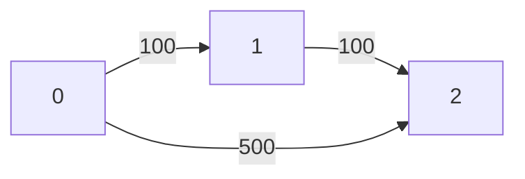

# Dynamic Programming With State Expansion
---

> [!IMPORTANT]
>
>       It appears when normal DP on position is NOT enough.
>
>       because your answer depends on extra information/state besides just where you are.

---

## 1. Core Idea of State Expansion

Normal DP:
```cpp
dp[i][j] = answer at cell (i,j)
```

> [!WARNING]
> But sometimes this fails because:
>
>      **Two paths** reaching same cell may **NOT** be equivalent.

> [!IMPORTANT]
> Because they may carry different:
> - XOR values
> - remaining budget
> - number of stops used
> - collected score
> - time spent
> - keys/masks/resources

So we expand state:
```cpp
dp[i][j][extra_state]
```

## 2. Mental Model

> Think: **"My position alone does not determine future."**

> Need: **"Position + current condition determines future."**

**That condition becomes extra DP dimension.**

## 3. How to Identify This Pattern


> [!NOTE]
> **Ask yourself:**
>
> If two ways reach same cell/node:
> - Can I safely keep only one?
>
>       If YES → normal DP.
>       If NO → state expansion.

### Example:
```
Minimum XOR Grid:
At cell (2,2):

1. Path A reached with XOR = 5
2. Path B reached with XOR = 9

Can discard one?

NO.

Because future XOR depends on previous XOR.

Thus:

dp[i][j][xor]
```

## 4. Generic Recognition Template

You need state expansion when problem has:

"Reach destination with constraint"
### Example
> [!IMPORTANT]
> - with K stops
> - within T time
> - with energy left
> - with fuel remaining
> - "Path value accumulates"

> [!IMPORTANT]
> - XOR
> - sum
> - score
> - parity
> - "Choices affect future"

> [!IMPORTANT]
> - cooldown
> - previous color
> - last move
> - remaining skips

## 5. Generic Transition Formula

```cpp
// usually
dp[position][state] =
    best from previous positions/states
//
// transition
new_state = update(old_state)
```

---

## 1. Minimum XOR Path in a Grid
[Leetcode link](https://leetcode.com/problems/minimum-xor-path-in-a-grid/description/)

```
You are given a 2D integer array grid of size m * n.
You start at the top-left cell (0, 0) and want to reach the bottom-right cell (m - 1, n - 1).

At each step, you may move either right or down.

The cost of a path is defined as the bitwise XOR of all the values in the 
cells along that path, including the start and end cells.
```

> Return the minimum possible XOR value among all valid paths from (0, 0) to (m - 1, n - 1).

Input: grid = [[6,7],[5,8]]
Output: 9

Explanation:

There are two valid paths:
- (0, 0) → (0, 1) → (1, 1) with XOR: 6 XOR 7 XOR 8 = 9
- (0, 0) → (1, 0) → (1, 1) with XOR: 6 XOR 5 XOR 8 = 11
- The minimum XOR value among all valid paths is 9.

### Intuition

> [!IMPORTANT]
> Future XOR depends on past XOR.
>
>       dp[i][j][xor] = is it possible to achieve XOR 'xor' at (i, j)
>       if dp[i][j][xor] == true --> update future --> transition
>       dp[i+1][j][xor^grid[i][j]] = true and dp[i][j+1][xor^grid[i][j]] = true

```cpp
int minCost(vector<vector<int>>& grid) {
    int m = grid.size(), n = grid[0].size();
    const int MAXX = 1024; // since values <= 1023
    
    vector<vector<vector<bool>>> dp(m, vector<vector<bool>>(n, vector<bool>(MAXX, false)));
    dp[0][0][grid[0][0]] = true;

    for(int i=0; i<m; i++) {
        for(int j=0; j<n; j++) {
            for(int x=0; x<MAXX; x++) {
                if(!dp[i][j][x]) continue;

                if(i+1 < m) {
                    int nextXor = x^grid[i+1][j];
                    dp[i+1][j][nextXor] = true;
                }

                if(j+1 < n) {
                    int nextXor = x^grid[i][j+1];
                    dp[i][j+1][nextXor] = true;
                }
            }
        }
    }

    // return min xor
    for(int x=0; x<MAXX; x++)
        if(dp[m-1][n-1][x])
            return x;
    
    return -1;
}
```

---

## 2. Cheapest Flights Within K Stops
[Leetcode link](https://leetcode.com/problems/cheapest-flights-within-k-stops/description/)

```
There are n cities connected by some number of flights. 
You are given an array flights where flights[i] = [fromi, toi, pricei] indicates 
that there is a flight from city fromi to city toi with cost pricei.

You are also given three integers src, dst, and k, return the cheapest 
price from src to dst with at most k stops. If there is no such route, return -1.
```



Input: n = 3, flights = [[0,1,100],[1,2,100],[0,2,500]]
src = 0, dst = 2, k = 1
Output: 200

Explanation:
- The graph is shown above.
- The optimal path with at most 1 stop from city 0 to 2 is marked in red and has cost 100 + 100 = 200.

### Intuition
> [!WARNING]
> - If we use dp[i] --> min cost to reach node i
> - we don't know dp[i] is achieved with how many stops

> [!IMPORTANT]
> - There can be atmost k+1 edges
> - dp[i][x] = min cost to reach ith node with x stops
> - update future --> transition
>       If there is a edge between i and j
>       dp[j][x+1] = min(dp[j][x+1], dp[i][x] + cost(i, j));

```cpp
void dfs(vector<vector<pair<int,int>>> &adj, vector<vector<int>> &dp,  int i, int stops, int k) {
    if(dp[i][stops] == INT_MAX) return;
    if(stops == k+1) return;

    for(auto [j, cost] : adj[i]){
        if(dp[i][stops] + cost < dp[j][stops+1]) {
            dp[j][stops+1] = dp[i][stops] + cost;
            dfs(adj, dp, j, stops+1, k);
        }
    }
}
int findCheapestPrice(int n, vector<vector<int>>& flights, int src, int dst, int k) {
    // dp[i][x] --> cost to arrive ith stop with cost x
    // it there is path i ---> j
    // dp[j][x+1] = min(dp[j][x+1], dp[i][x] + cost(i, j))

    vector<vector<pair<int,int>>> adj(n, vector<pair<int,int>>());
    for(auto &f: flights)
        adj[f[0]].push_back({f[1], f[2]});
    
    vector<vector<int>> dp(n, vector<int>(k+2, INT_MAX));
    dp[src][0] = 0;

    dfs(adj, dp, src, 0, k);
    
    int ans = INT_MAX;
    for(int stops=1; stops<=k+1; stops++)
        if(dp[dst][stops] != INT_MAX)
            ans = min(ans, dp[dst][stops]);
    
    return ans==INT_MAX ? -1 : ans;
}
```
