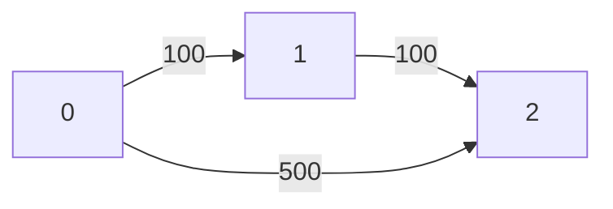

# Dynamic Programming With State Expansion
---

> [!IMPORTANT]
>
>       It appears when normal DP on position is NOT enough.
>
>       because your answer depends on extra information/state besides just where you are.

---

## 1. Core Idea of State Expansion

Normal DP:
```cpp
dp[i][j] = answer at cell (i,j)
```

> [!WARNING]
> But sometimes this fails because:
>
>      **Two paths** reaching same cell may **NOT** be equivalent.

> [!IMPORTANT]
> Because they may carry different:
> - XOR values
> - remaining budget
> - number of stops used
> - collected score
> - time spent
> - keys/masks/resources

So we expand state:
```cpp
dp[i][j][extra_state]
```

## 2. Mental Model

> Think: **"My position alone does not determine future."**

> Need: **"Position + current condition determines future."**

**That condition becomes extra DP dimension.**

## 3. How to Identify This Pattern


> [!NOTE]
> **Ask yourself:**
>
> If two ways reach same cell/node:
> - Can I safely keep only one?
>
>       If YES → normal DP.
>       If NO → state expansion.

### Example:
```
Minimum XOR Grid:
At cell (2,2):

1. Path A reached with XOR = 5
2. Path B reached with XOR = 9

Can discard one?

NO.

Because future XOR depends on previous XOR.

Thus:

dp[i][j][xor]
```

## 4. Generic Recognition Template

You need state expansion when problem has:

"Reach destination with constraint"
### Example
> [!IMPORTANT]
> - with K stops
> - within T time
> - with energy left
> - with fuel remaining
> - "Path value accumulates"

> [!IMPORTANT]
> - XOR
> - sum
> - score
> - parity
> - "Choices affect future"

> [!IMPORTANT]
> - cooldown
> - previous color
> - last move
> - remaining skips

## 5. Generic Transition Formula

```cpp
// usually
dp[position][state] =
    best from previous positions/states
//
// transition
new_state = update(old_state)
```

---

## 1. Minimum XOR Path in a Grid
[Leetcode link](https://leetcode.com/problems/minimum-xor-path-in-a-grid/description/)

```
You are given a 2D integer array grid of size m * n.
You start at the top-left cell (0, 0) and want to reach the bottom-right cell (m - 1, n - 1).

At each step, you may move either right or down.

The cost of a path is defined as the bitwise XOR of all the values in the 
cells along that path, including the start and end cells.
```

> Return the minimum possible XOR value among all valid paths from (0, 0) to (m - 1, n - 1).

Input: grid = [[6,7],[5,8]]
Output: 9

Explanation:

There are two valid paths:
- (0, 0) → (0, 1) → (1, 1) with XOR: 6 XOR 7 XOR 8 = 9
- (0, 0) → (1, 0) → (1, 1) with XOR: 6 XOR 5 XOR 8 = 11
- The minimum XOR value among all valid paths is 9.

### Intuition

> [!IMPORTANT]
> Future XOR depends on past XOR.
>
>       dp[i][j][xor] = is it possible to achieve XOR 'xor' at (i, j)
>       if dp[i][j][xor] == true --> update future --> transition
>       dp[i+1][j][xor^grid[i][j]] = true and dp[i][j+1][xor^grid[i][j]] = true

```cpp
int minCost(vector<vector<int>>& grid) {
    int m = grid.size(), n = grid[0].size();
    const int MAXX = 1024; // since values <= 1023
    
    vector<vector<vector<bool>>> dp(m, vector<vector<bool>>(n, vector<bool>(MAXX, false)));
    dp[0][0][grid[0][0]] = true;

    for(int i=0; i<m; i++) {
        for(int j=0; j<n; j++) {
            for(int x=0; x<MAXX; x++) {
                if(!dp[i][j][x]) continue;

                if(i+1 < m) {
                    int nextXor = x^grid[i+1][j];
                    dp[i+1][j][nextXor] = true;
                }

                if(j+1 < n) {
                    int nextXor = x^grid[i][j+1];
                    dp[i][j+1][nextXor] = true;
                }
            }
        }
    }

    // return min xor
    for(int x=0; x<MAXX; x++)
        if(dp[m-1][n-1][x])
            return x;
    
    return -1;
}
```

---

## 2. Cheapest Flights Within K Stops
[Leetcode link](https://leetcode.com/problems/cheapest-flights-within-k-stops/description/)

```
There are n cities connected by some number of flights. 
You are given an array flights where flights[i] = [fromi, toi, pricei] indicates 
that there is a flight from city fromi to city toi with cost pricei.

You are also given three integers src, dst, and k, return the cheapest 
price from src to dst with at most k stops. If there is no such route, return -1.
```



Input: n = 3, flights = [[0,1,100],[1,2,100],[0,2,500]]
src = 0, dst = 2, k = 1
Output: 200

Explanation:
- The graph is shown above.
- The optimal path with at most 1 stop from city 0 to 2 is marked in red and has cost 100 + 100 = 200.

### Intuition
> [!WARNING]
> - If we use dp[i] --> min cost to reach node i
> - we don't know dp[i] is achieved with how many stops

> [!IMPORTANT]
> - There can be atmost k+1 edges
> - dp[i][x] = min cost to reach ith node with x stops
> - update future --> transition
>       If there is a edge between i and j
>       dp[j][x+1] = min(dp[j][x+1], dp[i][x] + cost(i, j));

```cpp
void dfs(vector<vector<pair<int,int>>> &adj, vector<vector<int>> &dp,  int i, int stops, int k) {
    if(dp[i][stops] == INT_MAX) return;
    if(stops == k+1) return;

    for(auto [j, cost] : adj[i]){
        if(dp[i][stops] + cost < dp[j][stops+1]) {
            dp[j][stops+1] = dp[i][stops] + cost;
            dfs(adj, dp, j, stops+1, k);
        }
    }
}
int findCheapestPrice(int n, vector<vector<int>>& flights, int src, int dst, int k) {
    // dp[i][x] --> cost to arrive ith stop with cost x
    // it there is path i ---> j
    // dp[j][x+1] = min(dp[j][x+1], dp[i][x] + cost(i, j))

    vector<vector<pair<int,int>>> adj(n, vector<pair<int,int>>());
    for(auto &f: flights)
        adj[f[0]].push_back({f[1], f[2]});
    
    vector<vector<int>> dp(n, vector<int>(k+2, INT_MAX));
    dp[src][0] = 0;

    dfs(adj, dp, src, 0, k);
    
    int ans = INT_MAX;
    for(int stops=1; stops<=k+1; stops++)
        if(dp[dst][stops] != INT_MAX)
            ans = min(ans, dp[dst][stops]);
    
    return ans==INT_MAX ? -1 : ans;
}
```
---

## 3. Minimum Cost to Reach Destination in Time
[Leetcode link](https://leetcode.com/problems/minimum-cost-to-reach-destination-in-time/description/)

```
There is a country of n cities numbered from 0 to n - 1 where all the cities are connected by bi-directional roads. 
The roads are represented as a 2D integer array edges where edges[i] = [xi, yi, timei] denotes a 
road between cities xi and yi that takes timei minutes to travel. There may be multiple roads of differing 
travel times connecting the same two cities, but no road connects a city to itself.

Each time you pass through a city, you must pay a passing fee. This is represented as a 0-indexed integer 
array passingFees of length n where passingFees[j] is the amount of dollars you must pay when you pass through city j.

In the beginning, you are at city 0 and want to reach city n - 1 in maxTime minutes or less. 
The cost of your journey is the summation of passing fees for each city that you passed 
through at some moment of your journey (including the source and destination cities).
``` 

> Given maxTime, edges, and passingFees, return the minimum cost to complete your journey, 
> or -1 if you cannot complete it within maxTime minutes.

### Intuition

> [!IMPORTANT]
> dp[i][t] = min cost to reach city i in 't' minutes
> if there is a edge between i and j --> update future --> transition
>
>       dp[j][t + time(i, j)] = dp[i][t] + passingFees[j]
> If we use DFS for state expansion:
> - Might give TLE since it's ans undirected graph
> - Use Dijkstra for state expansion

```cpp
typedef pair<int, pair<int,int>> pii;

int minCost(int maxTime, vector<vector<int>>& edges, vector<int>& passingFees) {
    // dp[i][t] = min cost to reach city i in 't' minutes
    // if there is a edge between (i, j)
    // dp[j][t + time(i, j)] = dp[i][t] + passingFees[j]

    int n = passingFees.size();

    vector<vector<pair<int, int>>> adj(n, vector<pair<int,int>>());
    for(auto e : edges) {
        adj[e[0]].push_back({e[1], e[2]});
        adj[e[1]].push_back({e[0], e[2]});
    }

    vector<vector<int>> dp(n, vector<int>(maxTime+1,  INT_MAX));
    dp[0][0] = passingFees[0];

    priority_queue<pii, vector<pii>, greater<pii>> pq;
    pq.push({passingFees[0], {0, 0}});

    while(!pq.empty()) {
        auto [currCost, state] = pq.top();
        pq.pop();
        int i = state.first;
        int currTime = state.second;

        if(i == n-1) return currCost;

        for(auto [j, t]: adj[i]) {
            int nextTime = currTime + t;
            if(nextTime > maxTime) continue;

            int nextCost = currCost + passingFees[j];
            if(dp[j][nextTime] > nextCost) {
                dp[j][nextTime] = nextCost;
                pq.push({nextCost, {j, nextTime}});
            }
        }
    }
    return -1;

}
```

---

## 4. Shortest Path in a Grid with Obstacles Elimination
[Leetcode link=](https://leetcode.com/problems/shortest-path-in-a-grid-with-obstacles-elimination/description/)

You are given an m x n integer matrix grid where each cell is either 0 (empty) or 1 (obstacle). 
You can move up, down, left, or right from and to an empty cell in one step.

Return the minimum number of steps to walk from the upper left corner (0, 0) to the 
lower right corner (m - 1, n - 1) given that you can eliminate at most k obstacles. 
If it is not possible to find such walk return -1.

```
Input: grid = [[0,0,0],[1,1,0],[0,0,0],[0,1,1],[0,0,0]], k = 1
Output: 6

Explanation: 
The shortest path without eliminating any obstacle is 10.
The shortest path with one obstacle elimination at position (3,2) is 6. 
Such path is (0,0) -> (0,1) -> (0,2) -> (1,2) -> (2,2) -> (3,2) -> (4,2).
```

### Intuition
> [!IMPORTANT]
> dp[i][j][t] --> steps taken to reach (i, j) with t obstacles elimination
> 
> Now go in each direction and fill the values in dp.
> assume we move left i.e (i, j+1)
>
>       // If there is wall
>       if(grid[i][j+1] == 1 && t+1 <= k) dp[i][j+1][t+1] = min(dp[i][j+1][t+1], dp[i][j][t]+1)
>
>       // If there is no wall
>       if(grid[i][j+1] == 0) dp[i][j+1][t] = min(dp[i][j+1][t], dp[i][j][t]+1)

```cpp
int shortestPath(vector<vector<int>>& grid, int k) {
    // dp[i][j][t] --> steps taken to reach (i, j) with t obstacles elimination
    // assume we move left i.e (i, j+1)
    // if(grid[i][j+1] == 1 && t+1 <= k) dp[i][j+1][t+1] = min(dp[i][j+1][t+1], dp[i][j][t]+1)
    // if(grid[i][j+1] == 0) dp[i][j+1][t] = min(dp[i][j+1][t], dp[i][j][t]+1)

    int n = grid.size(), m = grid[0].size();
    vector<vector<vector<int>>> dp(n, vector<vector<int>>(m, vector<int>(k+1, INT_MAX)));

    vector<vector<int>> dir = {{1, 0}, {0, 1}, {-1, 0}, {0, -1}};

    // BFS
    queue<pair<int, pair<int,int>>> q; // x, i, j
    if(grid[0][0] == 0) {
        dp[0][0][0] = 0;
        q.push({0, {0, 0}});
    } else {
        dp[0][0][1] = 0;
        q.push({1, {0, 0}});
    }

    // BFS
    while(!q.empty()) {
        auto [t, pos] = q.front();
        q.pop();

        int i = pos.first, j = pos.second;
        for(auto d : dir) {
            int x = i + d[0];
            int y = j + d[1];

            if(x < 0 || y < 0 || x >= n || y >= m) continue;

            if(grid[x][y] == 1 && t+1 <= k) {
                if(dp[i][j][t] + 1 < dp[x][y][t+1]) {
                    dp[x][y][t+1] = dp[i][j][t] + 1;
                    q.push({t+1, {x, y}});
                }
            } else if(grid[x][y] == 0) {
                if(dp[i][j][t] + 1 < dp[x][y][t]) {
                    dp[x][y][t] = dp[i][j][t] + 1;
                    q.push({t, {x, y}});
                }
            }
        }
    }

    int ans = INT_MAX;
    for(int x=0; x<=k; x++) {
        ans = min(ans, dp[n-1][m-1][x]);
    }

    return ans==INT_MAX ? -1 : ans;
}
```


```
Minimum XOR Path in Grid
Shortest Path with K Stops
Minimum Cost to Reach Destination in Time

Shortest Path in Grid with Obstacles Elimination
Swim in Rising Water
Cherry Pickup
Unique Paths III
Decode Ways II

Number of Paths with Max Score
```
