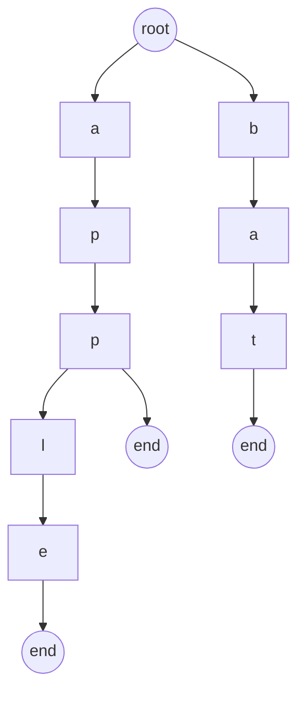

# What is a Trie

A Trie (prefix tree) is just a tree where:

- Each edge = a character
- Each path from root = a prefix or full word

Instead of storing:
> ["apple", "app", "bat"]

We store shared prefixes:


--- 

# When should YOU think “Trie”?

This is where most candidates miss Google-level questions.

Trigger words / patterns:

1. Prefix-related
- “startsWith”
- “prefix”
- “autocomplete”

2. Many strings + repeated queries
- insert + search multiple times
- avoid O(N * L) repeated comparisons

3. Dictionary-based problems
- word list + search
- replace words
- word break

4. Bitwise problems (IMPORTANT 🔥)
- “maximize XOR”
    👉 This uses a binary trie (0/1)

---

# Golden heuristic
> [!IMPORTANT]
> If you see:
>
>           strings + prefix OR many queries OR optimize search

---

# Problems

```
🟢 Easy (warmup)
Leetcode 208 → Implement Trie
Leetcode 14 → Longest Common Prefix

🟡 Medium (core understanding)
Leetcode 211 → Design Add and Search Words (wildcard)
Leetcode 648 → Replace Words
Leetcode 720 → Longest Word in Dictionary

🔴 Hard / Google-style
Leetcode 212 → Word Search II 🔥
Leetcode 421 → Maximum XOR of Two Numbers 🔥
Leetcode 1707 → Maximum XOR With Constraint 🔥
Leetcode 745 → Prefix and Suffix Search
```

# Common mistakes

1. ❌ Using Trie when HashMap is enough
2. ❌ Not freeing memory (in C++)
3. ❌ Hardcoding 26 (fails for other charset)
4. ❌ Not optimizing for constraints (TLE in Word Search II)
