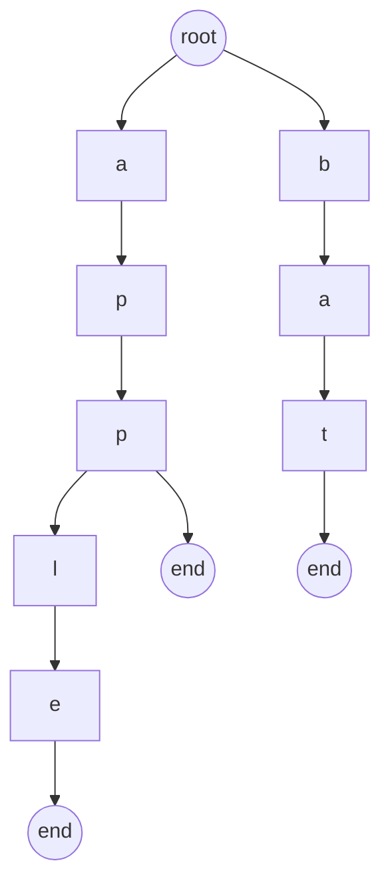

# What is a Trie

A Trie (prefix tree) is just a tree where:

- Each edge = a character
- Each path from root = a prefix or full word

Instead of storing:
> ["apple", "app", "bat"]

We store shared prefixes:


--- 

# When should YOU think “Trie”?

This is where most candidates miss Google-level questions.

Trigger words / patterns:

1. Prefix-related
- “startsWith”
- “prefix”
- “autocomplete”

2. Many strings + repeated queries
- insert + search multiple times
- avoid O(N * L) repeated comparisons

3. Dictionary-based problems
- word list + search
- replace words
- word break

4. Bitwise problems (IMPORTANT 🔥)
- “maximize XOR”
    👉 This uses a binary trie (0/1)

---

# Golden heuristic
> [!IMPORTANT]
> If you see:
>
>           strings + prefix OR many queries OR optimize search

---

# Problems

```
🟢 Easy (warmup)
Leetcode 208 → Implement Trie
Leetcode 14 → Longest Common Prefix

🟡 Medium (core understanding)
Leetcode 211 → Design Add and Search Words (wildcard)
Leetcode 648 → Replace Words
Leetcode 720 → Longest Word in Dictionary

🔴 Hard / Google-style
Leetcode 212 → Word Search II 🔥
Leetcode 421 → Maximum XOR of Two Numbers 🔥
Leetcode 1707 → Maximum XOR With Constraint 🔥
Leetcode 745 → Prefix and Suffix Search
```

# Common mistakes
> [!WARNING]
> - ❌ Using Trie when HashMap is enough
> - ❌ Not freeing memory (in C++)
> - ❌ Hardcoding 26 (fails for other charset)
> - ❌ Not optimizing for constraints (TLE in Word Search II)

---

## 1. Implement Trie (Prefix Tree)
[Leetcode link](https://leetcode.com/problems/implement-trie-prefix-tree/description/)

Implement the Trie class:

- Trie() Initializes the trie object.
- void insert(String word) Inserts the string word into the trie.
- boolean search(String word) Returns true if the string word is in the trie (i.e., was inserted before), and false otherwise.
- boolean startsWith(String prefix) Returns true if there is a previously inserted string word that has the prefix prefix, and false otherwise.

```
Input:
["Trie", "insert", "search", "search", "startsWith", "insert", "search"]
[[], ["apple"], ["apple"], ["app"], ["app"], ["app"], ["app"]]

Output:
[null, null, true, false, true, null, true]

Explanation
    Trie trie = new Trie();
    trie.insert("apple");
    trie.search("apple");   // return True
    trie.search("app");     // return False
    trie.startsWith("app"); // return True
    trie.insert("app");
    trie.search("app");     // return True
```

Constraints:
- 1 <= word.length, prefix.length <= 2000
- word and prefix consist only of lowercase English letters.
- At most 3 * 10^4 calls in total will be made to insert, search, and startsWith.

```cpp
class Node {
public:
    Node* links[26];
    bool endFlag;

    Node() {
        for(int i=0; i<26; i++) links[i] = NULL;
        endFlag = false;
    }

    bool isKeyExists(char c) {
        return this->links[c-'a'] != NULL;
    }

    void insertKey(char c) {
        this->links[c-'a'] = new Node();
    }

    Node* getKey(char c) {
        return this->links[c-'a'];
    }

    bool isEnd() {return this->endFlag;}
    void markEnd() {this->endFlag = true;}
};
class Trie {
public:
    Node* head;
    Trie() {
        head = new Node();
    }
    
    void insert(string word) {
        Node* curr = head;
        for(char &c : word) {
            if(!curr->isKeyExists(c)) {
                curr->insertKey(c);
            }
            curr = curr->getKey(c);
        }

        curr->markEnd();
    }
    
    bool search(string word) {
        Node* curr = head;
        for(char &c : word) {
            if(!curr->isKeyExists(c)) return false;
            curr = curr->getKey(c);
        }
        return curr->isEnd();
    }
    
    bool startsWith(string prefix) {
        Node* curr = head;
        for(char &c : prefix) {
            if(!curr->isKeyExists(c)) return false;
            curr = curr->getKey(c);
        }
        return true;
    }
};
```

```
L = max length of string

Time: 
    1. insert        --> O(L)
    2. search        --> O(L)
    3. startsWith    --> O(L)

Space:
    O(N*26*L) --> O(N*L)

```

---

## 2. Map Sum Pairs
[Leetcode link](https://leetcode.com/problems/map-sum-pairs/description/)

Implement the MapSum class:

- MapSum() Initializes the MapSum object.
- 
- void insert(String key, int val) Inserts the key-val pair into the map. 
- If the key already existed, the original key-value pair will be overridden to the new one.
- 
- int sum(string prefix) Returns the sum of all the pairs' value whose key starts with the prefix.

```
Input
    ["MapSum", "insert", "sum", "insert", "sum", "insert", "sum"]
    [[], ["apple", 3], ["ap"], ["app", 2], ["ap"], ["apple", 2], ["ap"]]

Output
    [null, null, 3, null, 5]

Explanation
    - MapSum mapSum = new MapSum();
    - mapSum.insert("apple", 3);  
    - mapSum.sum("ap");           // return 3 (apple = 3)
    - mapSum.insert("app", 2);    
    - mapSum.sum("ap");           // return 5 (apple + app = 3 + 2 = 5)
    - mapSum.insert("apple", 2);
    - mapSum.insert("ap");        // return 4 (apple + app = 2+2 = 5)
```

### Intuition
> [!IMPORTANT]
> - manage prefixSum at every node
> - when a (new word, new value) is inserted, at every node or char add prefixSum
> - But at update case (word, value) we need to again update the prefix sum for all nodes/chars in word
> - 
> - So maintain:
>               prefixSum, oldValue, isEnd
>
>               For update case get old value and subtract it from all nodes
>               Now update the prefixSum with new value

```
insert (apple, 3)
-   | prefixSum | oldValue
a   |    3      |   0
p   |    3      |   0
p   |    3      |   0
l   |    3      |   0
e   |    3      |   3


insert (app, 4)
-   | prefixSum | oldValue
a   |     7     |   0
p   |     7     |   0
p   |     7     |   4
l   |     3     |   0
e   |     3     |   3

insert (apple, 2)
-   | prefixSum | oldValue
a   |     6     |   0
p   |     6     |   0
p   |     6     |   4
l   |     2     |   0
e   |     2     |   2
```
