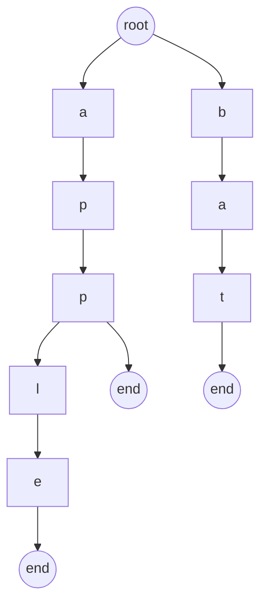

# What is a Trie

A Trie (prefix tree) is just a tree where:

- Each edge = a character
- Each path from root = a prefix or full word

Instead of storing:
> ["apple", "app", "bat"]

We store shared prefixes:

