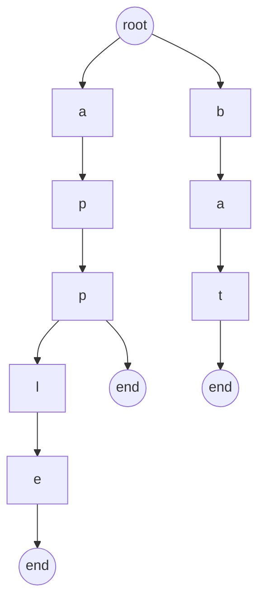

# What is a Trie

A Trie (prefix tree) is just a tree where:

- Each edge = a character
- Each path from root = a prefix or full word

Instead of storing:
> ["apple", "app", "bat"]

We store shared prefixes:


```mermaid
graph TD 
    root((root)) 

    root --> a[a] 
    root --> b[b]

    a --> p1[p] 
    p1 --> p2[p] 

    p2 --> l[l] 
    p2 --> end1((end)) 

    l --> e[e] 
    e --> end2((end)) 

    b --> a2[a] 
    a2 --> t[t] 
    t --> end3((end))
```
--- 

# When should YOU think “Trie”?

This is where most candidates miss Google-level questions.

Trigger words / patterns:

1. Prefix-related
- “startsWith”
- “prefix”
- “autocomplete”

2. Many strings + repeated queries
- insert + search multiple times
- avoid O(N * L) repeated comparisons

3. Dictionary-based problems
- word list + search
- replace words
- word break

4. Bitwise problems (IMPORTANT 🔥)
- “maximize XOR”
    👉 This uses a binary trie (0/1)

---

# Golden heuristic
> [!IMPORTANT]
> If you see:
>
>           strings + prefix OR many queries OR optimize search

---

# Problems

```
🟢 Easy (warmup)
Leetcode 208 → Implement Trie
Leetcode 14 → Longest Common Prefix

🟡 Medium (core understanding)
Leetcode 211 → Design Add and Search Words (wildcard)
Leetcode 648 → Replace Words
Leetcode 720 → Longest Word in Dictionary

🔴 Hard / Google-style
Leetcode 212 → Word Search II 🔥
Leetcode 421 → Maximum XOR of Two Numbers 🔥
Leetcode 1707 → Maximum XOR With Constraint 🔥
Leetcode 745 → Prefix and Suffix Search
```

# Common mistakes
> [!WARNING]
> - ❌ Using Trie when HashMap is enough
> - ❌ Not freeing memory (in C++)
> - ❌ Hardcoding 26 (fails for other charset)
> - ❌ Not optimizing for constraints (TLE in Word Search II)

---

## 1. Implement Trie (Prefix Tree)
[Leetcode link](https://leetcode.com/problems/implement-trie-prefix-tree/description/)

Implement the Trie class:

- Trie() Initializes the trie object.
- void insert(String word) Inserts the string word into the trie.
- boolean search(String word) Returns true if the string word is in the trie (i.e., was inserted before), and false otherwise.
- boolean startsWith(String prefix) Returns true if there is a previously inserted string word that has the prefix prefix, and false otherwise.

```
Input:
["Trie", "insert", "search", "search", "startsWith", "insert", "search"]
[[], ["apple"], ["apple"], ["app"], ["app"], ["app"], ["app"]]

Output:
[null, null, true, false, true, null, true]

Explanation
    Trie trie = new Trie();
    trie.insert("apple");
    trie.search("apple");   // return True
    trie.search("app");     // return False
    trie.startsWith("app"); // return True
    trie.insert("app");
    trie.search("app");     // return True
```

Constraints:
- 1 <= word.length, prefix.length <= 2000
- word and prefix consist only of lowercase English letters.
- At most 3 * 10^4 calls in total will be made to insert, search, and startsWith.

```cpp
class Node {
public:
    Node* links[26];
    bool endFlag;

    Node() {
        for(int i=0; i<26; i++) links[i] = NULL;
        endFlag = false;
    }

    bool isKeyExists(char c) {
        return this->links[c-'a'] != NULL;
    }

    void insertKey(char c) {
        this->links[c-'a'] = new Node();
    }

    Node* getKey(char c) {
        return this->links[c-'a'];
    }

    bool isEnd() {return this->endFlag;}
    void markEnd() {this->endFlag = true;}
};
class Trie {
public:
    Node* head;
    Trie() {
        head = new Node();
    }
    
    void insert(string word) {
        Node* curr = head;
        for(char &c : word) {
            if(!curr->isKeyExists(c)) {
                curr->insertKey(c);
            }
            curr = curr->getKey(c);
        }

        curr->markEnd();
    }
    
    bool search(string word) {
        Node* curr = head;
        for(char &c : word) {
            if(!curr->isKeyExists(c)) return false;
            curr = curr->getKey(c);
        }
        return curr->isEnd();
    }
    
    bool startsWith(string prefix) {
        Node* curr = head;
        for(char &c : prefix) {
            if(!curr->isKeyExists(c)) return false;
            curr = curr->getKey(c);
        }
        return true;
    }
};
```

```
L = max length of string

Time: 
    1. insert        --> O(L)
    2. search        --> O(L)
    3. startsWith    --> O(L)

Space:
    O(N*26*L) --> O(N*L)

```

---

## 2. Map Sum Pairs
[Leetcode link](https://leetcode.com/problems/map-sum-pairs/description/)

Implement the MapSum class:

- MapSum() Initializes the MapSum object.
- 
- void insert(String key, int val) Inserts the key-val pair into the map. 
- If the key already existed, the original key-value pair will be overridden to the new one.
- 
- int sum(string prefix) Returns the sum of all the pairs' value whose key starts with the prefix.

```
Input
    ["MapSum", "insert", "sum", "insert", "sum", "insert", "sum"]
    [[], ["apple", 3], ["ap"], ["app", 2], ["ap"], ["apple", 2], ["ap"]]

Output
    [null, null, 3, null, 5]

Explanation
    - MapSum mapSum = new MapSum();
    - mapSum.insert("apple", 3);  
    - mapSum.sum("ap");           // return 3 (apple = 3)
    - mapSum.insert("app", 2);    
    - mapSum.sum("ap");           // return 5 (apple + app = 3 + 2 = 5)
    - mapSum.insert("apple", 2);
    - mapSum.insert("ap");        // return 4 (apple + app = 2+2 = 5)
```

### Intuition
> [!IMPORTANT]
> - manage prefixSum at every node
> - when a (new word, new value) is inserted, at every node or char add prefixSum
> - But at update case (word, value) we need to again update the prefix sum for all nodes/chars in word
> - 
> - So maintain:
>               prefixSum, wordValue, isEnd
>
>               For update case get wordValue and subtract it from all nodes
>               Now update the prefixSum with new value


> insert (apple, 3)

| Node | prefixSum | wordValue | isEnd |
|------|-----------|-----------|-------|
| a    | 3         | 0         | false |
| p    | 3         | 0         | false |
| p    | 3         | 0         | false |
| l    | 3         | 0         | false |
| e    | 3         | 3         | true  |


> insert (app, 4)

| Node | prefixSum | wordValue | isEnd |
|------|-----------|-----------|-------|
| a    | 7         | 0         | false |
| p    | 7         | 0         | false |
| p    | 7         | 4         | true  |
| l    | 3         | 0         | false |
| e    | 3         | 3         | true  |

> insert (apple, 2)

| Node | prefixSum | wordValue | isEnd |
|------|-----------|-----------|-------|
| a    | 6         | 0         | false |
| p    | 6         | 0         | false |
| p    | 6         | 4         | true  |
| l    | 2         | 0         | false |
| e    | 2         | 2         | true  |


```cpp
class Node {
public:
    Node* links[26];
    int prefixSum;
    int wordValue;
    bool endFlag;

    Node() {
        for(int i=0; i<26; i++) links[i] = NULL;
        prefixSum = 0;
        wordValue = 0;
        endFlag = false;
    }

    bool isKeyExists(char &c) {
        return this->links[c-'a'] != NULL;
    }

    Node* getKey(char &c) {
        return this->links[c-'a'];
    }

    void insertKey(char &c) {
        this->links[c-'a'] = new Node();
    }

    void addPrefixSum(int val) {this->prefixSum += val;}
    int getPrefixSum() {return this->prefixSum;}
    int getWordValue() {return this->wordValue;}

    bool isEnd() {return this->endFlag;}
    void markEnd(int value) {
        this->endFlag = true;
        this->wordValue = value;
    }
};

class MapSum {
public:
    Node* head = new Node();
    MapSum() {
        
    }

    int getOldValue(string &word) {
        Node* curr = head;
        for(char &c: word) {
            if(!curr->isKeyExists(c)) return 0;
            curr = curr->getKey(c);
        }
        if(curr->isEnd()) return curr->getWordValue();
        return 0;
    }
    
    void insert(string key, int val) {
        int oldValue = getOldValue(key);

        Node* curr = head;
        for(char c: key) {
            if(!curr->isKeyExists(c)) {
                curr->insertKey(c);
            }
            curr = curr->getKey(c);
            curr->addPrefixSum(val-oldValue);
        }
        curr->markEnd(val);
    }
    
    int sum(string prefix) {
        Node* curr = head;
        for(char c: prefix) {
            if(!curr->isKeyExists(c)) return 0;
            curr = curr->getKey(c);
        }

        return curr->getPrefixSum();
    }
};
```

---

## 3. Design Add and Search Words Data Structure
[Leetcode link](https://leetcode.com/problems/design-add-and-search-words-data-structure/description/)

Design a data structure that supports adding new words and finding if a string matches any previously added string.

Implement the WordDictionary class:

> WordDictionary() Initializes the object.
> void addWord(word) Adds word to the data structure, it can be matched later.
> bool search(word) Returns true if there is any string in the data structure that matches word or false otherwise. 
> word may contain dots '.' where dots can be matched with any letter.

Input
    ["WordDictionary","addWord","addWord","addWord","search","search","search","search"]
    [[],["bad"],["dad"],["mad"],["pad"],["bad"],[".ad"],["b.."]]
Output
    [null,null,null,null,false,true,true,true]

Explanation
- WordDictionary wordDictionary = new WordDictionary();
- wordDictionary.addWord("bad");
- wordDictionary.addWord("dad");
- wordDictionary.addWord("mad");
- wordDictionary.search("pad"); // return False
- wordDictionary.search("bad"); // return True
- wordDictionary.search(".ad"); // return True
- wordDictionary.search("b.."); // return True

### Intuition
> [!IMPORTANT]
> - we need to worry about wild card matching
>
>           If we are at node 'curr' and we have the char '.' now we have to take all possible paths 
>           from node 'curr' and see if any path results a success
>
>           If at node 'curr' and we have a char 'a'<= c <='z' then we just need to follow one path
>           which is curr->getKey(c)


```cpp
class Node {
public:
    Node* links[26];
    bool endFlag;

    Node() {
        for(int i=0; i<26; i++) links[i] = NULL;
        endFlag = false;
    }

    bool isKey(char c) {return links[c-'a'] != NULL;}
    Node* getKey(char c) {return links[c-'a'];}
    void insertKey(char c) {links[c-'a'] = new Node();}
    bool isEnd() {return endFlag;}
    void markEnd() {endFlag = true;}
};
class WordDictionary {
public:
    Node* head;
    WordDictionary() {
        head = new Node();
    }
    
    void addWord(string word) {
        Node* curr = head;
        for(char c: word) {
            if(!curr->isKey(c)) curr->insertKey(c);
            curr = curr->getKey(c);
        }
        curr->markEnd();
    }

    bool dfs(string &word, int idx, Node* node) {
        if(!node) return false;
        if(idx == word.size()) return node->isEnd();
        

        if(word[idx] == '.') {
            for(int i=0; i<26; i++) { // follow all paths
                if(node->isKey('a'+i) && dfs(word, idx+1, node->getKey('a'+i)))
                    return true;
            }
        } else {
            if(node->isKey(word[idx]) && dfs(word, idx+1, node->getKey(word[idx]))) // follow matching path
                return true;
        }

        return false;
    }
    
    bool search(string word) {
        return dfs(word, 0, head);
    }
};
```

---

## 4. Replace Words
[Leetcode link](https://leetcode.com/problems/replace-words/description/)

"help" is root of "helpful"
simlimarly "cat" is the root of "cattle"

Example 1:
- Input: dictionary = ["cat","bat","rat"], sentence = "the cattle was rattled by the battery"
- Output: "the cat was rat by the bat"

Example 2:
- Input: dictionary = ["a","b","c"], sentence = "aadsfasf absbs bbab cadsfafs"
- Output: "a a b c"

### Intuition
> [!IMPORTANT]
>
> We need to search for a prefix which exists as a word in trie
> 
>           search each char of each string in sentence in trie, if at some point
>           in trie we end up at the end of some word, return it
>   
>           For example trie has word 'cat' and we are searching for 'cattle'
>           at index 2 after matching 't' we see trie node has endFlag true

```cpp
class Node {
public:
    Node* links[26];
    bool endFlag;

    Node() {
        for(int i=0; i<26; i++) links[i] = NULL;
        endFlag = false;
    }

    bool isKey(char c) {return links[c-'a'] != NULL;}
    Node* getKey(char c) {return links[c-'a'];}
    void insertKey(char c) {links[c-'a'] = new Node();}
    bool isEnd() {return endFlag;}
    void markEnd() {endFlag = true;}
};
class Solution {
public:
    Node* head;
    void insert(string word) {
        Node* curr = head;
        for(char c : word) {
            if(!curr->isKey(c)) curr->insertKey(c);
            curr = curr->getKey(c);
        }
        curr->markEnd();
    }

    string search(string word) {
        Node* curr = head;

        for(int i = 0; i < word.size(); i++) {
            char c = word[i];
            if(!curr->isKey(c)) return "";

            curr = curr->getKey(c);
            if(curr->isEnd()) return word.substr(0, i+1);
        }

        return "";
    }

    string replaceWords(vector<string>& dictionary, string sentence) {
        this->head = new Node();
        for(string &s: dictionary) insert(s);

        vector<string> ans;
        string s = "";
        
        for(int i=0; i<=sentence.size(); i++) {
            if(sentence[i] == ' ' || i == sentence.size()) {
                string match = search(s);

                if(match == "") ans.push_back(s);
                else ans.push_back(match);
                
                s = "";
            } else {
                s += sentence[i];
            }
        }

        string res = "";
        for(int i=0; i<ans.size(); i++) {
            if(i == ans.size()-1) res += ans[i];
            else res += (ans[i] + " ");
        }

        return res;

    }

};
```

---

## 5. Longest Word in Dictionary
[Leetcode link](https://leetcode.com/problems/longest-word-in-dictionary/description/)

Given an array of strings words representing an English Dictionary, 
return the longest word in words that can be built one character at a time by other words in words.

If there is more than one possible answer, return the longest word with the smallest 
lexicographical order. If there is no answer, return the empty string.

Note that the word should be built from left to right with each additional character 
being added to the end of a previous word. 

```
Input: words = ["a","banana","app","appl","ap","apply","apple"]
Output: "apple"
Explanation: Both "apply" and "apple" can be built from other words in the dictionary. However, "apple" is lexicographically smaller than "apply".
```

### Intuition
> [!IMPORTANT]
> - For string S to be valid answer, every prefix of it must exists in the dictionary
> - Just need to modify the search method

```cpp
class Node {
public:
    Node* links[26];
    bool endFlag;

    Node() {
        for(int i=0; i<26; i++) links[i] = NULL;
        endFlag = false;
    }

    bool isKey(char c) {return links[c-'a'] != NULL;}
    Node* getKey(char c) {return links[c-'a'];}
    void insertKey(char c) {links[c-'a'] = new Node();}
    bool isEnd() {return endFlag;}
    void markEnd() {endFlag = true;}
};

class Solution {
public:
    Node* head;
    void insert(string &word) {
        Node* curr = head;
        for(char c : word) {
            if(!curr->isKey(c)) curr->insertKey(c);
            curr = curr->getKey(c);
        }
        curr->markEnd();
    }

    bool search(string &word) {
        Node* curr = head;
        for(char c : word) {
            if(!curr->isKey(c)) return false;
            curr = curr->getKey(c);

            if(!curr->isEnd()) return false; // every prefix must exists 
        }
        return curr->isEnd();
    }

    string longestWord(vector<string>& words) {
        this->head = new Node();
        for(string &word: words) insert(word);

        string ans = "";
        for(string &word: words) {
            if(search(word)) {
                if(word.size() == ans.size())
                    ans = word < ans ? word : ans;
                else if(word.size() > ans.size())
                    ans = word;
            }
        }

        return ans;
    }
};
```
---

## 5. Word Search II
[Leetcode link](https://leetcode.com/problems/word-search-ii/description/)

Given an m x n board of characters and a list of strings words, return all words on the board.

Each word must be constructed from letters of sequentially adjacent cells, where adjacent 
cells are horizontally or vertically neighboring. The same letter cell may not be used more than once in a word

> [!NOTE]
> Brute force
> - For everyword run a DFS and do backtrack

```cpp
class Solution {
public:
    int n;
    int m;
    vector<vector<int>> dir={{1, 0}, {0, 1}, {-1, 0}, {0, -1}};

    bool dfs(vector<vector<char>>& board, string &word, int idx, int i, int j) {
        if(idx == word.size()) return true;
        if(i<0 || j<0 || i>=n || j>=m || board[i][j]=='*' || board[i][j] != word[idx]) return false;

        char c = board[i][j];
        board[i][j] = '*';

        for(auto &d: dir) {
            int x = i+d[0];
            int y = j+d[1];

            if(dfs(board, word, idx+1, x, y)) {
                board[i][j] = c;
                return true;
            }
        }

        board[i][j] = c;
        return false;
    }

    vector<string> findWords(vector<vector<char>>& board, vector<string>& words) {
        n = board.size();
        m = board[0].size();

        vector<string> ans = {};

        for(string &w: words) {
            bool flag = true;
            for(int i=0; i<n && flag; i++) {
                for(int j=0; j<m; j++) {
                    if(board[i][j] == w[0]) {
                        if(dfs(board, w, 0, i, j)){
                            ans.push_back(w);
                            flag = false;
                            break;
                        }
                    }
                }
            }
        }

        return ans;
    }
};
```

> [!WARNING]
> the time complexity is O(w * n * m * 4^L)
>
> - w is number of words
> - L is max length of word
> - 4^L is time complexity of DFS
>           this will give TLE

> [!IMPORTANT]
> Better approach
> - Make a trie with all words
> - For each char in board see if head->isKey(c)
>       - if yes then take the currNode = head->getKey(c) and pass it to DFS
> - Now while running DFS move to next cell(x, y) only if currNode->isKey(board[x][y])
>           Base condition would be currNode->getWord() != "" --> then ans.push_back(currNode->getWord())
>
>           Instead of: W separate searches
>           ONE board traversal - guided by all words at once


```
words = {cat, car, cart, care, cap, dog}
Board:
c a r
t e p
d o g

make trie:
root
 ├── c
 │    └── a
 │         ├── t   (cat)
 │         ├── r   (car)
 │         │    ├── t (cart)
 │         │    └── e (care)
 │         └── p   (cap)
 └── d
      └── o
           └── g   (dog)


At every cell in board:
    if head->isKey(board[i][j])
        dfs(board, head->getKey(board[i][j]), i, j)


Time complecity --> O(n * m * 3^L)

```

```cpp
class Node {
    Node* links[26];
    string word;
public:
    Node() {
        for(int i=0; i<26; i++) links[i] = NULL;
        word = "";
    }

    bool isKey(char c) {return links[c-'a'] != NULL;}
    Node* getKey(char c) {return links[c-'a'];}
    void setKey(char c) {links[c-'a'] = new Node();}
    string getWord() {return word;}
    void setWord(string s) {word = s;}
};

class Solution {
    Node* head;
    int n;
    int m;
    unordered_set<string> ans;

    vector<vector<int>> dir = {{1, 0}, {-1, 0}, {0, 1}, {0, -1}};
public:
    void insert(string &word) {
        Node* curr = head;
        for(char c : word) {
            if(!curr->isKey(c)) curr->setKey(c);
            curr = curr->getKey(c);
        }
        curr->setWord(word);
    }

    void dfs(vector<vector<char>>& board, int i, int j, Node* curr) {
        if(curr->getWord() != "") ans.insert(curr->getWord());

        char c = board[i][j];
        board[i][j] = '*';

        for(auto &d: dir) {
            int x = i+d[0];
            int y = j+d[1];

            if(x<0 || y<0 || x>=n || y>=m || board[x][y]=='*' || !curr->isKey(board[x][y])) continue;
            dfs(board, x, y, curr->getKey(board[x][y]));
        }

        board[i][j] = c;
    }

    vector<string> findWords(vector<vector<char>>& board, vector<string>& words) {
        this->head = new Node();
        ans = {};
        n = board.size();
        m = board[0].size();

        for(string &s: words) insert(s);

        for(int i=0; i<n; i++) {
            for(int j=0; j<m; j++) {
                if(head->isKey(board[i][j]))
                    dfs(board, i, j, head->getKey(board[i][j]));
            }
        }

        vector<string> res;
        for(string s: ans) res.push_back(s);

        return res;
    }
};
```

---

## 6. Maximum XOR of Two Numbers in an Array
[Leetcode link](https://leetcode.com/problems/maximum-xor-of-two-numbers-in-an-array/description/)

Given an integer array nums, return the maximum result of nums[i] XOR nums[j], where 0 <= i <= j < n.

Example:
Input: nums = [3,10,5,25,2,8]
Output: 28
Explanation: The maximum result is 5 XOR 25 = 28.

```
root
├── 0
│   ├── 0
│   │   ├── 0
│   │   │   ├── 1
│   │   │   │   ├── 1   -> 3   (00011)
│   │   │   │   └── 0   -> 2   (00010)
│   │   └── 1
│   │       └── 0
│   │           └── 1   -> 5   (00101)
│   └── 1
│       ├── 0
│       │   ├── 1
│       │   │   └── 0   -> 10  (01010)
│       │   └── 0
│       │       └── 0   -> 8   (01000)
└── 1
    └── 1
        └── 0
            └── 0
                └── 1   -> 25  (11001)
```
### Intuition
> [!IMPORTANT]
> For 5 (00101) -- lets calculate max XOR:
> 
> we just need to pick opposite bit if possible for max XOR
>
> - for 5th bit which is 0 --> pick 1
> - For 4th bit which is 0 --> pick 1
> - For 3rd bit which is 1 --> pick 0
> - For 2rd bit which is 0 --> pick 1 but on this path there is no 1 --> pick 0
> - For 1st bit which is 1 --> pick 0 but on this path there is no 0 --> pick 1
>
>               maxXor = (00101) ^ (11001) = (11110) = 28

```cpp
class Node {
    Node* links[2];
public:
    Node() {
        for(int i=0; i<2; i++) links[i] = NULL;
    }

    bool isKey(int a) {return links[a] != NULL;}
    Node* getKey(int a) {return links[a];}
    void setKey(int a) {links[a] = new Node();}
};

class Solution {
    Node* head;

    void insert(int num) {
        Node* curr = head;
        for(int i=30; i>=0; i--) {
            int x = (num >> i) & 1; // i-th bit

            if(!curr->isKey(x)) curr->setKey(x);
            curr = curr->getKey(x);
        }
    }

    int search(int num) {
        int ans = 0;
        Node* curr = head;
        for(int i=30; i>=0; i--) {
            int x = (num >> i) & 1; // curr bit

            int want = 1-x; // if curr bit is 1, we want 0, if 0, we want 1
            if(curr->getKey(want)) {
                ans = ans | (1 << i); // if want bit is there then update set that bit 1 in maxXor
                curr = curr->getKey(want);
            } else { 
                curr = curr->getKey(x); // else that bit in maxXor will be 0
            }
        }

        return ans;
    }
public:
    int findMaximumXOR(vector<int>& nums) {
        // max xor --> avoid same set bit in both numbers
        this->head = new Node();

        for(int num : nums) insert(num);

        int ans = 0;
        for(int num : nums) {
            ans = max(ans, search(num));
        }

        return ans;
    }
};
```
